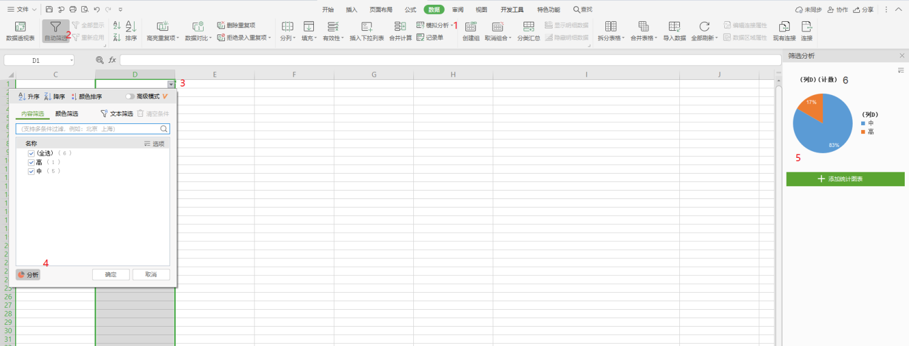

# 工作技巧

总结那些提高工作效率的工作技巧


## 1 Excel合并单元格

有时候，领导丢过来一个Excel叫我们批量修改数据，这时我们往往会通过写SQL的形式。但是你给的是Excel又不是SQL，这就变得复杂。别担心，我们可以使用合并单元格的方式，按照SQL的格式拼接在一起。

注：如何遇到复杂的SQL，可以使用EasyPoi等工具，通过编写Java程序进行处理。

```
=CONCAT(S1, S2, S3)
```


## 2 正则 ^$

正则表达式在工作中非常有用，平时工作中我最常用到的是快速替换。有时候，我们需要批量的修改数据的时，往往会通过写SQL的形式，比如批量更新，这时其实前面的内容是一样的，那我们如何快速替换，那就可以用到正则表达式中 "^$"(Shift + 64)，这个我称之为64，能够匹配到开头和结尾。

当然正则表达式的内容还有很多，应根据需要进行替换，总之目的只有一个，那就是快速替换。


## 3 windows创建服务

```
sc create nginx binpath= "D:\nginx-1.16.1\nginx.exe" start= auto
```

## 4 文章编写

我们对于每个源码类的文章套路为：

1. 怎么用：用场景来说明类的重要方法的使用技巧；
2. 为什么：源码解析其底层实现源码，复杂的源码会有动图解析；
3. 总结：总结出设计思想、最优使用姿势和坑，看看能否为工作中所用；
4. 面试题：总结出最新连环面试题，一题接着一题深入，可以作为面试官和面试者的面试指南。


## 5 饼图分析




## 6 CURL

```
curl http://127.0.0.1:8080/test -X POST -d '{"code":"test"}' -H "Content-Type:application/json"
// -H header
// -d param, query string
```


## 7 JOI工具包

```
<dependency>
    <groupId>org.openjdk.jol</groupId>
    <artifactId>jol-core</artifactId>
    <version>0.9</version>
</dependency>

// 查看对象头和对象占用的大小
System.out.println( ClassLayout.parseInstance(respVO).toPrintable());
System.out.println( GraphLayout.parseInstance(respVO).totalSize());
```


