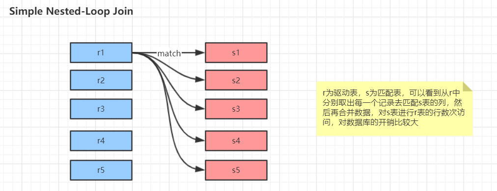

# MySQL

在这里列出MySQL中的基本知识，对于索引和事务是比较重要的内容，因此会单独一章说明。

一些内容来源：https://github.com/bjmashibing/InternetArchitect


## MySQL知识


### MySQL执行SQL过程

对于一条数据执行，并不是一个简单过程。了解执行SQL的生命周期，便于我们分析是哪一个过程导致了慢执行。

生命周期：

连接器 ——> 解析器  ——> 优化器  ——> 执行器

1. 在解析一个查询语句之前，如果查询缓存是打开的，那么MySQL会优先检查这个查询是否命中查询缓存中的数据，如果查询恰好命中了查询缓存，那么会在返回结果之前会检查用户权限，如果权限没有问题，那么MySQL会跳过所有的阶段，就直接从缓存中拿到结果并返回给客户端
2. MySQL通过关键字将SQL语句进行解析，并生成一颗解析树，MySQL解析器将使用MySQL语法规则验证和解析查询，例如验证使用使用了错误的关键字或者顺序是否正确等等，预处理器会进一步检查解析树是否合法，例如表名和列名是否存在，是否有歧义，还会验证权限等等


### 性能监控

当我们分析执行SQL时，有时想知道执行过程所花费的时间，cpu，io等，便可以用下面的命令。


#### show profiles;

```mysql
-- 开启profiling
mysql> set profiling=1;

-- 执行query
mysql> select * from T1;
mysql> select * from T2;

-- 展示最近的一次执行所花费的时间，status表示的不同的阶段
mysql> show profile;
+---------------+----------+
| Status        | Duration |
+---------------+----------+
| starting      | 0.000137 |
| freeing items | 4.7E-5   |
| cleaning up   | 2.4E-5   |
+---------------+----------+
3 rows in set


-- 当然也可以用以下命令查看从开启profiling所统计数据
mysql> show profiles;
+----------+------------+---------------------------------------+
| Query_ID | Duration   | Query                                 |
+----------+------------+---------------------------------------+
|        1 |   0.034193 | select * from iconsignment limit 10   |
|        2 | 0.00046575 | select * from iconsignment limit 10\G |
|        3 |   0.000418 | select * from iconsignment limit 10   |
|        4 |   0.000208 | \G

-- 也可以通过Query_ID指定要查询哪一次的
mysql> show profile for query 2

-- 还可以指定获取更多的属性属性
mysql> show profile cpu for query 2;
-- all表示查看所有的属性
mysql> show profile all for query 2;

```

注：使用performance schema来更加容易的监控mysql，详细见[performance schema详解.md](


#### show PROCESSLIST

使用show processlist查看连接的线程个数，来观察是否有大量线程处于不正常的状态或者其他不正常的特征

performance schema详解.md)


#### show status like 'Handler_read%'

 查看服务器状态

- Handler_read_first：读取索引第一个条目的次数（说明进行了全表扫描）

- **Handler_read_key：通过index获取数据的次数**（较高，说明使用索引情况较多）
- Handler_read_last：读取索引最后一个条目的次数

- Handler_read_next：通过索引读取下一条数据的次数

- Handler_read_prev：通过索引读取上一条数据的次数（一般是使用了order by）

- Handler_read_rnd：从固定位置读取数据的次数 （很多时候表现为没有使用索引或者文件排序）

- Handler_read_rnd_next：从数据节点读取下一条数据的次数（常说明你的表索引不正确或写入的查询没有利用索引）


#### show status like 'last_query_cost'

当我们执行查询的时候，MySQL会自动生成一个执行计划。查看执行的成本，数值越大说明花费越大

```mysql
show status like 'last_query_cost';
```


### 数据类型知识

#### BLOB 和 TEXT 

MySQL 把每个 BLOB 和 TEXT 值当作一个独立的对象处理。两者都是为了存储很大数据而设计的字符串类型，

- BLOB：采用二进制存储
- TEXT ：采用**字符方式**存储


#### datetime和timestamp

- datetime：**占用8个字节，与时区无关**，可保存到毫米
- timestamp：**占用4个字节，与时区有关**，精确到秒，采用整型存储。保存时间范围：1970-01-01到**2038-01-19**


#### int(11) 和varchar(255)

- int(11)，长度 无意义
- varchar(255)，长度 表现最大限制


## JOIN联表

join的本质是嵌套循环，因此建议是**小表join大表**，因为如果有索引的话，小表查询速度更快，循环次数更少。

当表A和表B使用列C关联的时候，如果优化器的关联顺序是B、A，那么就不需要再B表的对应列上建上索引，**没有用到的索引只会带来额外的负担**，一般情况下来说**，只需要在关联顺序中的第二个表的相应列上创建索引**

官方文档：https://dev.mysql.com/doc/refman/8.0/en/nested-loop-joins.html


### Simple Nested-Loop Join

驱动表和匹配表无索引情况




### Index Nested-Loop Join

驱动表和匹配表有索引情况


### Block Nested-Loop Join

将**驱动表放到join buffer中**，然后匹配表就能**一次**与join buffer中的数据进行对比。

> 举例来说：
>
> 外层循环的结果集是100行
>
> 1. 使用NLJ 算法需要扫描内部表100次。
> 2. 如果使用BNL算法，先把对Outer Loop表(外部表)每次读取的10行记录放到join buffer，然后在InnerLoop表(内部表)中**直接匹配这10行数据**，**内存循环就可以一次与这10行进行比较**, 这样只需要比较10次，对内部表的扫描减少了9/10。所以BNL算法就能够显著减少内层循环表扫描的次数。


1. Join Buffer会缓存**所有参与查询的列**而不是只有Join的列
2. 可以通过调整join_buffer_size缓存大小，默认262144，即：256k
3. join_buffer_size的最大值在MySQL 5.1.22版本前是4G-1，而之后的版本才能在64位操作系统下申请大于4G的Join Buffer空间
4. 使用Block Nested-Loop Join算法需要开启优化器管理配置的optimizer_switch的设置block_nested_loop为on，默认为开启


### Nested-Loop 与Block Nested-Loop

文章：[Using join buffer (Block Nested Loop)](https://www.cnblogs.com/wqbin/p/12127711.html)

- Nested Loop Join(NLJ)算法
- Block Nested-Loop Join(BNL)算法，与NLJ区别在于多了join_buffer


### join_buffer

```mysql
-- 默认262144 256k
show variables like '%join_buffer%';
-- join_buffer_size
```


### optimizer_switch

**优化器管理配置**，block_nested_loop=on为开启

```mysql
show variables like '%optimizer_switch%';

-- value 
-- block_nested_loop=on
index_merge=on,index_merge_union=on,index_merge_sort_union=on,index_merge_intersection=on,engine_condition_pushdown=on,index_condition_pushdown=on,mrr=on,mrr_cost_based=on,block_nested_loop=on,batched_key_access=off,materialization=on,semijoin=on,loosescan=on,firstmatch=on,duplicateweedout=on,subquery_materialization_cost_based=on,use_index_extensions=on,condition_fanout_filter=on,derived_merge=on
```


### 一张图看懂 SQL 的各种 join 用法

文章：[一张图看懂 SQL 的各种 join 用法](https://www.javazhiyin.com/32279.html)

- 内连接 INNER JOIN、JOIN
- 外连接 Left JOIN、Right JOIN
- 全连接 FULL JOIN
- 交叉连接 N*N CROSS JOIN
- 联合查询 UNION、UNION ALL


###  join on和where区别

1.  on条件是在**生成临时表时**使用的条件，它不管on中的条件是否为真，都会返回左边表中的记录。
2. where条件是在临时表生成好后，再对临时表进行过滤的条件。这时已经没有left join的含义（必须返回左边表的记录）了，条件不为真的就全部过滤掉。


## 2 死锁

MySQL 行级锁、间隙锁gapLock 解决：用主键id删除


[Innodb_pool_size](https://www.cnblogs.com/wanbin/p/9530833.html)

覆盖索引， select 字段 不走filesort


## 3 打印死锁日志


MySQL

```mysql
show engine innodb status;
```


Java

```java
// catch异常
catch (org.springframework.dao.DeadlockLoserDataAccessException e) {
    // 日志获取 见下方Dao
    
    // 日志打印
    log.error("死锁：type:{},name:{},status:{}", map.get("Type"), map.get("Name"),map.get("Status").split("LATEST DETECTED DEADLOCK")[1].split("FILE I/O")[0]);
}

// Dao层
@Select("show engine innodb status")
Map<String,String> getCurrentDeadLockLog();
```


## 4 存储过程插入数据过慢

```mysql
set sync_bin=0;set innodb_flush_log_at_trx_commit=0
select GLOBAL STATUS like 'innodb_page_size'
```


## 5 MySQL悲观锁

```mysql
for update
```


## 6 SHOW PROFILES;

```MYSQL
set profiling =1 ;
show profiles;


```


