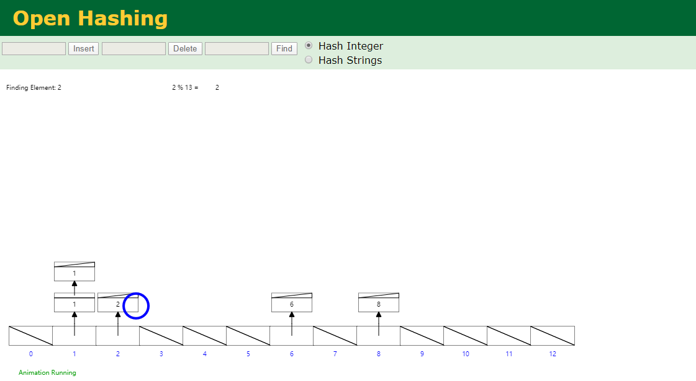
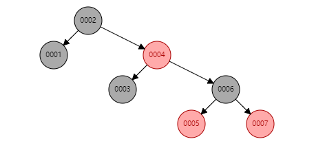
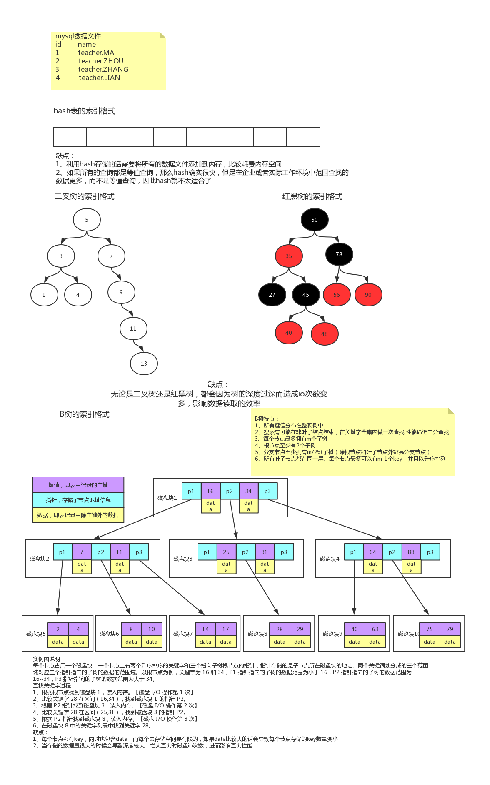
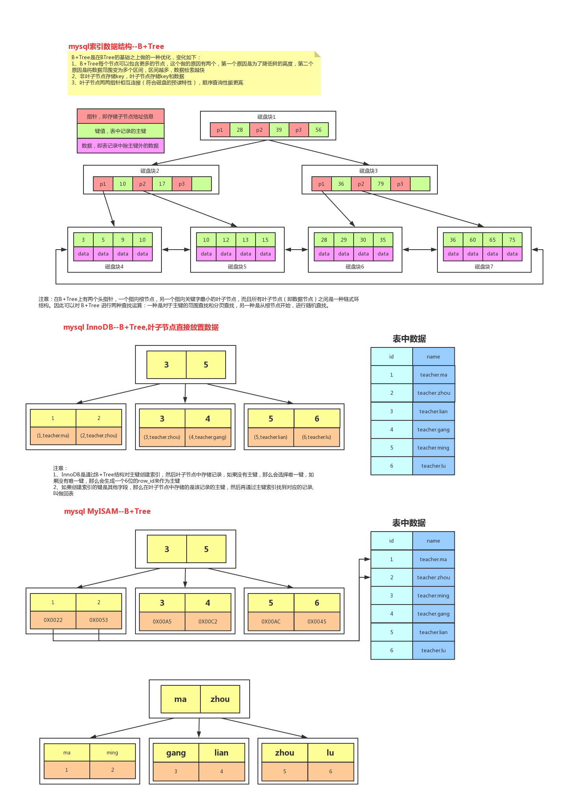
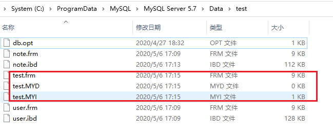
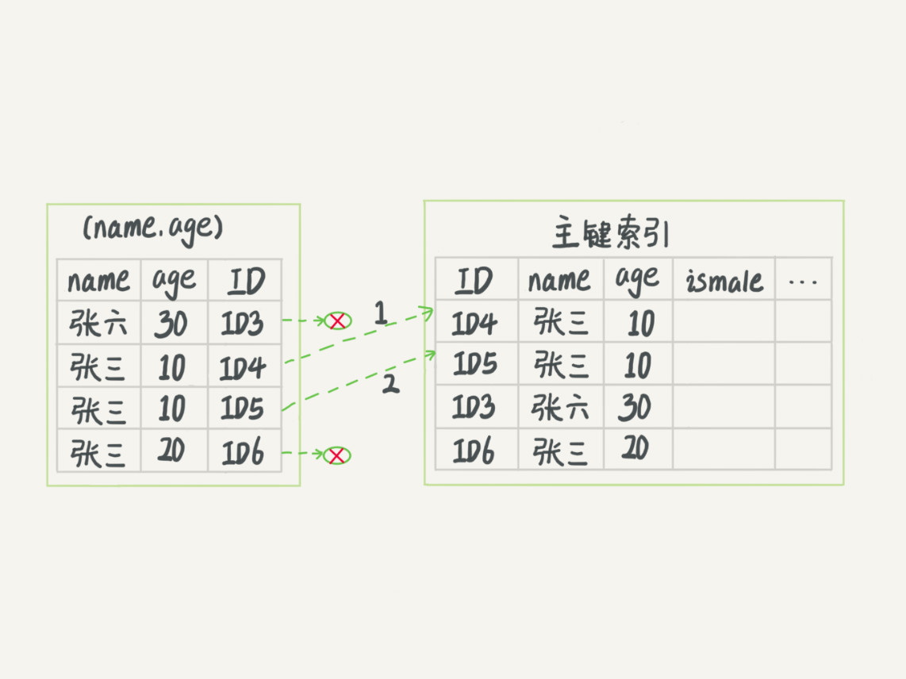
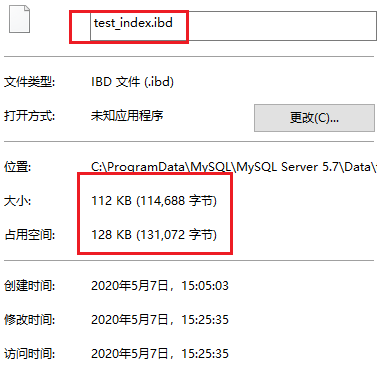
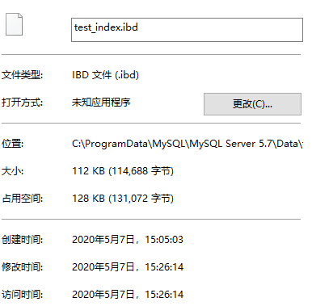
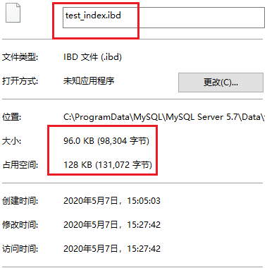

# 2 索引


## 前言

开发过程中免不了会使用到索引，今天就来和大家探讨一下数据库中的索引，便于大家能够更加了解索引、合理的设计和使用索引。


## 为什么会有索引

我们查阅东西的时候，总是会通过关键字去查询，想想如果不能通过关键字，而是要你一页一页去查询会怎么样，那还不得累死。

在我们看书的时候，书一般都会有一个目录，通过目录我们可以快速找到我们想要的章节。有了目录，我们就能够快速的查询。


**这个目录就相当于索引，这就是索引的目的，加快查询。但是有了目录我们打印书籍的时候，就得多打印几页，这就是索引额外的磁盘开销。**


## 索引的常见模型

在了解索引的好处后，我们来看看索引的模型。我们知道，数据最终是要存储的，那么索引又是如何存储的呢？了解索引的存储模型，有利于我们合理设计索引。


我们常见的基本数据类型，例如：int、long等都是存储简单的数据的。而要存储庞大的数据，就需要一种特殊的数据结构，树或Hash。

对于数据结构感兴趣的，可以看这个可视化的数据结构网站：https://www.cs.usfca.edu/~galles/visualization/Algorithms.html


比较常见的索引数据类型：

- Hash
- B+Tree


**索引数据结构选择**


说明，以下图是通过https://www.cs.usfca.edu/~galles/visualization/Algorithms.html制作的。


**索引必须是有序**，现在我们希望有一种数据结构，能够减少磁盘读取，而且又能快速查询，支持范围查询。


### 1、Hash

Hash是利用了数组快速查询的特点，但缺点是**不能范围查询，不能排序**， 并且数据重复会产生链表。




### 3、红黑树

红黑树比起二叉树，改进的一点就是会自动平衡，提高查询性能。**红黑树变色目的，减少自旋次数，自旋影响插入效率。**( 每一条路径，**黑节点的个数**是一样的)

但是由于数据量上来时，还是会导致树太高。





### 4、B Trees

与前面不同的是，B Trees是一个N叉树，这样就有效减少了我们磁盘的读取次数。

缺点是：

1. 每个节点都有key，同时也有data。**而每个页存储空间是有限的**，如果data比较大的话会导致每个节点存储的key数量变小
2. （磁盘扫描的时候，都是以4kb为单位进行扫描，我们在查看文件属性的时候，可以看到是一个**大小**，还有一个是**占用空间**）

2. 当存储的数据量很大的时候，同样会导致深度较大，增加查询时磁盘IO次数，影响性能。



### 5、B+ Trees

B+ Trees是对B Trees的改进，**非叶子节点不存data，增加存储空间，降低树的高度**，可以看到，每个叶子节点都指向相邻的叶子节点的地址（顺序查询性能更高）。





B+Trees是BTrees的一种变种。B+Trees和BTrees的不同主要在于：

- B+Tree中的非叶子结点不存储数据，只存储键值；
- B+Tree的叶子结点没有指针，所有键值都会出现在叶子结点上，且key存储的键值对应data数据的物理地址；
- B+Tree的每个非叶子节点由n个键值key和n个指针point组成；


## MySQL索引知识点介绍


### 索引分类

主键索引、唯一索引、普通索引、全文索引、联合索引


### 索引合并、索引列分裂和页合并

InnoDB存储引擎是采用聚簇索引的，每个节点都保存了该主键所对应行的数据，假设插入数据的主键是自增长的，那么根据二叉树算法会很快的把该数据添加到某个节点下，而其他的节点不用动；但是如果插入的是不规则的数据，那么每次插入都会改变二叉树之前的数据状态。从而导致了页分裂。


### 聚簇索引和非聚簇索引、 唯一索引和普通索引、二级索引

- 聚簇索引：不是单独的索引类型，而是指数据存储方式。叶子节点**存的是整行数据**。在 InnoDB 里，主键索引用的是聚簇索引的方式（clustered index）。 
- 非聚簇索引：叶子节点**内容是主键的值**，不直接存储数据。
- 在 InnoDB 里，非主键索引也被称为**二级索引**（secondary index）。


InnoDB 采用聚集(聚簇)索引，MyISAM 采用非聚集索引。我们也可以通过下图MySQL的数据存储划分结果得知。

说明：.frm是表的结构定义，在MyISAM中，MYD是数据的存储，MYI是索引的存储。在InnoDB中，.ibd包含了数据和索引的存储。

其实，只要看数据合索引是否存在一起，便能判断。




### 回表

我们知道，在InnoDB中采用的是聚簇索引方式，主键索引中，叶子节点存放的是所有数据。而非主键索引（二级索引）叶子节点存放的是主键的值。

假如有以下查询：

- 如果语句是 select * from T where ID=500，即主键查询方式，则只需要搜索 ID 这棵 B+ 树；
- 如果语句是 select * from T where k=5，即普通索引查询方式，则需要先搜索 k 索引树，得到 ID 的值为 500，再到 ID 索引树搜索一次。**这个过程称为回表**。


如果查询的值已经在索引上了，则不需要再回表查询。


### 联合索引 与 覆盖索引

如果所有要**查询的值**已经在索引上了，不需要再**回表**查询，则称为**覆盖索引**。


```mysql
CREATE TABLE `tuser` (
  `id` int(11) NOT NULL,
  `id_card` varchar(32) DEFAULT NULL,
  `name` varchar(32) DEFAULT NULL,
  PRIMARY KEY (`id`),
  KEY `idx_id_card_name` (`id_card`,`name`)
) ENGINE=InnoDB

-- 
 select id_card,name from tuser where id_card='xxxx'
```

**当extra有using index时，表示用到了覆盖索引**

```mysql
mysql> explain select store_id,film_id from inventory\G
*************************** 1. row ***************************
           id: 1
  select_type: SIMPLE
        table: inventory
   partitions: NULL
         type: index
possible_keys: NULL
          key: idx_store_id_film_id
      key_len: 3
          ref: NULL
         rows: 4581
     filtered: 100.00
        Extra: Using index
1 row in set, 1 warning (0.01 sec)
```


### 前缀索引

可以匹配某一列的开头部分


有时候需要索引很长的字符串，这会让索引变的大且慢，通常情况下可以使用某个列开始的部分字符串，这样大大的节约索引空间，从而提高索引效率，**但这会降低索引的选择性**，索引的选择性是指不重复的索引值和数据表记录总数的比值，范围从1/#T到1之间。索引的选择性越高则查询效率越高，因为选择性更高的索引可以让mysql在查找的时候过滤掉更多的行。

一般情况下某个列前缀的选择性也是足够高的，足以满足查询的性能，但是对应BLOB,TEXT,VARCHAR类型的列，必须要使用前缀索引，因为mysql不允许索引这些列的完整长度，使用该方法的诀窍在于要选择足够长的前缀以保证较高的选择性，通过又不能太长。


**选择合适的前缀索引**

可以通过字段 占用 总数的比例来选前缀索引的长度。我们可以先选择一个初始值，然后一个字符一个字符的增加，判断结果是否有明显变化。

如：下面5、6时差距挺大的，而选择7时候变化已经不大了，因此可以选择前缀索引长度为6

```mysql
select count(DISTINCT left(code, 5)) / count(*) from translation; -- 0.7
select count(DISTINCT left(code, 6)) / count(*) from translation; -- 0.865
select count(DISTINCT left(code, 7)) / count(*) from translation; -- 0.875
```


**创建前缀索引**

使用前缀索引后，可能会导致查询语句读数据的次数变多。使用前缀索引，定义好长度，就可以做到既节省空间，又不用额外增加太多的查询成本。 

```mysql
-- 指定索引长度
mysql> alter table translation add index idx_code(email(6));
```


### 索引下推

MySQL 5.6 引入的索引下推优化（index condition pushdown)， 可以在索引遍历过程中，**对索引中包含的字段先做判断，直接过滤掉不满足条件的记录**，减少回表次数。

```
mysql> select * from tuser where name like '张%' and age=10 and ismale=1;
```


对于user_table表，我们现在有（name,age）联合索引




InnoDB 在 (name,age) 索引内部就判断了 age 是否等于 10，对于不等于 10 的记录，直接判断并跳过。在我们的这个例子中，只需要对 ID4、ID5 这两条记录回表取数据判断，就只需要回表 2 次。


### 最左前缀原则

最左优先，使用函数不会走索引


### 强制使用索引

可以使用force index强制指定索引。但是通常不建议使用force index，因为我们无法预知业务的变化，有可能随着业务的变化不适用了，我们应该相信MySQL的优化能力。

```mysql
explain select * from itdragon_order_list force index(idx_order_levelDate) order by order_level,input_date;
```


### 删除索引 - 重建索引

**为什么表数据删掉一些，表文件大小不变？删除了索引，表文件大小还是不变？**

在InnoDB 引擎里

1. **虽然删除了表的部分记录，但是它的索引还在, 并未释放。**
2. 不论是删除主键还是创建主键，都会将整个表重建。而重新建表才能重建索引。


你可以使用以下命令重建索引

```
alter table T engine=InnoDB
```


假设我有一张 test_index 表，并建立 idx_a_b_c 联合索引

```
CREATE TABLE `test_index` (
  `id` int(11) NOT NULL,
  `a` int(32) DEFAULT NULL,
  `b` int(32) DEFAULT NULL,
  `c` int(32) DEFAULT NULL,
  PRIMARY KEY (`id`),
  KEY `idx_a_b_c` (`a`,`b`,`c`)
) ENGINE=InnoDB;

insert into test_index values(1,1,1,1);
insert into test_index values(2,2,2,2);
insert into test_index values(3,3,3,3);
insert into test_index values(4,4,4,4);
insert into test_index values(5,5,5,5);
insert into test_index values(6,6,6,6);
insert into test_index values(7,7,7,7);
insert into test_index values(8,8,8,8);
insert into test_index values(9,9,9,9);
insert into test_index values(10,10,10,10);
```


现在我们查看一下当前 test_index 表里面的数据大小




接下里，我们试着去删除数据 和 索引，发现文件大小并没有什么变化

```
DELETE from test_index;

ALTER TABLE `test_index`
DROP INDEX `idx_a_b_c`;
```



当我们执行以下语句时，文件终于变小了

```
alter table T engine=InnoDB
```




注：当DBA帮我们重建索引的时候，你会看到，有时候DBA会重新建立一张表，先关闭索引，然后把数据复制过去，现在你知道是什么原因了吧。


### 代理主键和自然主键

代理主键：与业务关务

自然主键：与业务有关


## 优化

1. **更新频繁**（删除或更新可能造成页分裂和页合并），区分度不高的，不宜建索引
2. 使用函数不会走索引
3. 区分度高的放最前面，最左前缀原则
4. 如果明确知道只有一条结果返回，limit能够提高效率（减少判断）
5. 推荐使用代理主键，自然主键与业务耦合，不适合维护


## 测试

现在我们有一张 test_index 表，为了使用范围查询，这里我将类型设置为int。

```
CREATE TABLE `test_index` (
  `id` int(11) NOT NULL,
  `a` int(32) DEFAULT NULL,
  `b` int(32) DEFAULT NULL,
  `c` int(32) DEFAULT NULL,
  PRIMARY KEY (`id`),
  KEY `idx_a_b_c` (`a`,`b`,`c`)
) ENGINE=InnoDB;

insert into test_index values(1,1,1,1);
insert into test_index values(2,2,2,2);
insert into test_index values(3,3,3,3);
insert into test_index values(4,4,4,4);
insert into test_index values(5,5,5,5);
```


**范围查询 type： range**

[range](https://dev.mysql.com/doc/refman/5.7/en/explain-output.html#jointype_range) can be used when a key column is compared to a constant using any of the [=](https://dev.mysql.com/doc/refman/5.7/en/comparison-operators.html#operator_equal), [<>](https://dev.mysql.com/doc/refman/5.7/en/comparison-operators.html#operator_not-equal), [>](https://dev.mysql.com/doc/refman/5.7/en/comparison-operators.html#operator_greater-than), [>=](https://dev.mysql.com/doc/refman/5.7/en/comparison-operators.html#operator_greater-than-or-equal), [<](https://dev.mysql.com/doc/refman/5.7/en/comparison-operators.html#operator_less-than), [<=](https://dev.mysql.com/doc/refman/5.7/en/comparison-operators.html#operator_less-than-or-equal), [IS NULL](https://dev.mysql.com/doc/refman/5.7/en/comparison-operators.html#operator_is-null), [<=>](https://dev.mysql.com/doc/refman/5.7/en/comparison-operators.html#operator_equal-to), [BETWEEN](https://dev.mysql.com/doc/refman/5.7/en/comparison-operators.html#operator_between), [LIKE](https://dev.mysql.com/doc/refman/5.7/en/string-comparison-functions.html#operator_like), or [IN()](https://dev.mysql.com/doc/refman/5.7/en/comparison-operators.html#operator_in) operators:

```
mysql> explain select * from test_index where a > 1 and b > 2;
+----+-------------+------------+------------+-------+---------------+-----------+---------+------+------+----------+--------------------------+
| id | select_type | table      | partitions | type  | possible_keys | key       | key_len | ref  | rows | filtered | Extra                    |
+----+-------------+------------+------------+-------+---------------+-----------+---------+------+------+----------+--------------------------+
|  1 | SIMPLE      | test_index | NULL       | range | idx_a_b_c     | idx_a_b_c | 5       | NULL |    4 |    33.33 | Using where; Using index |
+----+-------------+------------+------------+-------+---------------+-----------+---------+------+------+----------+--------------------------+
1 row in set (0.04 sec)
```


**最左优先 type：index**

```
mysql> explain select * from test_index where b = 2;
+----+-------------+------------+------------+-------+---------------+-----------+---------+------+------+----------+--------------------------+
| id | select_type | table      | partitions | type  | possible_keys | key       | key_len | ref  | rows | filtered | Extra                    |
+----+-------------+------------+------------+-------+---------------+-----------+---------+------+------+----------+--------------------------+
|  1 | SIMPLE      | test_index | NULL       | index | NULL          | idx_a_b_c | 15      | NULL |    5 |    20.00 | Using where; Using index |
+----+-------------+------------+------------+-------+---------------+-----------+---------+------+------+----------+--------------------------+
1 row in set (0.04 sec)
```


**idx_a_b_c索引中b出现范围查询**

```
mysql> explain select * from test_index where a = 2 and b > 1 and c = 2;
+----+-------------+------------+------------+-------+---------------+-----------+---------+------+------+----------+--------------------------+
| id | select_type | table      | partitions | type  | possible_keys | key       | key_len | ref  | rows | filtered | Extra                    |
+----+-------------+------------+------------+-------+---------------+-----------+---------+------+------+----------+--------------------------+
|  1 | SIMPLE      | test_index | NULL       | range | idx_a_b_c     | idx_a_b_c | 10      | NULL |    1 |    20.00 | Using where; Using index |
+----+-------------+------------+------------+-------+---------------+-----------+---------+------+------+----------+--------------------------+
1 row in set (0.05 sec)
```


**and时，前后顺序无关，MySQL优化器会进行优化**

**唯一索引对应的type是const**，通过索引一次就可以找到结果，普通索引对应的type是ref，表示非唯一性索引赛秒，找到值还要进行扫描，直到将索引文件扫描完为止，显而易见，const的性能要高于ref

```
mysql> explain select * from test_index where a = 2 and b = 2;
+----+-------------+------------+------------+------+---------------+-----------+---------+-------------+------+----------+-------------+
| id | select_type | table      | partitions | type | possible_keys | key       | key_len | ref         | rows | filtered | Extra       |
+----+-------------+------------+------------+------+---------------+-----------+---------+-------------+------+----------+-------------+
|  1 | SIMPLE      | test_index | NULL       | ref  | idx_a_b_c     | idx_a_b_c | 10      | const,const |    1 |   100.00 | Using index |
+----+-------------+------------+------------+------+---------------+-----------+---------+-------------+------+----------+-------------+
1 row in set (0.04 sec)

mysql> explain select * from test_index where b = 2 and a = 2;
+----+-------------+------------+------------+------+---------------+-----------+---------+-------------+------+----------+-------------+
| id | select_type | table      | partitions | type | possible_keys | key       | key_len | ref         | rows | filtered | Extra       |
+----+-------------+------------+------------+------+---------------+-----------+---------+-------------+------+----------+-------------+
|  1 | SIMPLE      | test_index | NULL       | ref  | idx_a_b_c     | idx_a_b_c | 10      | const,const |    1 |   100.00 | Using index |
+----+-------------+------------+------------+------+---------------+-----------+---------+-------------+------+----------+-------------+
1 row in set (0.05 sec)
```


## 选读 - EXPLAIN Output Format（Query Execution Plan）


参考：https://dev.mysql.com/doc/refman/5.7/en/explain-output.html#explain_rows

示例说明：[MySQLl执行计划.md](MySQLl执行计划.md)


- The EXPLAIN statement provides information about how MySQL executes statements:
- EXPLAIN works with SELECT, DELETE, INSERT, REPLACE, and UPDATE statements.


一般来说，得保证查询至少达到range级别，最好能达到ref。**一张表一次查询最多用到一个索引。**


| id            | SELECT的查询序列号                                           |
| ------------- | ------------------------------------------------------------ |
| select_type   | SELECT类型 <br />SIMPLE: 简单SELECT(不使用UNION或子查询) <br />PRIMARY: **最外面的SELECT** <br />UNION: UNION中的第二个或后面的SELECT语句 <br />DEPENDENT UNION: UNION中的第二个或后面的SELECT语句，取决于外面的查询 <br />UNION RESULT: UNION 的结果 <br />SUBQUERY: 子查询中的第一个SELECT <br />DEPENDENT SUBQUERY: 子查询中的第一个SELECT,取决于外面的查询 <br />DERIVED: 派生表(FROM子句的子查询，derived: 派生) <br />MATERIALIZED: 被物化的子查询 <br />UNCACHEABLE SUBQUERY: 一个子查询，其结果不能被缓存，必须为外部查询的每一行重新计算 <br />UNCACHEABLE UNION: UNION操作中，内层的不可被物化的子查询(类似于UNCACHEABLE SUBQUERY) |
| table         | 表名                                                         |
| partitions    | 分区                                                         |
| type          | 联表类型(join tyep)下面按照从 最佳类型 到 最坏类型 进行排序: <br />system: 表仅有一行(=系统表)。这是const联接类型的一个特例 <br />const: **表最多有一个匹配行**，该行在查询开始时读取。因为只有一行，所以该行中列的值可以被优化器的**其余部分视为常量**。const表非常快，因为它们只读取一次  <br />eq_ref: 对于每个来自于前面的表的行组合，从该表中读取一行。这可能是最好的联接类型，除了const类型 <br />ref: 对于每个来自于前面的表的行组合，所有有匹配索引值的行将从这张表中读取 fulltext: 执行FULLTEXT索引 <br />ref_or_null: 该联接类型如同ref，但是添加了MySQL可以专门搜索包含NULL值的行 <br />index_merge: 该联接类型表示使用了索引合并优化方法 <br />unique_subquery: 该类型替换了下面形式的IN子查询的<br />eq_ref: value IN (SELECT primary_key FROM single_table WHERE some_expr) unique_subquery是一个索引查找函数，可以完全替换子查询，效率更高 <br />index_subquery: 该联接类型类似于unique_subquery。可以替换IN子查询，但只适合下列形式的子查询中的非唯一索引: value IN (SELECT key_column FROM single_table WHERE some_expr) <br />range: 只检索给定范围内的行，使用一个索引来选择行 <br />index: 该联接类型与ALL相同，除了只有索引树被扫描。这通常比ALL快，因为索引文件通常比数据文件小 <br />ALL: 对于每个来自于先前的表的行组合，进行全表扫描 |
| possible_keys | MySQL可以使用哪个索引，但并不一定会使用 (查看表中包含的索引：SHOW INDEX FROM **tbl_name**.) |
| key           | 显示MySQL实际决定使用的键(索引)。如果没有选择索引，键是NULL  |
| key_len       | 显示MySQL决定使用的键长度。如果键是NULL，则长度为NULL        |
| ref           | 显示使用哪个列或常数与key一起从表中选择行                    |
| rows          | 显示MySQL认为它执行查询时必须检查的行数。多行之间的数据相乘可以估算要处理的行数。 |
| filtered      | 显示了通过条件过滤出的行数的百分比估计值                     |
| Extra         | MySQL解决查询的详细信息 <br />Distinct: MySQL发现第1个匹配行后，停止为当前的行组合搜索更多的行 <br />Not exists: MySQL能够对查询进行LEFT JOIN优化，发现1个匹配LEFT JOIN标准的行后，不再为前面的的行组合在该表内检查更多的行 range checked for each record (index map: #): MySQL没有发现好的可以使用的索引，但发现如果来自前面的表的列值已知，可能部分索引可以使用 <br />Using filesort: MySQL需要额外的一次传递，以找出如何按排序顺序检索行 <br />Using index: 从只使用索引树中的信息而不需要进一步搜索读取实际的行来检索表中的列信息 <br />Using temporary: 为了解决查询，MySQL需要创建一个临时表来容纳结果 <br />Using where: WHERE 子句用于限制哪一个行匹配下一个表或发送到客户 <br />Using sort_union(...), Using union(...), Using intersect(...): 这些函数说明如何为index_merge联接类型合并索引扫描 <br />Using index for group-by: 类似于访问表的Using index方式，Using index for group-by表示MySQL发现了一个索引，可以用来查询GROUP BY 或 DISTINCT查询的所有列，而不要额外搜索硬盘访问实际的表 |


