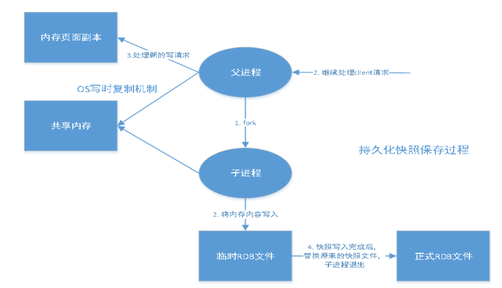
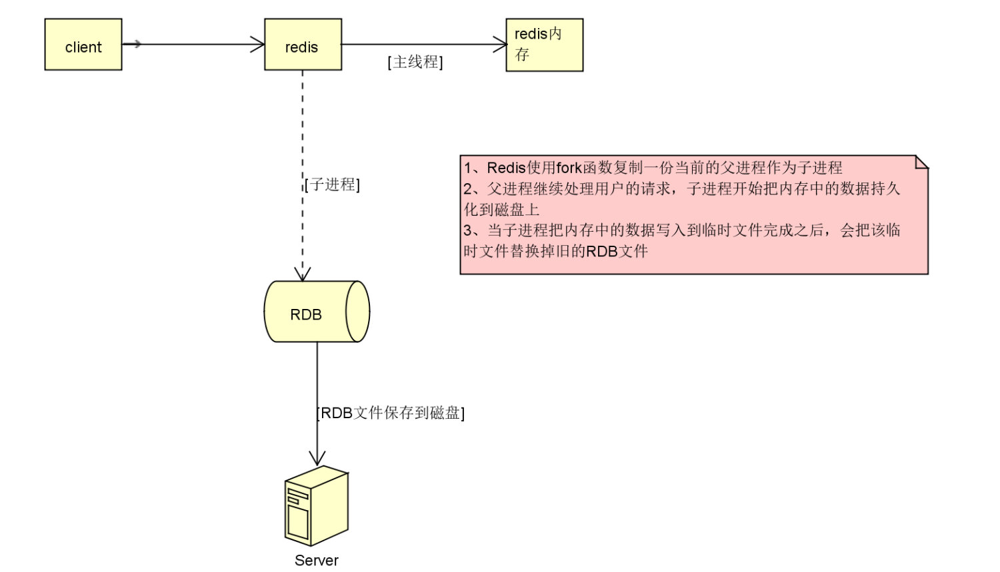

# Redis

**Redis**使⽤单线程的多路 **IO** 复⽤模型。


## 1 Redis常用命令

见 4 Redis常用命令


## 2 Redis分区

哈希分区

另外一种分区方法是hash分区。这对任何key都适用，也无需是object_name:这种形式，像下面描述的一样简单：

- 用一个hash函数将key转换为一个数字，比如使用crc32 hash函数。对key foobar执行crc32(foobar)会输出类似93024922的整数。
- 对这个整数取模，将其转化为0-3之间的数字，就可以将这个整数映射到4个Redis实例中的一个了。93024922 % 4 = 2，就是说key foobar应该被存到R2实例中。注意：取模操作是取除的余数，通常在多种编程语言中用%操作符实现。


## 3 持久化

- RDB：全量记录，适合冷备份
- AOF(Append-Only)：记录每次的操作，适合热备份

默认是不开启AOF，如果同时开启，Redis优先加载AOF，因为AOF文件更具有完整性


### RDB(Redis DataBase)

原理：fork  和 cow(copy on write)


fork是指redis通过创建子进程来进行RDB操作；

cow指的是，子进程创建后，父子进程共享数据段，父进程继续提供读写服务，写脏的页面数据会逐渐和子进程分离开来。


流程：

1.redis调用系统的fork()函数创建一个子进程

2.子进程将数据集写入一个临时的RDB文件

3.当子进程完成对临时的RDB文件的写入时，redis用新的RDB文件来替换原来旧的RDB文件，并删除旧的RDB文件。


redis在进行快照的过程中不会对RDB文件进行修改，只有快照结束后才会将旧快照替换成新快照，也就是说任何时候RDB文件都是完整的。







触发条件：

1. 满足save规则
2. 执行flushall
3. 退出redis


### AOF

原理：AOF通过 glibc 提供的 fsync(int fd) 函数来将每条写的命令 强制从内核缓存刷到磁盘

默认：每隔1s


Redis中的数据是有一定数量的，不可能说redis中的数据无限增长，进而导致AOF文件无限增长。内存的大小是一定的，等到了一定大小redis会采用淘汰策略，自动将内存中的数据清除掉。

AOF是存放每条写命令的，所以会不断的增大，当大到一定程度时，AOF会做rewrite操作，rewrite操作就是基于当时redis的数据重新构造一个小的AOF文件，然后将大的AOF文件删除。


修复AOF文件

```
$ redis-check-aof --fix appendonly.aof
```


缺点：

- 相对于数据文件来说，AOF文件远远大于RDB，修复速度也比RDB慢
- AOF运行效率比RDB慢，所以Redis默认配置的是RDB


**内存淘汰机制（MaxMemory-policy）-LRU**

```
# Evict: 移除的意思
# volatile-lru -> 使用LRU算法移除key，只对设置了过期时间的键
# allkeys-lru -> 使用LRU移除key
# volatile-lfu -> 使用LFU算法移除key，只对设置了过期时间的键
# allkeys-lfu -> 使用LFU移除key
# volatile-random -> 在过期集合中移除随机的key，只对设置了过期时间的key
# allkeys-random -> 在过期集合中移除随机的key
# volatile-ttl -> 移除TTL值最小的key，即最近要过期的key
# noeviction -> 不移除，返回错误
```


## 4 集群-哨兵

集群的部署：Redis cluster

主从同步，读写分离，master写，slave复制读。最低配置三个Redis服务器，一主二从

Redis cluster 支撑 N 个 Redis master node，每个master node都可以挂载多个 slave node


- Redis Sentinal着眼于高可用，在master宕机时会自动将slave提升为master，继续提供服务。
- Redis Cluster着眼于扩展性，在单个redis内存不足时，使用Cluster进行分片存储。


哨兵组件的主要功能：

- 集群监控：负责监控 Redis master 和 slave 进程是否正常工作。
- 消息通知：如果某个 Redis 实例有故障，那么哨兵负责发送消息作为报警通知给管理员。
- 故障转移：如果 master node 挂掉了，会自动转移到 slave node 上。
- 配置中心：如果故障转移发生了，通知 client 客户端新的 master 地址。
- 负载均衡


### 主从复制

步骤一：

新增配置文件， redis-6380.conf 、redis-6381.conf 、redis-6382.conf

```
akane@ubuntu:/etc/redis$ ll
total 256
drwxr-xr-x   2 root  root   4096 May 26 08:46 ./
drwxr-xr-x 125 root  root  12288 May 24 18:17 ../
-rw-r--r--   1 root  root      0 May 26 08:46 appendonly.aof
-rw-r-----   1 root  root  58834 May 26 08:46 redis-6380.conf
-rw-r-----   1 root  root  58834 May 26 08:45 redis-6381.conf
-rw-r-----   1 root  root  58834 May 26 08:45 redis-6382.conf
-rw-r-----   1 redis redis 58834 May 26 08:45 redis.conf
```

步骤二：

配置从机(redis-6380.conf 、redis-6381.conf 、redis-6382.conf)，修改Redis配置文件，修改内容为

```
port
pidfile
logfile "6379.log"
dbfilename dump6379.rdb
slaveof 127.0.0.1 6379

例如：
 port 6380
 pidfile /var/run/redis/redis-server-6380.pid
logfile /var/log/redis/redis-server-6380.log
dbfilename dump-6380.rdb
slaveof 127.0.0.1 6379
```

步骤三：

启动和 连接服务

```
启动，可以指定配置文件
akane@ubuntu:/usr/bin$ redis-server /etc/redis/redis-6380.conf
akane@ubuntu:/usr/bin$ redis-server /etc/redis/redis-6381.conf
akane@ubuntu:/usr/bin$ redis-server /etc/redis/redis-6382.conf

查看启动状态
akane@ubuntu:/usr/bin$ ps -ef | grep redis
akane      3181   1846  0 08:21 ?        00:00:03 redis-server *:6379
root       3506   1846  0 08:46 ?        00:00:02 redis-server 127.0.0.1:6380
akane      3642   2335  0 09:06 pts/0    00:00:00 redis-cli
akane      3753   3544  0 09:21 pts/4    00:00:00 redis-cli -p 6380
root       3777   1846  0 09:22 ?        00:00:00 redis-server 127.0.0.1:6381
root       3784   1846  0 09:22 ?        00:00:00 redis-server 127.0.0.1:6382
akane      3796   3396  0 09:23 pts/1    00:00:00 grep --color=auto redis

连接，本机可以直接指定端口即可
akane@ubuntu:/etc/redis$ redis-cli -p 6379
127.0.0.1:6379> 
akane@ubuntu:/etc/redis$ redis-cli -p 6380
127.0.0.1:6380> 
akane@ubuntu:/etc/redis$ redis-cli -p 6381
127.0.0.1:6381>
akane@ubuntu:/etc/redis$ redis-cli -p 6382
127.0.0.1:6382>  
```

查看当前节点信息

```
127.0.0.1:6379> info replication
# Replication
role:master
connected_slaves:0
master_replid:c6c595f314061ae7dc5132f89f9aa7eea999dc0f
master_replid2:0000000000000000000000000000000000000000
master_repl_offset:0
second_repl_offset:-1
repl_backlog_active:0
repl_backlog_size:1048576
repl_backlog_first_byte_offset:0
repl_backlog_histlen:0
```

步骤四：

```
akane@ubuntu:/etc/redis$ redis-cli -p 6380
从机使用slaveof命令配置
127.0.0.1:6380> slaveof 127.0.0.1 6379 
OK
127.0.0.1:6380> info replication
# Replication
role:slave
master_host:127.0.0.1
master_port:6379
master_link_status:down
master_last_io_seconds_ago:-1
master_sync_in_progress:0
slave_repl_offset:0
master_link_down_since_seconds:1590510374
slave_priority:100
slave_read_only:1
connected_slaves:0
master_replid:7b9e1bd416dc568947c8ccc4bd1c8789bf0f63af
master_replid2:0000000000000000000000000000000000000000
master_repl_offset:0
second_repl_offset:-1
repl_backlog_active:0
repl_backlog_size:1048576
repl_backlog_first_byte_offset:0
repl_backlog_histlen:0
127.0.0.1:6380> 
```

步骤五：查看当前节点信息

```
主机

从机
127.0.0.1:6380> info replication
# Replication
role:slave
master_host:127.0.0.1
master_port:6379
master_link_status:down
master_last_io_seconds_ago:-1
master_sync_in_progress:0
slave_repl_offset:0
master_link_down_since_seconds:1590510374
slave_priority:100
slave_read_only:1
connected_slaves:0
master_replid:7b9e1bd416dc568947c8ccc4bd1c8789bf0f63af
master_replid2:0000000000000000000000000000000000000000
master_repl_offset:0
second_repl_offset:-1
repl_backlog_active:0
repl_backlog_size:1048576
repl_backlog_first_byte_offset:0
repl_backlog_histlen:0
127.0.0.1:6380> info replication
# Replication
role:slave
master_host:127.0.0.1
master_port:6379
master_link_status:down
master_last_io_seconds_ago:-1
master_sync_in_progress:0
slave_repl_offset:0
master_link_down_since_seconds:1590544136
slave_priority:100
slave_read_only:1
connected_slaves:0
master_replid:7b9e1bd416dc568947c8ccc4bd1c8789bf0f63af
master_replid2:0000000000000000000000000000000000000000
master_repl_offset:0
second_repl_offset:-1
repl_backlog_active:0
repl_backlog_size:1048576
repl_backlog_first_byte_offset:0
repl_backlog_histlen:0
```

其他

```
从机不能写
127.0.0.1:6380> set k3 v3
(error) READONLY You can't write against a read only slave.


可以使用slaveof no one 使从机变成主机
```


主机断开，从机依然可以连接到主机，但是没有写操作。主机连接回来后，从机依然可以直接获取主机写的信息。

从机断开，如果使用命令slaveof 127.0.0.1 6379配置的，重启后默认是master。但只要变为从，也能立即从主机中获取数据。


### 哨兵模式

自动将从库转换为主库

步骤一：

新建配置文件sentinel.conf，配置内容

```
#sentinel monitor 被监控的名称 host port 法定人数，达到多少票才能故障转移
sentinel monitor myredis 127.0.0.1 6379 2
```


步骤二：

启动哨兵

```
redis-sentinel /etc/redis/sentinel.conf
或
redis-server /etc/redis/sentinel.conf --sentinel
```

- 如果主机断开了，会进行故障转移(failover)，进行投票选举
- 如果主机重新连接，只能作为从机


一主二从三哨兵

```
D:\Foobar\Redis-x64-3.0.504>redis-server.exe sentinel-26380.conf --sentinel
                _._
           _.-``__ ''-._
      _.-``    `.  `_.  ''-._           Redis 3.0.504 (00000000/0) 64 bit
  .-`` .-```.  ```\/    _.,_ ''-._
 (    '      ,       .-`  | `,    )     Running in sentinel mode
 |`-._`-...-` __...-.``-._|'` _.-'|     Port: 26380
 |    `-._   `._    /     _.-'    |     PID: 97508
  `-._    `-._  `-./  _.-'    _.-'
 |`-._`-._    `-.__.-'    _.-'_.-'|
 |    `-._`-._        _.-'_.-'    |           http://redis.io
  `-._    `-._`-.__.-'_.-'    _.-'
 |`-._`-._    `-.__.-'    _.-'_.-'|
 |    `-._`-._        _.-'_.-'    |
  `-._    `-._`-.__.-'_.-'    _.-'
      `-._    `-.__.-'    _.-'
          `-._        _.-'
              `-.__.-'

[97508] 29 May 10:47:11.985 # Sentinel runid is aa62f287c6f9f50eb606d15808bf110464709564
[97508] 29 May 10:47:11.985 # +monitor master mymaster 127.0.0.1 6379 quorum 2
[97508] 29 May 10:47:12.987 * +slave slave 127.0.0.1:6380 127.0.0.1 6380 @ mymaster 127.0.0.1 6379
[97508] 29 May 10:47:12.988 * +slave slave 127.0.0.1:6381 127.0.0.1 6381 @ mymaster 127.0.0.1 6379
[97508] 29 May 10:47:13.219 * +sentinel sentinel 127.0.0.1:26379 127.0.0.1 26379 @ mymaster 127.0.0.1 6379
[97508] 29 May 10:47:48.130 * +sentinel sentinel 127.0.0.1:26381 127.0.0.1 26381 @ mymaster 127.0.0.1 6379
[97508] 29 May 10:51:36.677 # +sdown master mymaster 127.0.0.1 6379
[97508] 29 May 10:51:36.777 # +odown master mymaster 127.0.0.1 6379 #quorum 2/2
[97508] 29 May 10:51:36.777 # +new-epoch 1
[97508] 29 May 10:51:36.777 # +try-failover master mymaster 127.0.0.1 6379
[97508] 29 May 10:51:36.779 # +vote-for-leader aa62f287c6f9f50eb606d15808bf110464709564 1
[97508] 29 May 10:51:36.781 # 127.0.0.1:26381 voted for aa62f287c6f9f50eb606d15808bf110464709564 1
[97508] 29 May 10:51:36.838 # +elected-leader master mymaster 127.0.0.1 6379
[97508] 29 May 10:51:36.838 # +failover-state-select-slave master mymaster 127.0.0.1 6379
[97508] 29 May 10:51:36.892 # +selected-slave slave 127.0.0.1:6381 127.0.0.1 6381 @ mymaster 127.0.0.1 6379
[97508] 29 May 10:51:36.892 * +failover-state-send-slaveof-noone slave 127.0.0.1:6381 127.0.0.1 6381 @ mymaster 127.0.0.1 6379
[97508] 29 May 10:51:36.994 * +failover-state-wait-promotion slave 127.0.0.1:6381 127.0.0.1 6381 @ mymaster 127.0.0.1 6379
[97508] 29 May 10:51:37.823 # +promoted-slave slave 127.0.0.1:6381 127.0.0.1 6381 @ mymaster 127.0.0.1 6379
[97508] 29 May 10:51:37.823 # +failover-state-reconf-slaves master mymaster 127.0.0.1 6379
[97508] 29 May 10:51:37.881 * +slave-reconf-sent slave 127.0.0.1:6380 127.0.0.1 6380 @ mymaster 127.0.0.1 6379
[97508] 29 May 10:51:38.842 * +slave-reconf-inprog slave 127.0.0.1:6380 127.0.0.1 6380 @ mymaster 127.0.0.1 6379
[97508] 29 May 10:51:38.898 # -odown master mymaster 127.0.0.1 6379
[97508] 29 May 10:51:39.851 * +slave-reconf-done slave 127.0.0.1:6380 127.0.0.1 6380 @ mymaster 127.0.0.1 6379
[97508] 29 May 10:51:39.912 # +failover-end master mymaster 127.0.0.1 6379
[97508] 29 May 10:51:39.912 # +switch-master mymaster 127.0.0.1 6379 127.0.0.1 6381
[97508] 29 May 10:51:39.913 * +slave slave 127.0.0.1:6380 127.0.0.1 6380 @ mymaster 127.0.0.1 6381
[97508] 29 May 10:51:39.914 * +slave slave 127.0.0.1:6379 127.0.0.1 6379 @ mymaster 127.0.0.1 6381
[97508] 29 May 10:52:06.815 # +sdown sentinel 127.0.0.1:26379 127.0.0.1 26379 @ mymaster 127.0.0.1 6381
[97508] 29 May 10:52:09.935 # +sdown slave 127.0.0.1:6379 127.0.0.1 6379 @ mymaster 127.0.0.1 6381
```


步骤三

查看哨兵和从机状态

```
127.0.0.1:6379> info sentinel
127.0.0.1:6379> info replication
```


### 集群

尽管可以使用哨兵主从集群实现可用性保证，但是这种实现方式每个节点的数据都是**全量复制**，数据存放量存在着局限性，**受限于内存最小的节点**，因此考虑采用数据**分片**的方式，来实现存储，这个就是redis-cluster。(redis5才开始支持redis-cluster)

https://blog.csdn.net/qq_20597727/article/details/83385737


步骤一

cluster-6379

```
cluster-enabled yes
cluster-node-timeout 15000
cluster-config-file nodes-6379.conf
```

cluster-6378

```
include ./cluster-6379.conf
port 6380
pidfile redis-server-6380.pid
logfile redis-server-6380.log
dbfilename dump-6380.rdb
cluster-config-file nodes-6379.conf
```


步骤二

```
redis-server cluster-6379.conf
redis-server cluster-6380.conf
redis-server cluster-6381.conf
redis-server cluster-6382.conf
redis-server cluster-6383.conf
redis-server cluster-6384.conf

// 1代表为每个创建的主服务器节点创建一个从服务器节点
redis-cli --cluster create 127.0.0.1:6379 127.0.0.1:6380 127.0.0.1:6381 127.0.0.1:6382 127.0.0.1:6383--cluster-replicas 1

// cluster info（查看集群信息）、cluster nodes（查看节点列表）
redis-cli --cluster info 127.0.0.1:6379
redis-cli --cluster help
```


## 5 Redis 的线程模型

Redis 内部使用文件事件处理器 file event handler，这个文件事件处理器是单线程的，所以 Redis 才叫做单线程的模型。它采用 IO 多路复用机制同时监听多个 Socket，根据 Socket 上的事件来选择对应的事件处理器进行处理。

文件事件处理器的结构包含 4 个部分：

- 多个 Socket
- IO 多路复用程序
- 文件事件分派器
- 事件处理器（连接应答处理器、命令请求处理器、命令回复处理器）

多个 Socket 可能会并发产生不同的操作，每个操作对应不同的文件事件，但是 IO 多路复用程序会监听多个 Socket，会将 Socket 产生的事件放入队列中排队，事件分派器每次从队列中取出一个事件，把该事件交给对应的事件处理器进行处理。


## 6 SpringBoot集成Redis


SpringBoot2.x已经将jedis改成了lettuce，见spring-boot-starter-data-redis

- Jedis：采用直连，多个线程操作时是不安全的。如果要避免不安全，要使用jedis pool，更像BIO模式
- luttuce：采用netty，实例有再多个线程中共享，不存在线程不安全问题。可以减少线程数据，更像NIO模式


自动配置org.springframework.boot.autoconfigure.data.redis.RedisAutoConfiguration


### 序列化

```
public class RedisTemplate<K, V> extends RedisAccessor implements RedisOperations<K, V>, BeanClassLoaderAware {
    private boolean enableTransactionSupport = false;
    private boolean exposeConnection = false;
    private boolean initialized = false;
    private boolean enableDefaultSerializer = true;
    @Nullable
    private RedisSerializer<?> defaultSerializer;
    @Nullable
    private ClassLoader classLoader;
    @Nullable
    private RedisSerializer keySerializer = null;
    @Nullable
    private RedisSerializer valueSerializer = null;
    @Nullable
    private RedisSerializer hashKeySerializer = null;
    @Nullable
    private RedisSerializer hashValueSerializer = null;
    private RedisSerializer<String> stringSerializer = RedisSerializer.string();
    
    public void afterPropertiesSet() {
    super.afterPropertiesSet();
    boolean defaultUsed = false;
    // 默认序列化
    if (this.defaultSerializer == null) {
        this.defaultSerializer = new JdkSerializationRedisSerializer(this.classLoader != null ? this.classLoader : this.getClass().getClassLoader());
    }
```


## 7 生成自增的序列

以id+日期作为key，设置自增，这样就可以每天从0开始生成自增的序列了


## 推荐阅读

- [Redis中文网](http://www.redis.cn/documentation.html)
- [Redis开发与运维](https://github.com/AkaneMurakawa/awesome-programming-books/blob/master/redis/Redis开发与运维.pdf)
- [菜鸟教程-Redis](https://www.runoob.com/redis/redis-tutorial.html)
- [狂神说Java-Redis最新超详细版教程通俗易懂](https://www.bilibili.com/video/BV1S54y1R7SB?p=1)
- [妈妈再也不担心我面试被Redis问得脸都绿了](https://www.cnblogs.com/wmyskxz/p/12568926.html#_label2_1)


## 后记

要想深入了解Redis，光是了解这些肯定是不够的。这里只是引个例子，当我们想学习一门知识的时候，如何去学习。在这里，主要的学习过程是：

1. 了解Redis是什么
2. Redis的使用，包括基本的命令和企业级的开发
3. 深入阅读Redis的配置，要想使用好Redis，那就要好好阅读其配置
4. 有能力，可以阅读Redis官网，那里有更详细的解释
5. 源码阅读，下载Redis的源码，我们可以看到Redis其实是C语言编写的，如果有兴趣，我们还可以看看Redis是如何实现