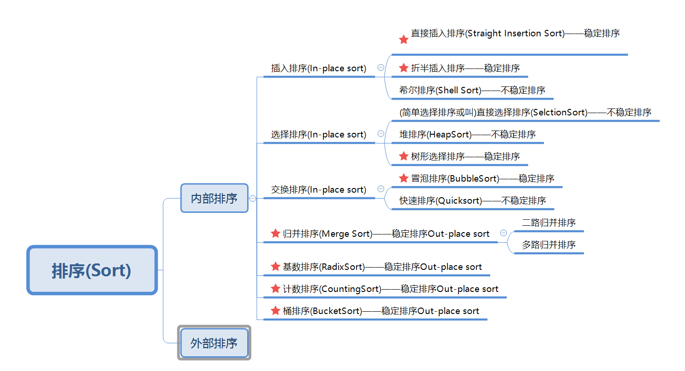
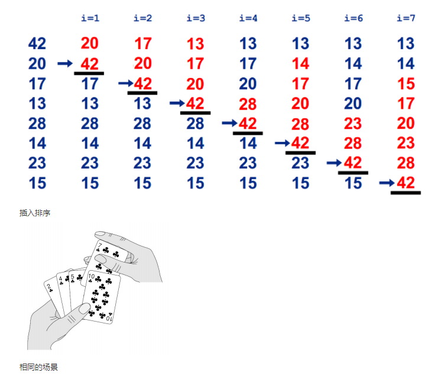
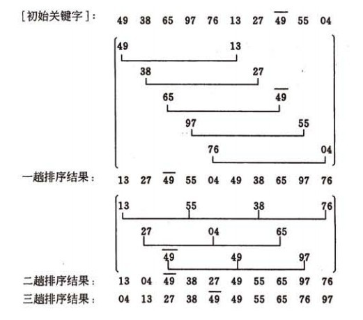
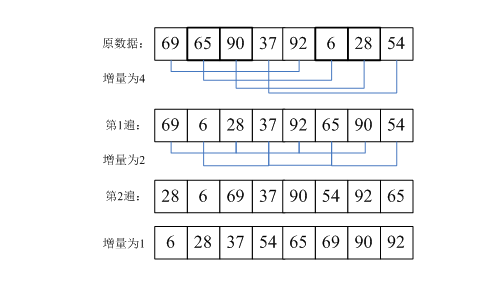
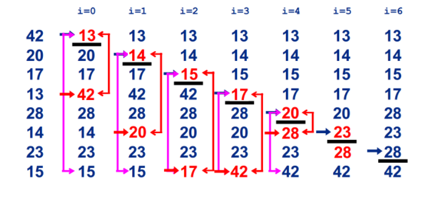
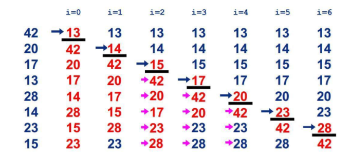
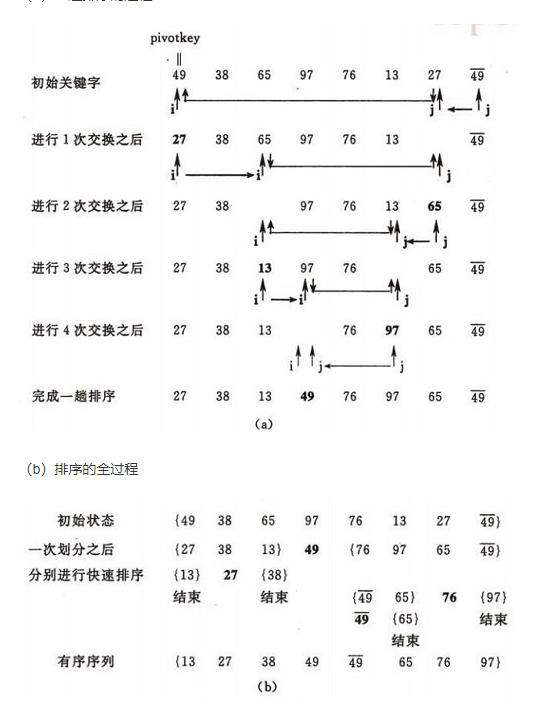
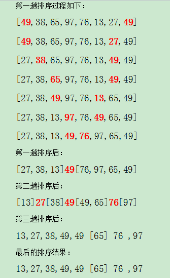

# 排序算法总结一

排序(Sort/Sequence)，是计算机内经常进行的一种操作，其目的是将一组"无序"的记录序列调整为"有序"的记录序列。使一串记录，按照其中的某个或某些关键字的大小，递增或递减的排列起来的操作。

排序的目的：便于查找！！！
排序算法的好坏？
答：时间复杂度、空间复杂度、稳定性


### 排序分类

#### 内部排序和外部排序
内部排序:数据记录在内存中进行排序。
外部排序:若参加排序的记录数量很大，整个序列的排序过程不可能在内存中完成，在排序的过程中需要访问外存，则为外部排序。


#### 就地排序和非就地排序
In-place sort:就地排序，不占用额外内存或占用常数的内存。所需的辅助空间并不依赖于问题的规模n，即辅助空间为O(1)
Out-place sort:需要占用额外的内存
当需要对大量数据进行排序时，In-place sort就显示出优点，因为只需要占用常数的内存。


#### 稳定排序和不稳定排序

stable sort:稳定排序
unstable sort:不稳定排序

**算法导论习题8.3-2说：如何对于不稳定的算法进行改进，使得那些不稳定的算法也稳定？**
其实很简单，只需要在每个输入元素**加一个index**，表示初始时的数组索引，当不稳定的算法排好序后，对于相同的元素对index排序即可。基于比较的排序都是遵循“决策树模型”，而在决策树模型中，我们能证明给予比较的排序算法最坏情况下的运行时间为Ω(nlgn)，证明的思路是因为将n个序列构成的决策树的叶子节点个数至少有n!，因此高度至少为nlgn。线性时间排序虽然能够理想情况下能在线性时间排序，但是每个排序都需要对输入数组做一些假设，比如计数排序需要输入数组数字范围为[0,k]等。在排序算法的正确性证明中介绍了”循环不变式“，他类似于数学归纳法，"初始"对应"n=1"，"保持"对应"假设n=k成立，当n=k+1时"。


#### 非线性时间比较类排序 和 线性时间非比较类排序
1.非线性时间比较类排序：交换类排序(快速排序和冒泡排序)、插入类排序(简单插入排序和希尔排序)、选择类排序(简单选择排序和堆排序)、归并排序(二路归并排序和多路归并排序)；
2.线性时间非比较类排序：计数排序、基数排序和桶排序。

总结： 
1.在比较类排序中，归并排序号称最快，其次是快速排序和堆排序，两者不相伯仲，但是有一点需要注意，数据初始排序状态对堆排序不会产生太大的影响，而快速排序却恰恰相反。
2.线性时间非比较类排序一般要优于非线性时间比较类排序，但前者对待排序元素的要求较为严格，比如计数排序要求待排序数的最大值不能太大，桶排序要求元素按照hash分桶后桶内元素的数量要均匀。**线性时间非比较类排序的典型特点是以空间换时间。**



**说明：本篇文章下面内容会讲到插入排序、选择排序、交换排序的基本思想，特点，时间空间复杂度，以及java代码实现。
下篇排序算法总结二将会讲到归并排序，计数排序，基数排序，桶排序。**


### <font color="#d9534f">插入排序</font>
##### 插入排序-直接插入排序(Straight Insertion Sort)
**1.基本思想**
直接插入排序也称为简单插入排序。
先将序列的第1个记录看成是一个有序的子序列，然后从第2个记录逐个进行插入，直至整个序列有序为止。

**2.特点**
稳定排序、In-place sort

**3.时间复杂度**
最好情况：n比较小或者元素基本有序O(n)。
最坏情况：如果待排序记录为逆序O(n^2)。
空间复杂度：O(1)

**4.代码实现**
```
public static void StraightInsertionSort(int[] arrays){
	/*大循环只要排length-1次，因为默认第一个排序好了*/
	for (int i = 1; i < arrays.length; i++) {
		/*从第二个记录开始和前面的逐个比较，如果大于就交换，没有就直接退出*/
		for (int j = i; j > 0; j--) { 
			if(arrays[j] < arrays[j-1]){
				int temp = arrays[j];
				arrays[j] = arrays[j-1];
				arrays[j-1] = temp;
			}
			else{
				break;//没有交换就直接退出这次for，直接下一个记录
			}
		}
	}
}
```


#### 插入排序-折半插入排序(Binary Insertion Sort)

**1.基本思想**
折半插入排序是对直接插入排序的改进，**由于前面已排序好**，我们就不用按照顺序依次**寻找插入**
点，可以**采用折半查找的方法**加快寻找插入点的速度

**2.特点**
稳定排序、In-place sort

**3.时间复杂度**
最好情况：O(nlogn)
最坏情况：O(n^2)
空间复杂度：O(1)

**4.代码实现**
```
public static void BinaryInsertionSort(int[] arrays){
	/*大循环只要排length-1次，因为默认第一个排序好了*/
	for (int i = 1; i < arrays.length; i++) {
		int temp = arrays[i]; //要插入的第i个记录
		int begin =0; //标记排序好的头部
		int end = i-1;//标记排序好的尾部,第i个记录位插入的数据，所以标记好的尾部为i-1
		while(begin <= end){
			int mid = (begin + end) / 2;
			if(temp > arrays[mid]){//temp为要插入的，表明在右边
				begin = mid + 1;
			}
			if(temp < arrays[mid]){//在左边
				end = mid - 1;
			}
		}
		/*当找到位置的时候，此时begin的位置就是插入点位置，begin后的数往后移动*/
		for(int j = i; j> begin; j--){
			arrays[j] = arrays[j-1]; 
		}
		arrays[begin] = temp;//插入i
	}
}
```


#### 插入排序-希尔排序(Shell Sort)

**1.基本思想**
Shell排序又称缩小增量排序, 由D. L. Shell在1959年提出，是对直接插入排序的改进。
相邻指定距离(称为增量)的元素进行比较，并不断把增量缩小至1，完成排序。

将需要排序的序列划分为若干个较小的序列，对这些序列进行直接插入排序，通过这样若干次操作可使需要排序的数据基本有序，最后再使用一次直接插入排序

**2.特点**
不稳定排序、In-place sort

**3.时间复杂度**
实际所需的时间取决于各次排序时增量的个数和增量的取值.
对于增量的选择，Shell 最初建议增量选择为n/2，并且对增量取半直到 1
O(n^1.3)到O(n^2)
空间复杂度：O(1)

**4.代码实现**
```
public static void ShellSort(int[] arrays){
	int gap = arrays.length;
	while(gap > 1){ //增量如果为1就结束
		for(gap = arrays.length/2; gap>0; gap /= 2){//增量逐次减半
			/*i：表示从gap开始到length的数——————gap   gap+1  ...  length-1*/
			for(int i = gap; i<arrays.length; i++){
				/*j=i-gap：表示gap开始前面的数——————0     1     ...  gap-1*/
				for(int j = i-gap; j>=0; j -= gap){		
					/*gap前面的数 和 gap后面的数 比较大小,j为gap前面的数*/
					if(arrays[j]>arrays[j+gap]){
						int	temp = arrays[j];
						arrays[j] = arrays[j+gap];   
						arrays[j+gap] = temp;
					}else{
						break;
					}
				}
			}
		}
	}
}
```


### <font color="#d9534f">选择排序</font>

#### 选择排序-直接选择排序(SelctionSort)
**1.基本思想**
直接选择排序也叫简单选择排序。
从记录中找到**最小的一个数和第一个位置交换**，然后在剩下的记录中**找到最小的和第二个位置交换**，循环直到剩下最好一个数。

**2.特点**
不稳定、In-place sort

**3.时间复杂度**
最好情况：O(n^2)
最坏情况：O(n^2)
简单选择排序也是常见排序算法中性能最差的排序算法。简单选择排序的比较次数与文件的初始状态没有关系，在第i趟排序中选出最小排序码的记录，需要做n-i次比较。
空间复杂度：O(1)

**4.代码实现**
```
public static void SelectionSort(int[] arrays){
	for(int i=0; i<arrays.length; i++){
		int minIndex = i;//minIndex为每次找到的最小的值
		for(int j=i+1; j<arrays.length; j++){
			if(arrays[j] < arrays[minIndex]){
				minIndex = j;//找出每一次数据中最小的
			}
		}
		
		/*如果minIndex和当前的第i个不是同一个数就换，这样第i个位置就是最小的*/
		if(minIndex != i){
			int temp = arrays[i];
			arrays[i] = arrays[minIndex];
			arrays[minIndex] = temp;
		}
	}
}
```


#### 选择排序-堆排序(HeapSort)

**1.基本思想**
堆是一棵完全二叉树，所谓完全二叉树即叶节点只能出现在最下层和次下层，并且最下面一层的结点都集中在该层最左边的若干位置的二叉树。

堆排序是一种树形选择排序，威洛母斯(J. Willioms)在1964年对直接选择排序的有效改进。
堆排序是在排序过程中，将向量中存储的数据看成一颗完全二叉树，使用完成二叉树中双亲结点和孩子节点之间的内在关系来选择关键字最小的记录，即待排序记录仍采用向量数字方式存储，并非采用树的存储结构。

第一个记录作为二叉树的根，每个节点表示一个记录。
**2.特点**
不稳定排序、In-place sort

**3.时间复杂度**
最好情况：O(nlog₂n) 注：log以2底n的对数
最坏情况：O(nlog₂n)
空间复杂度：O(1)

**4.代码实现**
```
/**
 * 选择排序-堆排序(HeapSort)——第一步
 * 调整大顶堆
 * 从i节点开始调整，n为总节点数。   i的子节点为：2*i+1 和 2*i+2
 * 
 * 一个父节点的子节点数的取值范围为[0,2],子节点数为零的父节点常被称为叶子节点。
 * 每一个父节点又可以看成是其子树分支的根节点。 
 * 2*i、2*i+1 、 2*i+2
 * 0 1 2 
 * @param arrays
 * @param parent
 * @param length
 */
public static void MinHeapFixdown(int[] arrays, int parent, int length){
	int child = 2*parent+1;//获得左子节点
	int temp = arrays[parent]; //保存当前父节点。
	while(child < length){
		/*如果有右子节点，child+1为右子节点，并且右子节点大与左子节点,则选取右子节点*/
		if(child+1<length && arrays[child] < arrays[child+1]){
			child++;
		}
		/*如果父节点的值 > 子节点的值， 结束*/
		if(temp >= arrays[child]){
			break;
		}
		/*把子节点的值赋给父节点*/
		arrays[parent] = arrays[child];
		parent = child;//选取左节点，继续向下筛选
		child = 2 * child + 1;
	}
	arrays[parent] = temp;
}

/**
 * 选择排序-堆排序(HeapSort)——第二步
 * 循环建立初始堆
 * @param arrays
 */
public static void MakeMinHeap(int[] arrays){
	for(int parent = arrays.length/2; parent>=0; parent--){
		MinHeapFixdown(arrays, parent, arrays.length-1);
	}
}
	
/**
 * 选择排序-堆排序(HeapSort)——第三步
 * @param arrays
 */
public static void HeapSort(int[] arrays){
	MakeMinHeap(arrays);
	/*进行length-1次循环，完成排序*/
	for(int i = arrays.length-1; i>0; i--){
		/*最后一个元素和第一个元素交换*/
		int temp = arrays[0];
		arrays[0] = arrays[i];
		arrays[i] = temp;
		/*筛选arrays[0]节点，得到i-1个节点的堆*/
		MinHeapFixdown(arrays,0,i);
	}
}
	
```


### <font color="#d9534f">交换排序</font>
#### 交换排序-冒泡排序(BubbleSort)
**1.基本思想**
从数组中第一个数开始，依次遍历数组中的每一个数，**通过相邻比较交换**，每一轮循环下来找出剩余未排序数的中的最大数并”冒泡”至数列的顶端。

**2.特点**
稳定排序、In-place sort

**3.时间复杂度**
最好情况：O(n^2)
最坏情况：O(n^2)
(当然，也可以进行改进使得最佳运行时间为O(n))
空间复杂度：O(1)

**4.代码实现**
```
public static void BubbleSort(int[] arrays){
	for(int i=1; i<arrays.length; i++){ //外圈for循环表示大循环只需要比较length-1次。
		for (int j = 0; j < arrays.length-i; j++) { //内圈for循环开始两两之间比较
			if(arrays[j] > arrays[j+1]){
				int temp = arrays[j];
				arrays[j] = arrays[j+1];
				arrays[j+1] = temp;
			}
		}
	}
}
```
**优化**：设置一共flag控制开关，如果发生了交换就设为true，**如果在一轮结束后没有发生交换，就说明已经排序好了。后面就不用继续比较了**。
```
public static void BubbleSort(int[] arrays){
	boolean flag;//用于标识是否交换的开关
	for(int i=1; i<arrays.length; i++){ //外圈for循环表示大循环只需要比较length-1次。
		flag = false;
		for (int j = 0; j < arrays.length-i; j++) { //内圈for循环开始两两之间比较
			if(arrays[j] > arrays[j+1]){
				int temp = arrays[j];
				arrays[j] = arrays[j+1];
				arrays[j+1] = temp;
				flag = true;
			}
		}
		if(!flag){//如果没有交换就直接退出了，说明没有可以换了。
			break;
		} 
	}
}
```


#### 交换排序-快速排序(Quicksort)

**1.基本思想**
先从数列中取出一个数作为**key值(通常选择第一个元素或者最后一个元素)**，将比这个数小的数全部放在它的左边，大于或等于它的数全部放在它的右边，对左右两个小数列重复第二步，直至各区间只有1个数。


**2.特点**
不稳定排序、In-place sort

**3.时间复杂度**
最好情况：O(nlog₂n)
最坏情况：O(n^2)
空间复杂度：O(log₂n)

**4.代码实现**
```
public static void QuickSort(int[] arrays,int low, int high){
	if(low >= high){//如果最低位的下标>=最高位的下标
		return;
	}
	int left = low;//i
	int right = high;//j
	int key = arrays[left];//选取第一个key，或者你可以选最后一个
	while(left < right){
		while(left < right && arrays[right] >= key){
			right--;//从右边向左，找第一个值小于key的。  左边
		}
		arrays[left] = arrays[right];//找到arrays[left]后和arrays[right]交换
		
		while(left < right && arrays[left] <= key){
			left++;//从左边向右，找第一个大于key的值。 右边
		}
		arrays[right] = arrays[left];//找到arrays[right]后和arrays[left]交换
	}
	arrays[left] = key;//当在当组内找完一边以后就把中间数key回归，就是说此时中间的值为key
	QuickSort(arrays, low, left-1);//对key左边的元素进行递归排序
	QuickSort(arrays, left+1, high);//对key右边的元素进行递归排序
}
```