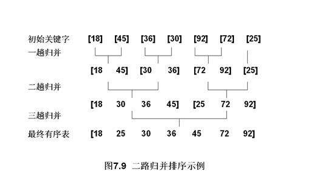
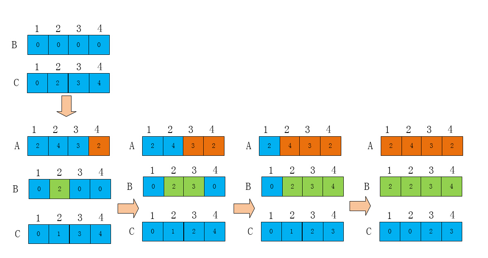
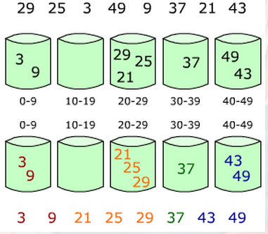

# 排序算法总结二

**这是排序算法总结的第二篇文章，在本文章中涉及的内容为归并排序，计数排序，基数排序，桶排
序，其他排序内容请参看排序算法总结一**

### <font color="#d9534f">二路归并排序(Merge Sort)</font>
**1.基本思想**
归并排序属于比较类非线性时间排序，号称比较类排序中性能最佳者，在数据中应用中较广。
归并排序是分治法(Divide and Conquer)的一个典型的应用。将已有序的子序列合并，得到完全有序的序列。
**即先使每个子序列有序，再使子序列段间有序**。若将两个有序表合并成一个有序表，称为二路归并。

**2.特点**
稳定排序、Out-place sort

**3.时间复杂度**
最好情况：O(nlog₂n)
最坏情况：O(nlog₂n)
空间复杂度：O(n)

**4.代码实现**

```
参考思想
/**
 * 二路归并排序(Merge Sort)
 * 将有序数组A[]和B[]合并到C[]中
 * @param arraysA
 * @param arraysB
 * @param arraysC
 */
public static void MergeArray(int arraysA[], int arraysB[], int arraysC[]){
	/*主要思想：比较两个数组中的数，谁小就先取出谁*/
	int i = 0;//A[]的开始下标
	int j = 0;//B[]的开始下标
	int k = 0;//C[]的开始下标
	while(i < arraysA.length && j < arraysB.length){
		/*判断谁小，然后放入，k++， i/j++ */
		if(arraysA[i] < arraysB[j]){
			arraysC[k] = arraysA[i];
			k++;
			i++;
		}else{
			arraysC[k] = arraysB[j];
			k++;
			j++;
		}
	}
	/*如果B[]已经分配完，而A[]没有分完，那剩下的就都是A直接放入到C[]中*/
	while(i < arraysA.length){
		arraysC[k] = arraysA[i];
		k++;
		i++;
	}
	/*如果A[]已经分配完，而B[]没有分完，那剩下的就都是A直接放入到C[]中*/
	while(j < arraysB.length){
		arraysC[k] = arraysB[j];
		k++;
		j++;
	}
}
```

**二路归并排序完整代码实现如下**
```
/**
 * 二路归并排序(Merge Sort)——第一步
 * 将arrays[first...middle]和arrays[middle+1...end]合并
 * @param arrays
 * @param first
 * @param middle
 * @param end
 * @param temp
 */
public static void MergeArray(int arrays[], int first, int middle, int end, int temp[]){
	int i = first;//A[]开始下标
	int m = middle;
	int j = middle+1;//B[]开始下标
	int n = end;
	int k = 0;  //C[]开始下标,这里为temp[]
	while(i <= m && j <= n){
		/*判断谁小，然后放入，k++， i/j++ */
		if(arrays[i] < arrays[j]){
			temp[k] = arrays[i];
			k++;
			i++;
		}else{
			temp[k] = arrays[j];
			k++;
			j++;
		}
	}
	/*如果B[]已经分配完，而A[]没有分完，那剩下的就都是A直接放入到C[]中*/
	while(i <= m){
		temp[k] = arrays[i];
		k++;
		i++;
	}
	/*如果A[]已经分配完，而B[]没有分完，那剩下的就都是A直接放入到C[]中*/
	while(j <= n){
		temp[k] = arrays[j];
		k++;
		j++;
	}
	
	/*将temp[]的值赋给arrays[]，这样arrays[]得到的就是排序好的*/
	for(i=0; i<k;i++){
		arrays[first+i] = temp[i];
	}
	
}

/**
 * 二路归并排序(Merge Sort)——第二步
 * @param arrays
 * @param first
 * @param last
 * @param temp
 */
public static void MergeSort(int[] arrays,int first, int last, int temp[]){
	if(first < last){
		int middle = (first+last) >> 1;
		MergeSort(arrays, first, middle, temp);//左半部分排好序
		MergeSort(arrays, middle+1, last, temp);//右半部分排好序
		MergeArray(arrays, first, middle, last, temp);//合并左右部分
	}
}
```


### <font color="#d9534f">计数排序(CountingSort)</font>

**1.基本思想**
在待排序序列中，对于给定的输入序列中的**每一个元素x**，确定该序列中值**小于x的元素的个数**
**(此处并非比较各元素的大小，而是通过对元素值的计数和计数值的累加来确定)，**这样就知道了该元素的正确位置。
例如，对于待排序序列{10,5,3,1,9,3}，有5个数比10小，那么10就应该放在第6个位置。

计数排序是一个非基于比较的排序算法，该算法于1954年由 Harold H. Seward 提出。它的优势在于在对一定范围内的整数排序时，它的复杂度为Ο(n+r)其中r是整数的范围)，快于任何比较排序算法。当然这是一种牺牲空间换取时间的做法，而且**当O(r)>O(n*log(n))**的时候其效率反而不如基于比较的排序(基于比较的排序的时间复杂度在理论上的下限是O(n*log(n)), 如归并排序，堆排序)

**2.特点**
稳定排序、Out-place sort

**3.时间复杂度**
最好情况：O(n+r)
最坏情况：O(n+r)
其中，n为排序的数的个数，r为基数

**4.代码实现**
```
/**
 * 计数排序(CountingSort)
 * @param arrays
 * @param max  待排序数组中最大的数
 */
public static void CountingSort(int[] arrays, int max){
	//max:待排序数组中最大的数
	int[] result = new int[arrays.length];//保留结果
	int[] temp = new int[max+1];//初始化数组，默认元素为0
	
	for(int i=0; i<arrays.length; i++){
		//遍历待排序的数组，计算其中的每一个元素出现的次数，比如一个key为i的元素出现了3次，那么A[i]=3
		int value = arrays[i];
		temp[value] += 1;  //temp[]初始化为0。 之后1，2...
	}
	
	/*对所有计数累加*/
	for(int i=1; i<temp.length; i++){
		temp[i] += temp[i-1];
	}
	
	for(int i = arrays.length-1; i>=0; i--){//逆向遍历源数组（保证稳定性），根据计数数组中对应的值填充到先的数组中
		int value = arrays[i];//记录原数组的每一个数
		int position = temp[value] - 1;//由于下标从0开始，所以这里减1
		result[position] = value;//放入适当的位置
		temp[value] -= 1;//放了一个就减一个
	}
	
	/*将结果赋给arrays数组*/
	for (int i = 0; i < arrays.length; i++) {
		arrays[i] = result[i];
	}
}
```


### <font color="#d9534f">基数排序(RadixSort)</font>

**1.基本思想**
1.首先根据个位数的数值，将它们分配至编号0到9的桶子中接下来将这些桶子中的数值按顺序重新串接起来，
2.根据十位数的数值，将它们分配至编号0到9的桶子中接下来将这些桶子中的数值按顺序重新串接起来，以此类推...直到最高位结束。
3.根据最高位数的数值，将它们分配至编号0到9的桶子中，得到排序。

基数排序号称线性时间排序算法中性能最好，速度最快的排序算法。
基数排序属于"分配式排序"(distribution sort)，是非比较类线性时间排序的一种，又称:桶子法(bucket sort)。
顾名思义，它是通过键值的部分信息，将要排序的元素分配至某些"桶"中，以达到排序的作用。

**MSD：最高位优先(Most Significant Digit first)法**
先按k1排序分组，同一组中记录，关键码k1相等，再对各组按k2排序分成子组，之后，对后面的关键码继续这样的排序分组，直到按最次位关键码kd对各子组排序后。再将各组连接起来，便得到一个有序序列。MSD从高位开始排到低位，排完一位后不合并桶，相同的高位划分子桶继续分配，最后再合并
**LSD：最低位优先(Least Significant Digit first)法**
先从kd开始排序，再对kd-1进行排序，依次重复，直到对k1排序后便得到一个有序序列。LSD从低位开始排到高位，每排一位都是把各个桶合并，再按下一位排序。

基数排序的方式可以采用LSD(Least significant digital)或MSD（Most significant digital)，LSD的排序方式由键值的最右边开始，而MSD则相反，由键值的最左边开始。

例如：[520 350 72 383 15 442 352 86 158 352]排序过程

**2.特点**
稳定排序、Out-place sort

**3.时间复杂度**
最好情况：O(d\*(n+r))
最坏情况：O(d\*(n+r))
空间复杂度：O(n+r)
其中，d为多少位数，r为基数(盒子10，0~9)，n为待排序序列中有n个记录

**4.代码实现**
```
/**
 * 基数排序(RadixSort)
 * @param arrays  待排序数组
 * @param radix  基数 10 (任何一个阿拉伯数，它的各个位数上的基数都是以0~9来表示的。所以我们不妨把0~9视为10个桶) 
 * @param distance  待排序中的数最大的位数
 */
public static void RadixSort(int[] arrays, int radix, int distance){
	int length = arrays.length;
	int[] temp = new int[length];//临时数组，用来暂存元素
	int[] count = new int[radix];//radix: 10 用于计数排序 盒子 0~9
	int divide = 1;  //1  10 100
	
	for(int i = 0; i<distance; i++){
		System.arraycopy(arrays, 0, temp, 0, length);
		Arrays.fill(count, 0);//盒子清空
		
		/*用来把每个数的 <个十百千万...> 分开，并且使相对应号数的桶的个数增加1*/
		for (int j = 0; j < length; j++) {
			//divide：1 10 100
			//radix： 基数 10
			//取出每一个数的位。例如123：divide:1时，取出 3。divide:10时，取出2
			int tempKey = (temp[j]/divide) % radix;
			count[tempKey]++; //盒子中的<个 十 百...>的个数
		}
		
		/*对所有计数累加*/
		//radix： 基数 10
		for (int j = 1; j < radix; j++) {
			count[j] += count[j-1];
		}
		for (int j = length-1; j>=0; j--) {//逆向遍历源数组（保证稳定性），根据计数数组中对应的值填充到先的数组中
			int tempKey = (temp[j]/divide) % radix;
			count[tempKey]--;//由于下标从0开始，所以这里减1
			arrays[count[tempKey]] = temp[j];
		}
		
		//(temp[j]/divide) % radix
		divide = divide * radix; //divide：1 10 100,通过distance控制
	}
}
```

### <font color="#d9534f">桶排序(BucketSort)</font>
**1.基本思想**
**桶排序，顾名思义就是运用桶的思想来将数据放到相应的桶内，再将每一个桶内的数据进行排序，
最后把所有桶内数据按照顺序取出来，得到的就是我们需要的有序数据**

桶排序是分配排序的一种，但其是基于比较排序的，它是一个分布式的排序，介于MSD基数排序和LSD基数排序之间。这也是与基数排序最大的区别所在。
桶排序算法想法类似于散列表。首先要假设待排序的元素输入符合某种均匀分布，例如数据均匀分布在[ 0,1）区间上，则可将此区间划分为10个小区间，称为桶，对散布到同一个桶中的元素再排序。
**要求：待排序数长度一致。**

1.建立一堆buckets； 
2.遍历原始数组，并将数据放入到各自的buckets当中； 
3.对非空的buckets进行排序； 
4.按照顺序遍历这些buckets并放回到原始数组中即可构成排序后的数组。

**2.特点**
稳定排序、Out-place sort

**3.时间复杂度**
最好情况：O(nlgn)
最坏情况：O(n)

**4.代码实现**
```
/**
 * 桶排序(BucketSort)
 * @param arrays 待排序数组
 * @param max  最大的数
 * @param min  最小的数
 */
public static void BucketSort(int[] arrays,int max, int min){
	int bucketNum = (max - min) / arrays.length + 1;//桶数，比如10个桶
	/*创建链表(桶)集合并初始化，结婚中的链表用于存放相应的元素*/
	LinkedList<LinkedList<Integer>> buckets = new LinkedList<LinkedList<Integer>>();//存桶，桶集合
	for(int i = 0; i<bucketNum; i++){
		LinkedList<Integer> bucket = new LinkedList<Integer>();//存元素，桶
		buckets.add(bucket);
	}
	
	/*把元素放进相对应的桶中*/
	for(int i = 0; i<arrays.length; i++){
		int index = (arrays[i] - min) /arrays.length;//把元素放进相对应的桶中
		buckets.get(index).add(arrays[i]);
	}
	
	/*对每个桶中的元素排序，并放进arrays[]*/
	int index = 0;//用于排序后从每个桶中依次取出,arrays的下标
	for(LinkedList<Integer> linkedList : buckets){
		int size = linkedList.size(); //每个桶的长度
		if(size == 0){
			continue;
		}
		int[] temp = new int[size];
		for(int i = 0; i<temp.length; i++){
			temp[i] = linkedList.get(i);//将桶的数取出放进入temp[]中
		}
		Arrays.sort(temp);//对桶里面的数进行排序，选择一种排序方式，

		/*排序后从每个桶中依次取出*/
		for (int i = 0; i < temp.length; i++) {
			arrays[index] = temp[i];
			index++;
		}
	}
}	
```


完！！！