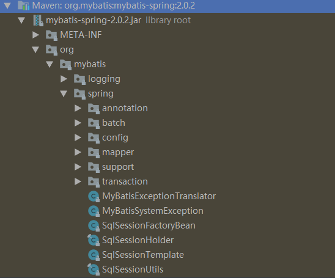

# Mybatis-Spring源码分析

阅读源码的意义，学习其实现的架构和思想，其次懂得扩展。

在阅读之前，需要你了解Mybatis的源码，以及SpringIOC的一些基本知识。


## Mybatis-Spring工程结构




## SqlSessionFactoryBean

需要注意的是 SqlSessionFactoryBean 实现了 Spring 的 FactoryBean 接口（参见 Spring 官方文档 3.8 节 [通过工厂 bean 自定义实例化逻辑](https://docs.spring.io/spring/docs/current/spring-framework-reference/core.html#beans-factory-extension-factorybean)）。这意味着由 Spring 最终创建的 bean **并不是** SqlSessionFactoryBean 本身，而是工厂类（SqlSessionFactoryBean）的 getObject() 方法的返回结果。

这种情况下，Spring 将会在应用启动时为你创建 SqlSessionFactory，并使用 sqlSessionFactory 这个名字存储起来。


在这里SqlSessionFactoryBean实现了Spring的FactoryBean接口，将SqlSessionFactory交给Spring去管理，当获取Bean放入容器时则通过Mybatis的方式进行创建，只不过进行了一些封装。

```
public class SqlSessionFactoryBean implements 
    FactoryBean<SqlSessionFactory>, 
    InitializingBean, 
    ApplicationListener<ApplicationEvent> {
      
        
  @Override
  public SqlSessionFactory getObject() throws Exception {
    if (this.sqlSessionFactory == null) {
      // 创建SqlSessionFactory
      afterPropertiesSet();
    }

    return this.sqlSessionFactory;
  }
        
   /**
   * {@inheritDoc}
   */
  @Override
  public void afterPropertiesSet() throws Exception {
    notNull(dataSource, "Property 'dataSource' is required");
    notNull(sqlSessionFactoryBuilder, "Property 'sqlSessionFactoryBuilder' is required");
    state((configuration == null && configLocation == null) || !(configuration != null && configLocation != null),
        "Property 'configuration' and 'configLocation' can not specified with together");
    
    this.sqlSessionFactory = buildSqlSessionFactory();
  }      
        
   
```


# 阅读

- [Mybatis官方中文文档](https://mybatis.org/mybatis-3/zh/index.html)
- [Mybatis-Spring官方中文文档](http://mybatis.org/spring/zh/index.html)