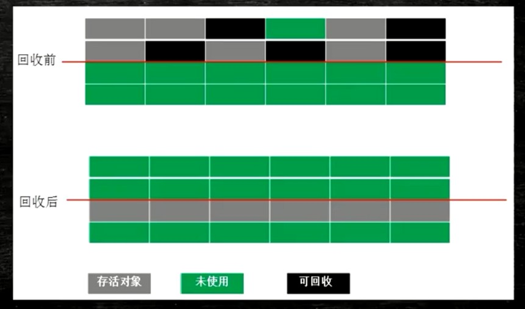
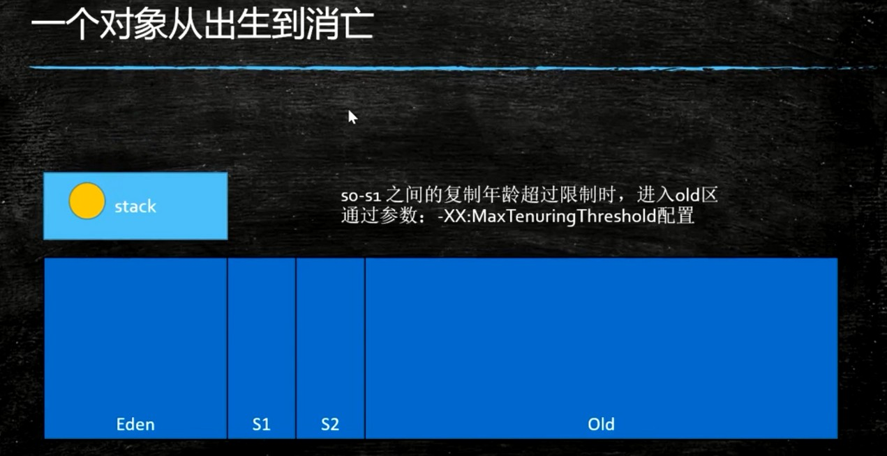

# JVM - 垃圾回收

## 如何判断对象的死亡？

- 引用计数器，为0（不能解决循环引用问题）
- 可达性分析算法（GC Roots不可达）


### 可达性分析算法

将“**GC Roots**”对象作为起点，从这些节点开始向下搜索引用的对象，搜索走过的路径被称为引用链（Reference Chain)，当一个对象到 GC Roots 没有任何引用链相连时（即从 GC Roots 节点到该节点不可达），则证明该对象是不可用的。引用链可达标记为非垃圾对象，引用链不可达是垃圾对象。


#### GC Roots根节点

虚拟栈(即线程栈)的本地变量、静态变量、常量池、本地方法栈(native)的变量等等。 


## GC算法

- 标记-清除（Mark-Sweep）

- 复制算法（Copying）
- 标记-压缩（标记整理）（Mark-Compact）


### 1、标记清除算法(Mark-Sweep)

说明：先把内存区域中的对象进行标记，标记哪些属于可回收，然后将其清理掉。


分析：

- 算法相对简单
- 存活对象较多时效率高
- 两遍扫描、效率偏低
- 由于分配内存的时候需要连续的空间，那么清理这些空间的时候，就会造成不再可用，形成垃圾碎片，浪费空间


### 2、复制算法（Copying）

说明：将内存分为两个区域，先在一个区域存储，然后将可用的对象移到另一个区域，清理掉垃圾区域。


分析：

- 适用于存活对象较少的情况
- 只扫描一次，效率提高，没有碎片
- 空间浪费
- 移动复制对象，需要调整对象引用




### 3、标记-压缩（标记整理）（Mark-Compact）

说明：标记过程仍然与标记清除算法一样，但后续步骤不是直接对可回收对象进行清理，而是让所有存活的**对象都压缩到一端**，再清理掉端边界以外的内存区域。


分析：

- 没有碎片，方便对象分配
- 不会浪费空间
- 扫描两次
- 需要移动对象，效率偏低


## JVM内存分代算法

将内存空间分配几个区域，逻辑分代里分为：新生代和老年代，然后每个区域选择合适的垃圾收集算法(前面说的123，标记清除、复制算法、标记压缩算法)

注：

> 除Epsilon、ZGC、Shenandoah之外的GC都是使用逻辑分代模型
>
> G1是逻辑分代，物理不分代；除此之外，逻辑分代，物理分代


### 结论

- 新生代大量死去，少量存活，适合复制算法

- 老年代存活率高，回收较少，适合标记清除或标记压缩


### 一个对象从出生到消亡的过程




### 堆内存逻辑分区


逻辑分代里分为：新生代和老年代

新生代：刚new出来的对象

老年代：垃圾回收很多次未能回收的

新生代又分为三个区域：一个eden、两个survivor（即from和to），默认比例是8：1：1


当进行一次minor gc时（既年轻代的gc），minor gc是串行的，eden空间如果没有被gc root引用的会被回收，**而依然存活的会被移动到from空间中**，如果from空间在minor gc时对象依旧可以存活，就会对该对象年龄+1，当年龄达到一定数值时会直接放入老年代，没有达到年龄的存活对象会被复制到to中。这时from和eden空间已经被清空，虚拟机会交换from和to的空间，空的from变成to，to的变成from，保证了to是空的，minor gc会不断重复这样的工作，直到to彻底被填满，这时会将对象移动到老年代。


### 如何查看当前版本JDK内存模型？

JDK不同的版本，堆内存分布模型是不一样，谈内存模型不说明版本的都是耍流氓，那么我们如何确定呢？

下图为java自带的jvm工具(**jvisualvm**)，可从图中看到内存模型分布情况：Eden、s0、s1、Old、Metaspace


## GC概念

https://kuaibao.qq.com/s/20190228A0656E00?refer=spider


### 分配说明

例如：`java -Xms 3072M -Xmx3072M`

表示分配的最大最小堆的大小为3G。下面来看看各个分区的分配情况：

- Young和Old默认是1：2，因此Old占2/3，也就是2G；
- Young = Eden+s0+s1，因此Yound占1/3，也就是1G;
- Eden和s0，s1为8：1：1，因此Eden占8/10，也就是800M;
- s0和s1，因此占1/10, 都是100M。

**所以增大年轻代(-Xmn)后，将会减小年老代(Xmx-Xmn)大小。此值对系统性能影响较大。**


### JVM一些概念列表

- 年轻代：Eden+s0+s1

- Old区：老年代
- Eden区：伊甸园区
- survivor区：又分为s0、s1，或叫from区、to区

- -Xms：最小堆

- -Xmn：年轻代分配大小（注：n代表new）
- -Xmx：最大堆

- MinorGC/YGC：发生在年轻代，采用复制算法（注：YGC：Young GC）

- MajorGC：发生在老年代，采用标记压缩或标记清除算法

- FullGC：MinorGC+MajorGC

- 动态年龄判断

- 分代年龄

- 逃逸对象


### 内存分配流程

内存分配主要是按照下面的流程，并不是像我们所理解的，new就直接分配到堆上，还有可能分配到栈上。


**栈上分配（注：一般无需调整）**

- 线程私有小对象
- 无逃逸
- 支持标量替换


**线程本地分配TLAB(Thread Local Allocation Buffer)（注：一般无需调整）**

- 在eden区为线程分配的空间，默认占eden区的1%（好处：多线程的时候不用竞争eden就可以申请空间，提高效率）
- 小对象


**什么情况进入老年代Old区？**

1、大对象直接进入老年代，可通过``-XX:PretenureSizeThreshold`设置
2、分代年龄到达15（对象头分代年龄4位，因此最大是15）会移动老年代，可通过`-XX:MaxTenuringThreshold`设置

- Parallel Scavenge 15
- CMS 6
- G1 15

3、对象动态年龄判断，可通过`-XX: TargetSurvivorRatio`设置

- s0 -> s1超过s1的50%，把年龄最大的放入Old


参数设置示例：

```
注：-表示去掉不适用，+表示使用
-XX:-EliminateAllocations  // 标量替换
-XX:-DoEscapeAnalysis      // 逃逸分析
-XX:-UseTLAB               // 线程专有对象分配  

-XX:+DoEscapeAnalysis
```


## 概念解释

**内存溢出**： out of memory，指程序在申请内存时，没有足够的内存空间供其使用，出现out of memory。例如：申请了一个integer，但给它存了long才能存下的数，那就是内存溢出。

**内存泄露**：memory leak，指程序在申请内存后，无法释放已申请的内存空间，**其实说白了就是该内存空间使用完毕之后未回收。**。注意：一次内存泄露危害可以忽略，但内存泄露堆积后果很严重，无论多少内存迟早会被占光。


### 逃逸分析

逃逸分析：就是分析对象动态作用域。当一个对象在方法中被定义后，它可能被**外部所引用**，称之为逃逸。例如：作为调用参数或者变量传递到其他地方中。

示例：

```java
public class EscapeAnalysisTest {

    User myUser;
    public static void main(String[] args){

    }

    public  void newUser1(){
       new User("1", "1");
    }

    public  void newUser2(){
        // 逃逸对象，新指向
        myUser = new User("1", "1");
    }
}

```


编译器可以对代码做如下优化：

一、同步省略。如果一个对象被发现只能从一个线程被访问到，那么对于这个对象的操作可以不考虑同步。

二、将堆分配转化为栈分配。如果一个对象在子程序中被分配，要使指向该对象的指针永远不会逃逸，对象可能是栈分配的候选，而不是堆分配。（栈上分配--Hotspot并没有实现真正意义上的栈上分配，实际上是标量替换）

三、分离对象或标量替换。有的对象可能不需要作为一个连续的内存结构存在也可以被访问到，那么对象的部分（或全部）可以不存储在内存，而是存储在CPU寄存器中。在动态编译同步块的时候，JIT编译器可以借助逃逸分析来判断同步块所使用的锁对象是否只能够被一个线程访问而没有被发布到其他线程。如果同步块所使用的锁对象通过这种分析被证实只能够被一个线程访问，就是优化成锁消除。

https://blog.csdn.net/w372426096/article/details/80938788


### 标量替换

例如：对象T中有`int a， b;`，那么完全可以不用把T当作一个对象，而不是用两个int变量替换。


### 对象动态年龄判断

解释：s0 -> s1超过s1的50%，把年龄最大的放入Old。可通过`-XX: TargetSurvivorRatio`设置

当从s0、eden区放入到s1时，如果这批对象的大小超过s1的50%，则将**>=**这批对象年龄最大的对象，放入到Old。

> 例如：Survivor1区域里现有一批对象，年龄1+年龄2+年龄n的多个年龄对象总和超过了Survivor2区域的50%，此时就会把年龄n(含以上)的对象都放入老年代。
>
> 这个规则是希望那些可能是长期存活的对象，尽早进入老年代。对象动态年龄判断机制一般是在minor gc之后触发的。 

jvm误区--动态对象年龄判定：https://www.jianshu.com/p/989d3b06a49d


### STW

GC的时候会导致STW，也就是stop the world，这个时候会去暂停正在运行的线程（在客户的使用角度来看，就是感觉系统有点卡顿的样子）

因此，我们要进行调优，就是要避免STW，避免Full GC。正常的Full GC周期是几天或几周。


### Safe Point

安全点，对于GC的时候并不是马上停止，而是找一个安全点

### 分配担保

YGC期间，survivor区空间不够，通过空间担保直接进入老年代。
