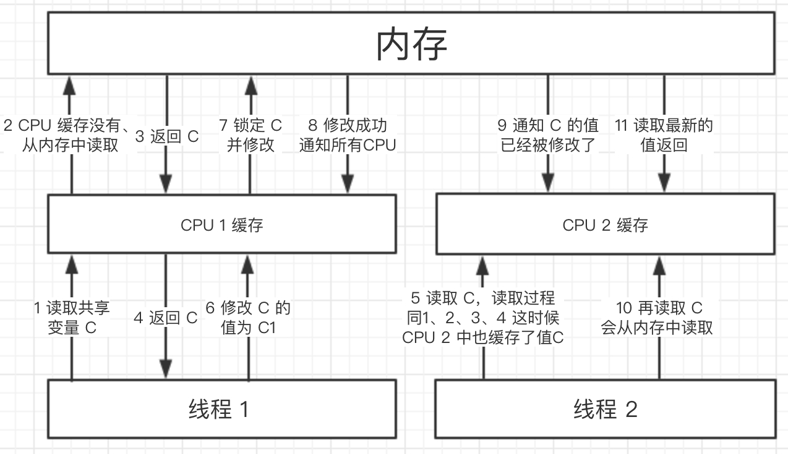
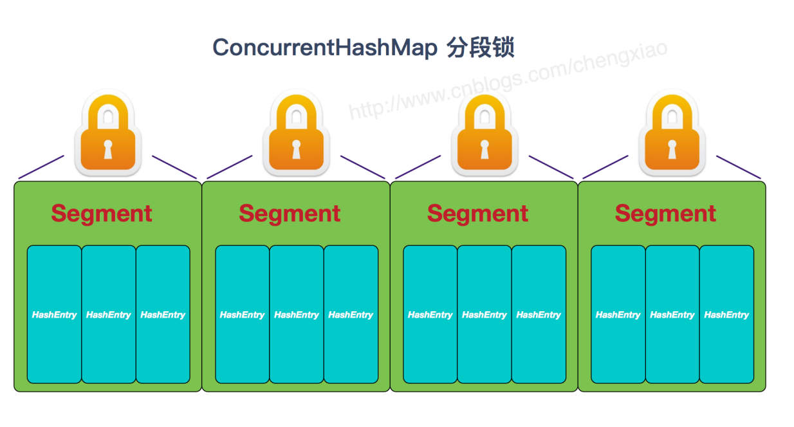
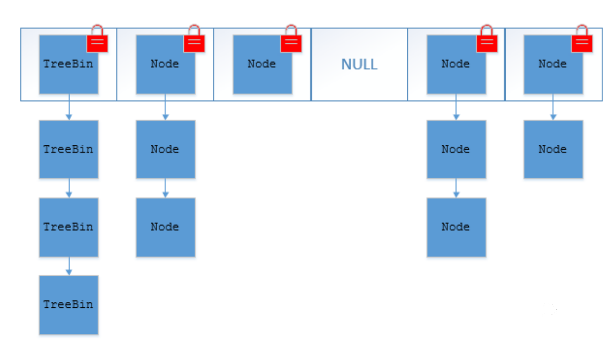

# 2 Java基础

## 1 Java常用关键字

### 1.1 static-线程共享

这时候我们非常需要注意的一点就是线程安全的问题了，因为当多个线程同时对共享变量进行读写时，很有可能会出现并发问题，

如我们定义了：public static List<String> list = new ArrayList();这样的共享变量。这个 list 如果同时被多个线程访问的话，就有线程安全的问题，这时候一般有两个解决办法：

1. 把线程不安全的 ArrayList 换成 线程安全的 CopyOnWriteArrayList；
2. 每次访问时，手动加锁。

所以在使用 static 修饰类变量时，如何保证线程安全是我们常常需要考虑的。


示例：

```
public class StaticDemo {
    public static void main(String[] args) {
        SD sd = new SD();
//      SD.b; SD.eat()   static 通过类名点访问
//      SD.this.a;
    }
}

class SD{
    int a ;
    static int b;
    void show(){
        //static 中没有隐式this
//      this.a;
//      SD.b;
    }
    static void eat(){}
}
```


注意：继承  ，static静态不具有多态


### 1.2 final

final 的意思是不变的，一般来说用于以下三种场景：

1. 被 final 修饰的类，表明该类是无法继承的；
2. 被 final 修饰的方法，表明该方法是无法覆写的；
3. 被 final 修饰的变量，说明该变量在声明的时候，就必须初始化完成，而且以后也不能修改其内存地址。

第三点注意下，我们说的是无法修改其内存地址，并没有说无法修改其值。因为对于 List、Map 这些集合类来说，被 final 修饰后，是可以修改其内部值的，但却无法修改其初始化时的内存地址。


### 1.3 try、catch、finally

**catch 中发生了未知异常，finally 还会执行么？**

答：会的，catch 发生了异常，finally 还会执行的，并且是 finally 执行完成之后，才会抛出 catch 中的异常。

不过 catch 会吃掉 try 中抛出的异常，为了避免这种情况，在一些可以预见 catch 中会发生异常的地方，先把 try 抛出的异常打印出来，这样从日志中就可以看到完整的异常了。


**try和finally中都有return？**

答：会返回finally中的return，会把try中的try中的return吞掉。所以，千万不要写这种垃圾坑人代码。


### 1.3.1 finally和try中有return

```
public static void main(String[] args) {
    int i = tryAndFinallyReturnTest();
    // 0
    System.out.println("i: " + i);
}

private static int tryAndFinallyReturnTest(){
    try {
        int i = 10/2;
        return 1;
    }catch (IllegalArgumentException e){
        e.printStackTrace();
    }finally {
        return 0;
    }
}

// --------------------------------------------------
public static void main(String[] args) {
    int i = tryAndFinallyReturnTest();
    // 0
    System.out.println("i: " + i);
}

private static int tryAndFinallyReturnTest(){
    try {
        int i = 10/0;
        return 1;
    }catch (IllegalArgumentException e){
        e.printStackTrace();
        return 2;
    }finally {
        return 0;
    }
}
```


说明，最终会返回的是finally中的return，说明finally会被try或catch里面的异常覆盖掉


### 1.3.2 finally和catch中抛出的异常

```
public static void main(String[] args) {
    // Exception in thread "main" java.lang.RuntimeException
    cathcAndFinallyThrowExceptionTest();
}

private static int cathcAndFinallyThrowExceptionTest(){
    try {
        int i = 10/0;
        return 1;
    }catch (ArithmeticException e){
        System.out.println("catch: ");
        throw new ArithmeticException();
    }finally {
        System.out.println("finally: ");
        throw new RuntimeException();
    }
}
```


说明，最终会返回的是finally中的异常，因为只能抛出一个异常。没有被抛出的异常称为“被屏蔽”的异常（Suppressed Exception）


### 1.3.3 如何保存所有的异常信息？

通过addSuppressed获取

```
public final synchronized void addSuppressed(Throwable exception) 
```


示例：

```
 public static void main(String[] args) {
        int i = tryAndFinallyReturnTest();
        // 0
        System.out.println("i: " + i);

        // Exception in thread "main" java.lang.RuntimeException
        // cathcAndFinallyThrowExceptionTest();


        try{
            catchOriginExceptionTest();
        }catch (Exception e){
//            java.lang.RuntimeException
//            at com.example.exception.ExceptionDemo.catchOriginExceptionTest(ExceptionDemo.java:33)
//            at com.example.exception.ExceptionDemo.main(ExceptionDemo.java:15)
//            Suppressed: java.lang.ArithmeticException: / by zero
//            at com.example.exception.ExceptionDemo.catchOriginExceptionTest(ExceptionDemo.java:26)
//    ... 1 more
            System.out.println("getCause: " + e.getCause());
            System.out.println("suppressed: " + e.getSuppressed());
            e.printStackTrace();
        }
    }
    
    private static int catchOriginExceptionTest(){
    Exception origin = null;
    try {
        int i = 10/0;
        return 1;
    }catch (ArithmeticException e){
        System.out.println("catch: ");
        origin = e;
        throw e;
    }finally {
        RuntimeException e = new RuntimeException();
        System.out.println("finally: ");
        if (origin != null){
            e.addSuppressed(origin);
        }
        throw e;
    }
}
    
```

1. try、catch、finally语句中，在如果try语句有return语句，则返回的之后当前try中变量此时对应的值，此后对变量做任何 的修改，都不影响try中return的返回值 
2. 如果finally块中有return 语句，则返回try或catch中的返回语句忽略。 
3. 如果finally块中抛出异常，则整个try、catch、finally块中抛出异常


### 1.4 volatile

内存可见性，防止指令重排

volatile 的意思是可见的，常用来修饰某个共享变量，意思是当共享变量的值被修改后，会及时通知到其它线程上，其它线程就能知道当前共享变量的值已经被修改了。

我们再说原理之前，先说下基础知识。就是在多核 CPU 下，为了提高效率，线程在拿值时，是直接和 CPU 缓存打交道的，而不是内存。主要是因为 CPU 缓存执行速度更快，比如线程要拿值 C，会直接从 CPU 缓存中拿， CPU 缓存中没有，就会从内存中拿，所以线程读的操作永远都是拿 CPU 缓存的值。

这时候会产生一个问题，CPU 缓存中的值和内存中的值可能并不是时刻都同步，导致线程计算的值可能不是最新的，共享变量的值有可能已经被其它线程所修改了，但此时修改是机器内存的值，CPU 缓存的值还是老的，导致计算会出现问题。

这时候有个机制，就是内存会主动通知 CPU 缓存。当前共享变量的值已经失效了，你需要重新来拉取一份，CPU 缓存就会重新从内存中拿取一份最新的值。

volatile 关键字就会触发这种机制，加了 volatile 关键字的变量，就会被识别成共享变量，内存中值被修改后，会通知到各个 CPU 缓存，使 CPU 缓存中的值也对应被修改，从而保证线程从 CPU 缓存中拿取出来的值是最新的。

我们画了一个图来说明一下：



- 并不能保证线程安全性，保证了可见性，但不保证原子性。
- count++不具备原子性，实际上包含了三个操作：获取值，自增，赋值。


### 1.5 transient

transient 关键字我们常用来修饰类变量，意思是当前变量是无需进行序列化的。在序列化时，就会忽略该变量，这些在序列化工具底层，就已经对 transient 进行了支持。


### 1.6 default

接口默认实现方法


### 1.7运行时环境

比如我们的String是在java.lang包下，而这个包是在rt.jar下，rt即runtime


## 2 基础知识

**
**

### 2.1 重写与重载

```
/**
 * 向上造型，父类的引用指向子类的对象。
 * 能点出来什么，看引用类型。
 * 方法重写的时候，看对象，遵循"运行期绑定"
 * 方法重载的时候，看引用类型，遵循"编译期绑定"
 *  
 *  重写Override和重载Overload的区别：
 *  1)重写发生在父子类，方法名和参数列表相同，方法体不同，看对象的类型来调用方法，遵循"运行期绑定"
 *  2)重载发生在一个类中，方法名相同，参数和列表不同，和"返回值无关"，看引用的类型绑定方法，遵循"编译期绑定"
 * 
 * 方法调用同方法体绑定
 * 私有的话就没有了，兄弟
 *
 */
public class SuperDemo {
    public static void main(String[] args) {
        Sup sup = new Sub();
        sup.show();// Sub show ，重写的时候看对象
        sup.eat();//Sup eat 如果方法是静态的话，就不具有多态了
        sup.jump();//sup jump
        System.out.println("____________________");
        Su su = new Su();
        su.f(sup);  //Sup f，重载的时候看引用            
    }
}

class Su{
    void f(Sub s){
        System.out.println("Sub f");
        s.show();
    }
    void f(Sup s){
        System.out.println("Sup f");
        s.show();
    }
}

class Sup{
    private int c;
    int a;
    void show(){
        System.out.println("Sup show");
    }
    static void eat(){
        System.out.println("Sup eat");
    }
    private void run(){
        System.out.println("Sup run");
    }
    void jump(){
        System.out.println("Sup jump");
    }
    Sup(int n){}
}

class Sub extends Sup{
    int b;
    void show(){
        System.out.println("Sub show");
    }
    static void eat(){
        System.out.println("Sub eat");
    }
    public void run(){
        System.out.println("Sub run");
    }
    Sub(){
        //如果父类有有参的构造必须调用，输入参数。
        super(78);
    }
}
```


### 2. 2 自动拆箱与自动拆箱

```
/**
 * 包装类
 * java有8个基本类型，由于他们不是引用类型，不具有面向对象特性，因此有了包装类。
 *
 */
public class IntegerDemo {
    public static void main(String[] args) {
        /*
         *基本类型转换为包装类的时候不建议用new 的形式
         *建议用静态方法valueOf。 
         */
        Integer i1 = Integer.valueOf(12);
        Integer i2 = Integer.valueOf(12);
        Integer i3 = new Integer(12);
        
        //String str = "fdsaf".valueOf("d");
        //String 里是把基本类型转换成String
        
        System.out.println(i1 == i2);
        System.out.println(i1 == i3);
        
        int d = i1.intValue();
        System.out.println(d);
        
        //MAX_VALUE MIN_VALUE
        
        /**
         * JDK1.5之后推出了一个新的特性：
         * 自动拆装箱
         * 该特性是编译器认可，而非虚拟机。该特性是编译器
         * 在编译源代码时自动补充了基本类型与包装类之间的转换，从而方便了。
         */
        //自动拆箱
        int i4 = new Integer(12);//  int i4 = new Integer(12).intValue();
        
        //自动装箱
        //编译器补充代码到class文件中。
        Integer in = 12;// Integer in = Integer.valueOf(12);
        
        //parseInt  字符串转换成整型，parseInt 整型转成成字符串String.valueOf
    }
}
```


### 2.3 正则表达式

```
/**
 * 
 * 1). \d \w \s DWS
 * 2)[]集合
 * 3)数目 :* + ？ {m} {n,} {m, n}
 * 4)分组:(|)  |或  
 * 5)整体 ^ $     ^\w{8,10}$:表示整体字符串只能出现单词字符串8-10个
 * 
 * 正则表达式一
 * boolean matches(String regex)
 * String中提供的matches方法，用于匹配某一字符串是否符合某一格式
 * 
 * 正则表达式二
 * String[] split(String regex)
 * 
 * 正则表达式三
 * String replaceAll(String regex, String str)
 * 和谐
 *
 */
public class String_matches {
    public static void main(String[] args) {
        //正则表达式一
        String email = "chenshing@gmail.com";
        String regex = "[a-zA-Z0-9_]+@[a-zA-Z0-9_]+(\\.[a-zA-Z]+)+";
        System.out.println(email.matches(regex));
        
        //正则表达式二
        String[] data = email.split("\\.");
        for (String str : data) {
            System.out.print(str);
        }
        
        System.out.println();
        
        //正则表达式三
        String str = "cmm,你是sb啊，叼你阿公";
        str = str.replaceAll("cmm|sb|叼|阿公", "***");
        System.out.println(str);
    }
}
```


### 2.3.1 解析HTTP请求中的行信息

```
/**
 * www.baidu.com/index.html
 * 
 * www.baidu.com/reg?username=fanchuanqi&password=123456
 * 
 * 解析HTTP请求中的请求行信息
 * 请求行格式:
 * method uri protocol-version
 * 方法 资源路径 协议版本
 * 
 * 例如:
 * GET /index.html HTTP/1.1
 * 
 * GET /reg?username=fanchuanqi&password=123456 HTTP/1.1
 * 
 * @author HanaeYuuma
 *
 */
public class RegexDemo2 {
    public static void main(String[] args) {
        parseUri("/reg?username=fanchuanqi&password=123456");
    }
    
    /*
     * /reg?username=fanchuanqi&password=123456
     * loc:/reg
     * username:fanchuanqi
     * password:123456
     */
    public static void parseUri(String str){
        String[] data = str.split("\\?");
        System.out.println("loc:"+data[0]);
        
        data = data[1].split("&");
        for (int i = 0; i < data.length; i++) {
            String[] string = data[i].split("=");
            System.out.println(string[0]+":"+string[1]);
        }
    }
 }
```


### 2.4 StringBuilder和StringBuffer

StringBuffer是StringBuilder的线程安全版本，现在很少使用(廖雪峰老师说的)

```
/**
 * java.lang.StringBuilder
 * 内部维护一个可变的字符数字，由于字符串的涉及不利于频繁修改字符串内容
 * (每次修改内容创建对象是很消耗内存的)，StringBuilder由于维护可变的
 * 字符数字，所以基于它修改字符串都是在一个字符数字进行的，所以内存开销小。
 * 频繁修改时候的修饰明显。
 * 
 * StringBuilder的设计目的就是为了解决修改字符串的问题，所以其提供了很多便于
 * 修改字符串内存的方法。
 * 
 * StringBuilder是非线程安全的，并发处理的，性能稍快
 * StringBuffer是线程安全的，同步处理的，性能稍慢。
 * 
 * 并发的关键是你有处理多个任务的能力，不一定要同时。
 * 并行的关键是你有同时处理多个任务的能力。
 * 所以我认为它们最关键的点就是：是否是『同时』。
 *
 */
public class StringBuilderDemo {
    public static void main(String[] args) {
        String str = "aaaa";
        StringBuilder builder = new StringBuilder(str);
        System.out.println(builder);
        
        builder.append(",bbbbbb");
        System.out.println(builder);
        
        builder.replace(10, 20, "ccccc");
        System.out.println(builder);
        
        builder.insert(0,"d");
        System.out.println(builder);
    }
}
```


### 2.5 字符串常量池

```
*
 * String是不可变类，从源码中我们可以看到用final修饰了，并且value是private final
 */
public final class String
    implements java.io.Serializable, Comparable<String>, CharSequence {
    /** The value is used for character storage. */
    private final char value[];
}


/**
 * 字符串常量池
 * java堆字符串有一个优化措施，即：JVM在堆内存中
 * 创建了一段区域--字符串常量池，用来缓存曾经通过
 * 字面量形式创建过的字符串对象，一旦使用曾经创建过
 * 的字符串字面量创建对象时，会直接重用常量池中的
 * 该对象而不是再新建，这样可以避免因大量使用内容一页的字符串堆内存的大量开销。
 * 
 * 但也因此，java要求字符串是不变对象，即：字符串
 * 对象创建吼其内容不可改变，改变一定会创建新字符串对象。
 * 
 * 
 * 所谓常量池是JVM在堆内存中创建的一段区域----字符串常量池，
 * 用来缓存曾经通过字面量形式创建过的字符串对象。
 * 堆：   内存池，常量池
 * 堆栈： 内存池
 * 寄存器：
 * 方法区：
 *
 */
public class StringBuilderDemo2 {
    public static void main(String[] args) {
        StringBuilder builder = new StringBuilder("a");
        for (int i = 0; i < 10000; i++) {
            builder.append("a");
        }
        System.out.println("完成1");
        
        String str = "a";
        for (int i = 0; i < 10000; i++) {
            //频繁修改字符串的性能损耗问题
            //str += str;
        }
        System.out.println("完成2");
        
        String str1 = "123abc";
        String str2 = "123abc";
        String str3 = "123abc";
        
        System.out.println(str1 == str2);
        System.out.println(str2 == str3);
        
        str1 += "!";
        System.out.println(str1 == str2);//str1 和str2不再相等，修改内容会创建新的对象
        System.out.println(str2 == str3);
    }
}
```


### 2.6 值传递还是引用传递

java中方法参数传递方式是按值传递

如果参数是基本类型，传递的是基本类型的字面量值的拷贝。

如果参数是引用类型，传递的是该参量所引用的对象在堆中地址值的拷贝。

引用传递是指，函数在调用时，传递的参数就是实参本身（的地址）。

```
/**
 * 值传递还是引用传递??
 * java中方法参数传递方式是按值传递。
 * 如果参数是基本类型，传递的是基本类型的字面量值的拷贝。
 * 如果参数是引用类型，传递的是该参量所引用的对象在堆中地址值的拷贝。
 * 
 * "引用传递是指，函数在调用时，传递的参数就是实参本身（的地址）。"
 *
 */
public class ReturnParDemo {
    public static void main(String[] args) {
        int x = 1;
        int[] a = {1};
        add(1);
        add(a);
        System.out.println("x:"+x+ " a:"+a[0]);
        //result  x:1 a:2
        
        Point p = new Point(1,2);
        System.out.println("p:"+p);//(1,2)
        /*
         * java方法参数传递方式只有一种:值传递
         * 这里只是将p保存的值(地址)传给了方法
         * 中的参数p1
         */
        test(p);
        System.out.println("p:"+p);//(2,2)
    }
    
    public static void test(Point p1){
        /*
         * p1由于与p指向同一个对象，所以将其x
         * 值可以改变为2,main方法中的p看到的
         * 也是改后的效果
         */
        p1.setX(2);
        /*
         * p1重新指向一个新创建的对象，但是并不
         * 影响main方法中的p对原来对象的引用。
         */
        p1 = new Point(3,4);
    }
    public static void add(int x){
        x += x;
    }
    
    public static void add(int[] a){
        a[0] += a[0];
        a = new int[]{10,1};
    }
}
```


结论：Java中的是值传递，首先要搞懂的是所谓的引用传递指的是传递引用地址。

但是从上面的示例中，我们可以看到，传入的p1，重新new后，还是之前，说明其引用地址没有改变。


其他 https://www.zhihu.com/question/31203609/answer/50992895


### 2.7 为什么我们要重写Hashcode和equals

主要是因为有时候我们需要重写equals方法，比如HashMap。这时候为了保证一致性就必须重写hashCode()方法

```
/**
 * 影响散列表(Map)查询性能的一个因素是：产生链表
 * 而产生列表的原因：作为Key的元素hashcode值一样，而equals比较不为true.
 * 
 *  hashcode值一样时，在Map内部数组的位置相同，但是若是Key不同，那么就会在该
 *  位置产生一个链表。遍历链表检索数据会降低HashMap检索性能，所以要避免。
 *  
 *  因此在API文档中也有说明对equals和hashcode 的重写要求：
 *  1.成对重写，两个一起写。
 *  2.一致性，即：equals比较为true时候hashcode返回的数字应该相等
 *  3.稳定性，即：当一个对象参与equals比较的属性的值没有发生改变的前提下，
 *  多次调用hashcode返回的数字应当不变
 *
```


#### 2.7.1 如何重写hashCode()和equals()

上面是直接使用IDE生成的的Hascode和equals方法，如果让我们写的话可以按照下面的原则

```
/**
     * 重写Object提供的equals方法
     * 该方法目的是比较两个对象的内容是否一致
     * 
     * 比较原则：
     * 将两个对象的属性值进行比较，不一定需求所有的属性值相同，具体根据当前类的设计需求而定
     */
    public boolean equals(Object obj){//obj 为p2 ，假设p1.equals(p2);
        //首先判断是否为空。
        if(obj == null){//p2
            return false;
        }
        //然后判断是同一个对象,p2 == p2?
        if(obj == this){
            return true;
        }
        if(obj instanceof Point){ //同一个类型？ 按照自己的需求去实现这里，Point是一个测试类
            Point p = (Point)obj;
            return this.x == p.x && this.y == p.y;
        }
        return true;
    }
 
    @Override
    public int hashCode() {
        final int prime = 31;
        int result = 1;
        result = prime * result + x;
        result = prime * result + y;
        return result;
    }
    //2*3  1*6
```


### 2.8 serialVersionUID

验证类版本的标识，用于序列化和反序列化中的对接。如果没有指定，会通过类名、方法名等众多因素计算而得到一个值。

如果我们不希望通过编译来强制划分软件版本，即实现序列化接口的实体能够兼容先前版本，未作更改的类，就需要显式地定义一个名为serialVersionUID，类型为long的变量，不修改这个变量值的序列化实体都可以相互进行串行化和反串行化。**serialVersionUID为了让该类别 Serializable向后兼容。如果你修改了此类, 要修改此值**.


> \* If a serializable class does not explicitly declare a serialVersionUID, then
>
> \* the serialization runtime will calculate a default serialVersionUID value
>
> \* for that class based on various aspects of the class,
>
> \* Therefore, to guarantee a consistent serialVersionUID value across different java
>
> \* compiler implementations, a serializable class must declare an explicit
>
> \* serialVersionUID value.

因此，为了保证跨不同java编译器实现的一致的serialVersionUID值，可序列化类必须声明显式的serialVersionUID值。


### 2.9 引用与指针

引用？指针？地址？之前给Audrey讲解Python的时候，涉及到了这几个概念。本想解释一下，可是发现她好像并不太理解，我也没有想到更通俗的例子，索性就告诉她把引用和指针当作差不多就行了，然后我们可以根据这个引用/指针找到这个对象，当我们去改变这个引用/指针指向的对象的时候，会使其永久发生变化。但是并非这么简单，引用和指针还有很多的区别，以前总结过的我也忘记了，然后我在网上找到了比较赞成的总结。

1.引用是别名，而指针是实体。c/c++的引用，它跟java的引用完全不是一个东西，c/c++的引用是同一块内存的不同名字。而java的引用是指向一个对象，引用本身也占用了内存。(在这里我看到一个好玩的公式：Java = C++ --)

2.引用不可以为空，而指针可以为空

3.引用不可以改变，而指针可以改变

4.java中是没有指针的，所有就涉及到值传递的问题，到底是值传递？还是引用传递？答案是值传递


#### ==与equals()

知道了上面的引用和指针的区别，那就更好理解==与equals()，**==比较的是对象的引用**。

在Java中，判断值类型的变量是否相等，可以使用==运算符。但是，判断引用类型的变量是否相等，==表示“引用是否相等”，或者说，是否指向同一个对象。

判断引用类型的变量内容是否相等，必须使用equals()方法


### 2.10静态导包

还有一种import static的语法，它可以导入可以导入一个类的静态字段和静态方法


### 2.11 软引用/弱引用

软引用（SoftReference）的含义是，如果一个对象只具有软引用，而当前虚拟机堆内存空间足够，那么垃圾回收器就不会回收它，反之就会回收这些软引用指向的对象。

弱引用（WeakReference）与软引用的区别在于，垃圾回收器一旦发现某块内存上只有弱引用（一定请注意只有弱引用，没强引用），不管当前内存空间是否足够，那么都会回收这块内存。

https://www.javazhiyin.com/13546.html

作用：做缓存


### 2.12 classpath和jar

[claspath和jar](https://www.liaoxuefeng.com/wiki/1252599548343744/1260466914339296)


### 2.13 Intern

[使用String.intern() 优化内存](https://blog.csdn.net/zhaizu/article/details/39785085)


## 3 进阶知识


### 3.1 泛型

泛型是一种类似”模板代码“的技术，不同语言的泛型实现方式不一定相同。

Java语言的泛型实现方式是**擦拭法（Type Erasure）**。

所谓擦拭法是指，虚拟机对泛型其实一无所知，所有的工作都是编译器做的。


Java的泛型是由编译器在编译时实行的，**编译器内部永远把所有类型****T****视为****Object****处理**，但是，在需要转型的时候，编译器会根据T的类型自动为我们实行安全地强制转型。

了解了Java泛型的实现方式——擦拭法，我们就知道了Java泛型的局限：

- 局限一：<T>不能是基本类型，如int，因为实际类型是Object，Object类型无法持有基本类型
- 局限二：无法取得带泛型的Class。
- 无法判断带泛型的Class：
- 不能实例化T类型：


就是一种模板，好处：编译时类型安全检测


#### 3.1.1 编写泛型类时，要特别注意，泛型类型<T>不能用于静态方法

有些同学在网上搜索发现，可以在static修饰符后面加一个<T>，编译就能通过：

```
public class Pair<T> {
    private T first;
    private T last;
    public Pair(T first, T last) {
        this.first = first;
        this.last = last;
    }
    public T getFirst() { ... }
    public T getLast() { ... }

    // 可以编译通过:
    public static <T> Pair<T> create(T first, T last) {
        return new Pair<T>(first, last);
    }
}
```

但实际上，这个<T>和Pair<T>类型的<T>已经没有任何关系了。

对于静态方法，我们可以单独改写为“泛型”方法，只需要使用另一个类型即可。对于上面的create()静态方法，我们应该把它改为另一种泛型类型，例如，<K>：

```
public class Pair<T> {
    private T first;
    private T last;
    public Pair(T first, T last) {
        this.first = first;
        this.last = last;
    }
    public T getFirst() { ... }
    public T getLast() { ... }

    // 静态泛型方法应该使用其他类型区分:
    public static <K> Pair<K> create(K first, K last) {
        return new Pair<K>(first, last);
    }
}
```

这样才能清楚地将静态方法的泛型类型和实例类型的泛型类型区分开。


#### 3.1.2 T，E，K，V，？

- ？表示不确定的类型
- T(Type)表示具体的类型
- KV表示Key-Value
- E(Element)表示Element

示例

无届通配符? extends OrderDTO  ?通配符，可以理解为占位符 上届通配符? extends E  可以接收E类型或者E的子类型，这是向上限定 下届通配符? super E 可以接收E类型或者E的父类型，向下限定


#### 3.1.3 ?和T区别

无限定通配符<?>很少使用，可以用<T>替换，同时它是所有<T>类型的超类


因为<?>通配符既没有extends，也没有super，因此：

- 不允许调用set(T)方法并传入引用（null除外）
- 不允许调用T get()方法并获取T引用（只能获取Object引用）
- 换句话说，既不能读，也不能写，那只能做一些null判断：

```
/**
 * 泛型
 * 泛型是编译器认可
 * 泛型的实际类型是Object，在使用的时候编译器会进行检查或自动造型
 * 当对泛型变量赋值时，编译器检查是否符合类型要求
 * 获取泛型值时，编译器会补充自动造型的代码。
 *
 */
 
 public class Person<E> {
    private E x;
    private E y;
    private int age;
    public E getX() {
        return x;
    }
    public void setX(E x) {
        this.x = x;
    }
    public E getY() {
        return y;
    }
    public void setY(E y) {
        this.y = y;
    }
    public int getAge() {
        return age;
    }
    public void setAge(int age) {
        this.age = age;
    }
    
    public Person(E x, E y, int age) {
        super();
        this.x = x;
        this.y = y;
        this.age = age;
    }
    @Override
    public String toString() {
        return super.toString();
    }
}

public class PersonTest {
    public static void main(String[] args) {
        Person<Integer> p1 = new Person<Integer>(1,2,3);
        System.out.println(p1);
        
        p1.setX(2);
        System.out.println(p1);
        
        int x = p1.getX();
        System.out.println(x);
        
        System.out.println(p1);
        //泛型不指定则是原型Object
        Person p2 = p1;
        p2.setX(4);
        System.out.println(p1.getX());
        
    }
}
```


#### 3.1.4 其他

因为Java引入了泛型，所以，只用Class来标识类型已经不够了。实际上，Java的类型系统结构如下：

```
                      ┌────┐
                      │Type│
                      └────┘
                         ▲
                         │
   ┌────────────┬────────┴─────────┬───────────────┐
   │            │                  │               │
┌─────┐┌─────────────────┐┌────────────────┐┌────────────┐
│Class││ParameterizedType││GenericArrayType││WildcardType│
└─────┘└─────────────────┘└────────────────┘└────────────┘
```


#### 3.1.5 对比extends和super通配符

我们再回顾一下extends通配符。作为方法参数，<? extends T>类型和<? super T>类型的区别在于：

- <? extends T>允许调用读方法T get()获取T的引用，但不允许调用写方法set(T)传入T的引用（传入null除外）；
- <? super T>允许调用写方法set(T)传入T的引用，但不允许调用读方法T get()获取T的引用（获取Object除外）。


extends 一个是允许读不允许写，super 另一个是允许写不允许读。

先记住上面的结论，我们来看Java标准库的Collections类定义的copy()方法：

```
public class Collections {
    // 把src的每个元素复制到dest中:
    public static <T> void copy(List<? super T> dest, List<? extends T> src) {
        for (int i=0; i<src.size(); i++) {
            T t = src.get(i);
            dest.add(t);
        }
    }
}
```

#### 3.1.6 泛型擦除

JVM是不认识泛型了，因此泛型擦除是对于虚拟机而言的。


### 3.2 反射


#### 3.2.1 认识反射

反射是为了解决在运行期，对某个实例一无所知的情况下，如何调用其方法

通过Class实例获取class信息的方法称为反射（Reflection）


#### 3.2.2 如何获取一个class的Class实例？

有三个方法：

```
// 方法一：直接通过一个class的静态变量class获取
Class clazz1 = User.class;
// 方法二：如果我们有一个实例变量，可以通过该实例变量提供的getClass()方法获取：
User user = new User();
Class<? extends User> clazz2 = user.getClass();
// 方法三：如果知道一个class的完整类名，可以通过静态方法Class.forName()获取：
Class clazz3 = Class.forName("com.example.model.User");

// 因为Class实例在JVM中是唯一的，所以，上述方法获取的Class实例是同一个实例
System.out.println(clazz1 == clazz2);
System.out.println(clazz3 == clazz2);
```


#### 3.2.3动态加载

JVM在执行Java程序的时候，并不是一次性把所有用到的class全部加载到内存，而是第一次需要用到class时才加载


#### 3.2.4 访问字段

我们先看看如何通过Class实例获取字段信息。Class类提供了以下几个方法来获取字段：

- Field getField(name)：根据字段名获取某个public的field（包括父类）
- Field getDeclaredField(name)：根据字段名获取当前类的某个field（不包括父类）
- Field[] getFields()：获取所有public的field（包括父类）
- Field[] getDeclaredFields()：获取当前类的所有field（不包括父类）


一个Field对象包含了一个字段的所有信息：

- getName()：返回字段名称，例如，"name"；
- getType()：返回字段类型，也是一个Class实例，例如，String.class；
- getModifiers()：返回字段的修饰符，它是一个int，不同的bit表示不同的含义。


调用Field.setAccessible(true)的意思是，别管这个字段是不是public，一律允许访问。


#### 3.2.5 访问方法

我们已经能通过Class实例获取所有Field对象，同样的，可以通过Class实例获取所有Method信息。Class类提供了以下几个方法来获取Method：

- Method getMethod(name, Class...)：获取某个public的Method（包括父类）
- Method getDeclaredMethod(name, Class...)：获取当前类的某个Method（不包括父类）
- Method[] getMethods()：获取所有public的Method（包括父类）
- Method[] getDeclaredMethods()：获取当前类的所有Method（不包括父类）


一个Method对象包含一个方法的所有信息：

- getName()：返回方法名称，例如："getScore"；
- getReturnType()：返回方法返回值类型，也是一个Class实例，例如：String.class；
- getParameterTypes()：返回方法的参数类型，是一个Class数组，例如：{String.class, int.class}；
- getModifiers()：返回方法的修饰符，它是一个int，不同的bit表示不同的含义。


#### 3.2.6 调用方法 - Method.invoke

通过反射调用方法时，仍然遵循多态原则。

```
public class Main {
    public static void main(String[] args) throws Exception {
        // String对象:
        String s = "Hello world";
        // 获取String substring(int)方法，参数为int:
        Method m = String.class.getMethod("substring", int.class);
        // 在s对象上调用该方法并获取结果:
        String r = (String) m.invoke(s, 6);
        // 打印调用结果:
        System.out.println(r);
    }
}
```


#### 3.2.7 调用构造方法

通过Class实例获取Constructor的方法如下：

- getConstructor(Class...)：获取某个public的Constructor；
- getDeclaredConstructor(Class...)：获取某个Constructor；
- getConstructors()：获取所有public的Constructor；
- getDeclaredConstructors()：获取所有Constructor。


Constructor对象封装了构造方法的所有信息；

通过Class实例的方法可以获取Constructor实例：getConstructor()，getConstructors()，getDeclaredConstructor()，getDeclaredConstructors()；

通过Constructor实例可以创建一个实例对象：newInstance(Object... parameters)； 通过设置setAccessible(true)来访问非public构造方法。


#### 3.2.8 获取继承关系

通过Class对象可以获取继承关系：

- Class getSuperclass()：获取父类类型；
- Class[] getInterfaces()：获取当前类实现的所有接口。

通过Class对象的isAssignableFrom()方法可以判断一个向上转型是否可以实现。


#### 继承关系 -instanceof

```
Object n = Integer.valueOf(123);
boolean isDouble = n instanceof Double; // false
boolean isInteger = n instanceof Integer; // true
boolean isNumber = n instanceof Number; // true
boolean isSerializable = n instanceof java.io.Serializable; // true
```


#### 3.2.9 动态代理

在运行期动态创建一个interface实例的方法如下：

1. 定义一个InvocationHandler实例，它负责实现接口的方法调用；
2. 通过Proxy.newProxyInstance()创建interface实例，它需要3个参数：

1. 1. 使用的ClassLoader，通常就是接口类的ClassLoader；
   2. 需要实现的接口数组，至少需要传入一个接口进去；
   3. 用来处理接口方法调用的InvocationHandler实例。

1. 将返回的Object强制转型为接口。


### 3.3 Java中的堆、栈、队列

[集合](https://mp.weixin.qq.com/s/TMTmpL6iA6Ol0T57yW5QJA)


#### 3.3.1 Deque_stack

```
import java.util.Deque;
import java.util.LinkedList;
/**
 * 使用双端队列实现栈结构
 * 当仅仅调用双端队列的一端进出队时候就实现了栈操作
 * 
 * push，pop
 *
 */
public class Deque_stack {
    public static void main(String[] args) {
        Deque<String> stack = new LinkedList<String>();
        stack.push("one");
        stack.push("two");
        stack.push("three");
        String str = stack.pop();
        System.out.println(str);
        System.out.println(stack);
        for(String s : stack){
            System.out.println(s);
        }
        System.out.println(stack);
        
        while(stack.size()>0){
            String s = stack.pop();
            System.out.println(s);
        }
        System.out.println(stack);
    }
}
```


#### 3.3.2 Deque

```
import java.util.Deque;
import java.util.LinkedList;

/**
 * 双端队列Deque   ，继承自Queue
 * offerFirst，pollLast
 * 猜测是double queue的缩写，在字典上没有直接的翻译
 *
 */
public class DequeDemo {
    public static void main(String[] args) {
        Deque<String> deque = new LinkedList<String>();
        deque.addFirst("one");
        deque.addFirst("two");
        deque.addLast("three");
        deque.addLast("four");
        /**
         * offerFirst,offerLast让人知道是在用Deque
         */
        deque.offerFirst("one");
        deque.offerLast("two");
        System.out.println(deque);
        
        String first = deque.pollFirst();
        String last = deque.pollLast();
        System.out.println(deque);
    }
    
}
```


#### 3.3.3 Queue

```
import java.util.LinkedList;
import java.util.Queue;

/**
 * 队列Queue, Queue接口继承Collection
 * offer , poll peek
 * FIFO
 * 
 * ArrayList适合查询，LinkedList适合删除
 *
 */
public class QueueDemo {
    public static void main(String[] args) {
        Queue<String> queue = new LinkedList<String>();
        queue.offer("one");
        queue.offer("two");
        queue.offer("three");
        queue.offer("four");
        queue.offer("five");
        System.out.println(queue);
        
        /**
         * 取队首，然后在队列中删除
         */
        String str = queue.poll();
        System.out.println(str);
        System.out.println(queue);
        
        /*
         * E peek()   英文：偷看，窥视的意思
         * 引用队首地址，但是还在队列中
         */
        str = queue.peek();
        System.out.println(str);
        System.out.println(queue);
        
        /*
         * 遍历
         */
        
        for (String s : queue) {
            System.out.println(s);
        }
        
        while(queue.size() > 0){
            String s = queue.poll();
            System.out.println(s);
        }
        System.out.println("final:"+queue);
    }
}
```

### 3.4 在⼀个静态⽅法内调⽤⼀个⾮静态成员为什么是⾮法的?

由于**静态方法可以不通过对象进行调用**，因此在静态方法里，不能调用其他非静态变量，也不可以访问非静态变量成员。


### 3.5ConcurrentHashMap锁

ConcurrentHashMap1.7使用的**Segment分段锁**，ConcurrentHashMap1.8取消了Segment分段锁，**采用CAS和synchronized来保证并发安全**。数据结构跟HashMap1.8的结构类似，数组+链表/红黑二叉树。Java8在链表长度超过一定阈值（8）时将链表（寻址时间复杂度为0（N））转换为红黑树（寻址时间复杂度为0（1og（N）））

synchronized**只锁定当前链表或红黑二又树的首节点**，这样只要hash不冲突，就不会产生并发，效率又提升N倍。


1.7




1.8



### 4.1高并发

[高并发](https://mp.weixin.qq.com/s/4JQZ6pNNzcgRuU8qEigefg)


### 4.2 @Transaction事务传播和隔离

[Spring Boot 中使用 @Transactional 注解配置事务管理](https://blog.csdn.net/nextyu/article/details/78669997)


### 4.3 JSON中取数据

```
markCode = net.sf.json.JSONObject.fromObject(markCodesStr).getString("markCode");

// 其实，也可以用Java中的index + subString 去获取
```