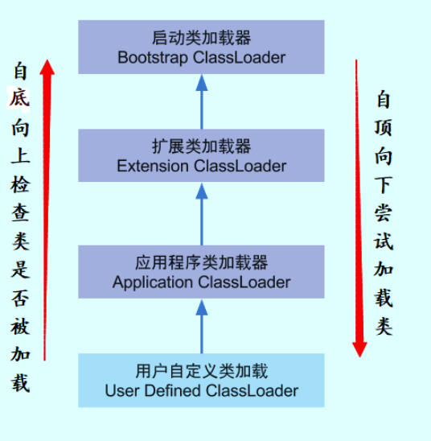
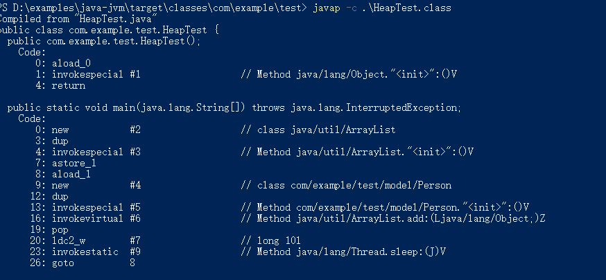
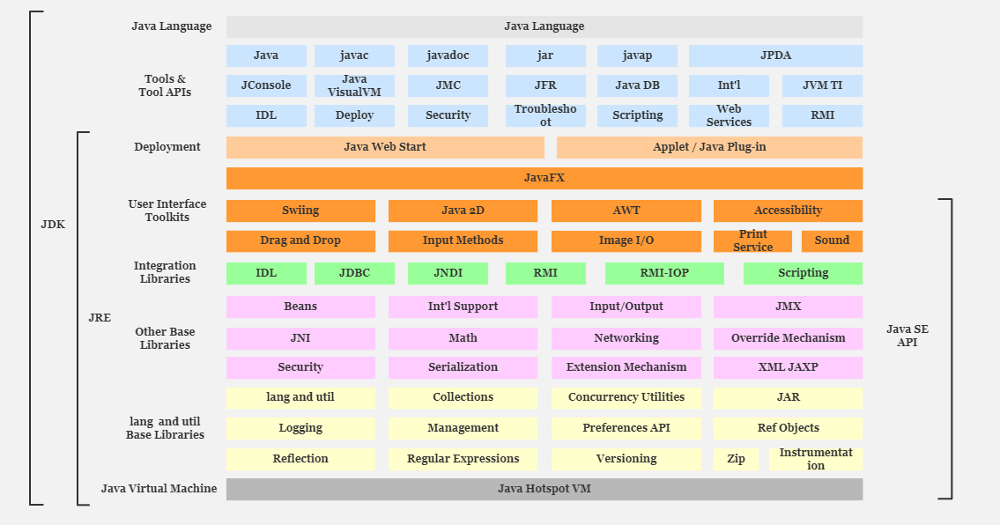
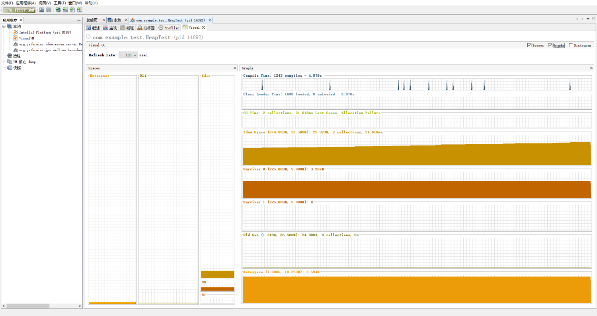
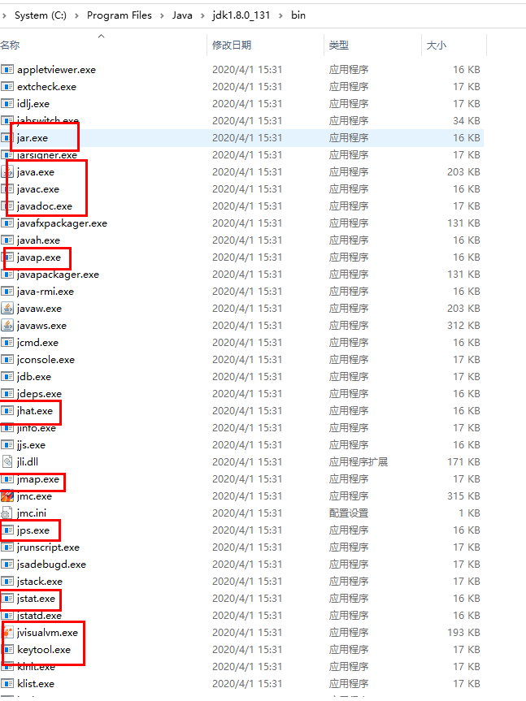
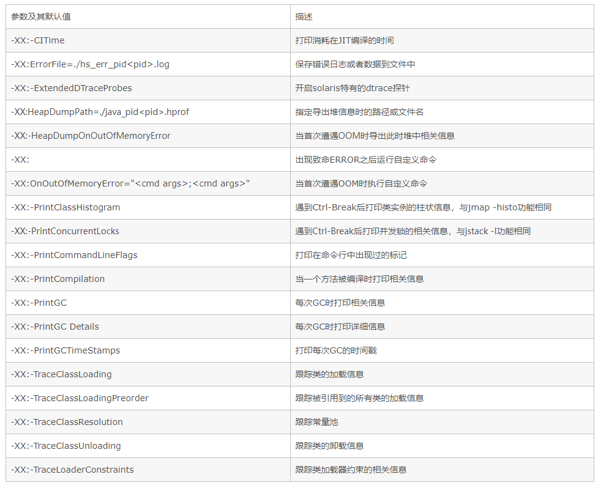

# JVM-1 知识总结

## 阅读说明

在本文中你会看到引入了多篇链接，这里建议你去阅读。另外，我也会引用到自己的笔记，在你阅读我的笔记时，阅读以下文章建议是下面的顺序：

- JVM知识总结 **也就是本篇文章**
- processon平台：<JVM-JDK1.8 https://www.processon.com/view/link/5e8f03211e085370359b6a01 密码：p5Wh>
- JVM内存溢出分析


本文主要是从JVM调优出发，了解为什么要调优，以及如何调优，如何处理线上内存溢出问题。另外本文说明使用的是JDK1.8**。**


## 1. 为什么要调优


要了解为什么调优，那肯定是有问题才需要进行优化，那么首先得从JVM内存模型开始讲解。了解JVM的工作流程，以及可能出现的问题。所谓调优就是说默认的并不合适，需要我们去调整。


**内存溢出** out of memory，是指程序在申请内存时，没有足够的内存空间供其使用，出现out of memory；比如申请了一个integer,但给它存了long才能存下的数，那就是内存溢出。

**内存泄露** memory leak，是指程序在申请内存后，无法释放已申请的内存空间，一次内存泄露危害可以忽略，但内存泄露堆积后果很严重，无论多少内存,迟早会被占光。**其实说白了就是该内存空间使用完毕之后未回收。**


## 2. JVM内存模型

详细见：https://www.processon.com/view/link/5e8f03211e085370359b6a01 密码：p5Wh

其他版本：https://www.processon.com/view/5c749debe4b0f9fba6921d15


如何查看当前版本JDK内存模型？

JDK不同的版本，堆内存分布模型是不一样，谈内存模型不说明版本的都是耍流氓，那么我们如何确定呢？

下图为java自带的jvm工具**(使用见本文中的四、JVM工具**)，可从图中看到内存模型分布情况：Eden、s0、s1、Old、Metaspace


## 3. JVM知识


#### 为什么要将永久代(PermGen)替换为元空间(MetaSpace)呢? 

**整个永久代有⼀个 JVM 本身设置固定⼤⼩上线，⽆法进⾏调整**，⽽**元空间使⽤的是直接内存**，受本机 可⽤内存的限制，并且永远不会得到java.lang.OutOfMemoryError。你可以使⽤ -XX： MaxMetaspaceSize 标志设置最⼤元空间⼤⼩，默认值为 unlimited，这意味着它只受系统内存的限 制。 -XX：MetaspaceSize 调整标志定义元空间的初始⼤⼩如果未指定此标志，则 Metaspace 将根 据运⾏时的应⽤程序需求动态地重新调整⼤⼩。


#### 强引⽤,软引⽤,弱引⽤,虚引⽤

**强引⽤(StrongReference)** 以前我们使⽤的⼤部分引⽤实际上都是强引⽤，这是使⽤最普遍的引⽤。如果⼀个对象具有强引⽤，那 就类似于**必不可少的⽣活⽤品**，垃圾回收器绝不会回收它。当内存空 间不⾜，Java虚拟机宁愿抛出 OutOfMemoryError错误，使程序异常终⽌，也不会靠随意回收具有强引⽤的对象来解决内存不⾜问题。


**软引⽤(SoftReference)** 如果⼀个对象只具有软引⽤，那就类似于**可有可⽆的⽣活⽤品**。如果内存空间⾜够，垃圾回收器就不会 回收它，如果内存空间不⾜了，就会回收这些对象的内存。只要垃圾回收器没有回收它，该对象就可以 被程序使⽤。软引⽤可⽤来实现内存敏感的⾼速缓存。 软引⽤可以和⼀个引⽤队列（ReferenceQueue）联合使⽤，如果软引⽤所引⽤的对象被垃圾回收，JAVA 虚拟机就会把这个软引⽤加⼊到与之关联的引⽤队列中。


**弱引⽤(WeakReference)** 如果⼀个对象只具有弱引⽤，那就类似于**可有可⽆的⽣活⽤品**。弱引⽤与软引⽤的区别在于：只具有弱 引⽤的对象拥有更短暂的⽣命周期。在垃圾回收器线程扫描它 所管辖的内存区域的过程中，**⼀旦发现 了只具有弱引⽤的对象，不管当前内存空间⾜够与否，都会回收它的内存。**不过，由于垃圾回收器是⼀ 个优先级很低的线程， 因此不⼀定会很快发现那些只具有弱引⽤的对象。 弱引⽤可以和⼀个引⽤队列（ReferenceQueue）联合使⽤，如果弱引⽤所引⽤的对象被垃圾回收，Java 虚拟机就会把这个弱引⽤加⼊到与之关联的引⽤队列中


**虚引⽤（PhantomReference）** "虚引⽤"顾名思义，就是形同虚设，与其他⼏种引⽤都不同，虚引⽤并不会决定对象的⽣命周期。如果 ⼀个对象仅持有虚引⽤，那么它就和没有任何引⽤⼀样，在任何时候都可能被垃圾回收。**虚引⽤主要⽤来跟踪对象被垃圾回收的活动。**


特别注意，在程序设计中⼀般很少使⽤弱引⽤与虚引⽤，使⽤软引⽤的情况᫾多，这是因为软引⽤可以 加速JVM对垃圾内存的回收速度，可以维护系统的运⾏安全，防⽌内存溢出（OutOfMemory）等问题的产 ⽣。


#### 并发与并行

并⾏（**Parallel**） ：指在同一时刻，有多条指令在多个处理器上同时执行。所以无论从微观还是从宏观来看，二者都是一起执行的。

并发（**Concurrent**）：指在同一时刻只能有一条指令执行，但多个进程指令被快速的轮换执行，使得在宏观上具有多个进程同时执行的效果，但在微观上并不是同时执行的，只是把时间分成若干段，使多个进程快速交替的执行。


#### 知道类加载的过程吗？

类加载过程：**加载**——>连接——>初始化。连接过程⼜可分为三步:验证——>准备——>解析


#### 知道哪些类加载器?

 JVM 中内置了三个重要的 ClassLoader，除了 BootstrapClassLoader 其他类加载器均由 Java 实现且 全部继承⾃ java.lang.ClassLoader ： 

1. **BootstrapClassLoader**(启动类加载器) ：最顶层的加载类，由C++实现，负责加载 %JAVA_HOME%/lib ⽬录下的jar包和类或者或被 -Xbootclasspath 参数指定的路径中的所 有类。 

2. **ExtensionClassLoader**(扩展类加载器) ：主要负责加载⽬录 %JRE_HOME%/lib/ext ⽬录下 的jar包和类，或被 java.ext.dirs 系统变量所指定的路径下的jar包。 

3. **AppClassLoader**(应⽤程序类加载器) :⾯向我们⽤户的加载器，负责加载当前应⽤classpath下 的所有jar包和类。




#### 双亲委派模型介绍 

**每⼀个类都有⼀个对应它的类加载器**。系统中的 ClassLoder 在协同⼯作的时候会默认使⽤ 双亲委派 模型 。即在类加载的时候，系统会⾸先判断当前类是否被加载过。已经被加载的类会直接返回，否则 才会尝试加载。加载的时候，**⾸先会把该请求委派该⽗类加载器的 loadClass() 处理**，因此所有的 请求最终都应该传送到顶层的启动类加载器 BootstrapClassLoader 中。当⽗类加载器⽆法处理 时，才由⾃⼰来处理。**当⽗类加载器为null时，会使⽤启动类加载器 BootstrapClassLoader 作为 ⽗类加载器。**


**如果我们不想⽤双亲委派模型怎么办？** 为了避免双亲委托机制，我们可以⾃⼰定义⼀个类加载器，要继承 ClassLoader，然后重载 loadClass() 即可。


## 4. JVM工具

在这里介绍一下JVM调优会使用的一些工具。


### 4.1 javap

java自带的反编译工具，命令：

```
javap -c xxx.class
```

从图中可以看到Code下面的数字就是程序计数器，用于了解Java是如何解释工作的



其它：javac -verbose Test.class


### 4.2 Java平台的结构图

可以从图中看到javap就是我们是jdk自带的tool




### 4.3 jvisualvm

jvisualvm：JDK自带的JVM工具

命令：

jvisualvm


输入以上命令，则会自动打开该工具，从图中左侧栏目可以看到当前运行的一些线程。**应用程序-本地**

可能你打开的时候看不到图中Visual GC这个菜单

**这是因为Java VisualVM默认没有安装Visual GC插件，需要手动安装**

<[**Java程序性能分析工具Java VisualVM（Visual GC）—程序员必备利器**](https://www.cnblogs.com/linghu-java/p/5689227.html) https://www.cnblogs.com/linghu-java/p/5689227.html>




这个工具可以查看一些内存和CPU信息，系统配置，当然从图中也可以了解JVM堆内存模型


### 4.4 MAT(Memory Analyzer Tool)

介绍：

MAT是Memory Analyzer tool的缩写。Eclipse开发的分析工具。

Eclipse的内存分析器是一种快速，功能丰富的Java堆分析工具，帮助你查找内存泄漏和减少内存消耗。

下载地址：https://www.eclipse.org/mat/downloads.php

基础配置：

安装目录下的MemoryAnalyzer.ini文件内容**Xmx配置要大于dump文件，否者无法对dump文件进行分析**

打开后，配置Windows ->  Preferences ->  Memory Analyzer -> General configuration for Memory Analyzer中的Keep unreachable objects勾选，如果不勾选的话，只会给你分析当前JVM栈用对象，Bytes display选择MB

更多介绍见我的笔记：<JVM内存溢出分析 http://note.youdao.com/noteshare?id=d54be24d4db0df59959933c5270cc963>


### 4.5 JDK自带工具

更多工具见java安装目录下的**/bin/**

****


### 4.6 JVM内存溢出分析

<JVM内存溢出分析 http://note.youdao.com/noteshare?id=d54be24d4db0df59959933c5270cc963>


## 5. JVM参数设置

### 为什么调优？

在（**二、JVM内存模型）**中你了解到了，GC的时候会导致STW，也就是stop the world，这个时候会去暂停正在运行的线程（在客户的使用角度来看，就是感觉系统有点卡顿的样子）

因此，我们要进行调优，就是要避免STW，避免Full GC。正常的Full GC周期是几天或几周


### 那如何调优？

JVM默认的参数并不一定适合我们的程序，因此想要进行调优，就要了解JVM的参数设置，从而进行选择，设置一个对程序合适的参数。


### 如何设置JVM内存分配？

```
$ java -Xms128m -Xmx256m -XX:MetaspaceSize=128m -XX:MaxMetaspaceSize=256m -XX:+HeapDumpOnOutOfMemoryError -XX:HeapDumpPath=/usr/local/xxxx.hprof" -jar xxx.jar
-XX:+HeapDumpOnOutOfMemoryError
-XX:HeapDumpPath=/usr/local/xxxx.hprof -jar
-Xms1500m -Xmx1500m
-XX:MetaspaceSize=128m -XX:MaxMetaspaceSize=512m
-XX:+PrintGCDetails
```


**阅读说明**

用-XX作为前缀的参数列表在jvm中可能是不健壮的，SUN也不推荐使用，后续可能会在没有通知的情况下就直接取消了；

但是由于这些参数中的确有很多是对我们很有用的，比如我们经常会见到的-XX:PermSize、-XX:MaxPermSize等等；


jvm参数主要包括三种：

- 堆和栈空间设置
- 垃圾收集器设置（包括并发gc）
- 辅助配置（统计跟踪、逃逸分析)


参考 <IntelliJ IDEA设置JVM运行参数 https://blog.csdn.net/sdujava2011/article/details/50086933>

<jvm参数详解 https://blog.csdn.net/kid_2412/article/details/52633739>


### 5.1 性能优化参数说明

| 参数                       | 介绍                           | 说明                                                         |
| -------------------------- | ------------------------------ | ------------------------------------------------------------ |
| -Xms                       | Java Heap初始值                | JVM最好将-Xms和-Xmx设为相同值（为了避免在运行时频繁调整Heap的大小） |
| -Xmx                       | Java Heap最大值                | 默认值为物理内存的1/4最佳设值应该视物理内存大小及计算机内其他内存开销而定 |
| -Xmn                       | Java Heap中Young区大小         | 堆内存 = 年轻代+年老代+元空间元空间一般固定大小为64m，**默认年轻代和年老代是1/3：2/3的关系。**所以增大年轻代后，将会减小**年老代**大小。此值对系统性能影响较大，Sun官方推荐配置为整个堆的3/8。 |
| -Xss                       | 每个线程的堆栈大小             |                                                              |
| -Xoss                      | 本地方法栈大小                 | 对hotspot无效                                                |
| XX:NewRatio                | Young年轻代与Old老年代的比例   | 例如：-XX:NewRatio=4，即年轻代：年老代=1：4                  |
| -XX:SurvivorRatio          | Eden与survivor的比例           | 例如：-XX:SurvivorRatio=4，即Eden:Survivor=4:2默认为8，即Eden:Survivor=8:2。也就是我们看JVM内存模型常看到的，Eden占新生代的8/10，From幸存区和To幸存区各占新生代的1/10 |
| -XX:MaxMetaspaceSize       | 最大元空间                     |                                                              |
| -XX:MaxTenuringThreshold   | 年轻代最大gc分代年龄           | 如果超过这个阈值会直接接入老年代，如果设置为0，年轻代不经过survivor空间直接进入老年代 |
| -XX:PretenureSizeThreshold | 设置大对象直接进入老年代的阈值 | 当大对象大小超过该值将会直接在老年代分配，默认值是0，意思是不管多大都是先在eden中分配内存 |
| -XX: TargetSurvivorRatio   | **对象动态年龄判断**           | 当前放对象的Survivor区域里，一批对象的总大小大于这块Survivor区域内存大小的50%(-XX: TargetSurvivorRatio可以指定)，那么此时**大于等于**这批对象年龄最大值的对象，就可以直接进入老年代了。例如：Survivor区域里现有一批对象，年龄1+年龄2+年龄n的多个年龄对象总和超过了Survivor区域的50%,此时就会把年龄n(含以上)的对象都放入老年代。这个规则其实是希望那些可能是长期存活的对象，尽早进入老年代。**对象动态年龄判断机制一般是在minor gc之后触发的。** |

- -XX:+UseSerialGC：在新生代和老年代使用串休gc
- -XX:+UseParNewGc：在新生代使用并行gc
- -XX:+UseParallelOldGC：在老年代使用并行gc
- **-XX:ParallelGCThread：**设置Parallel gc的垃圾PretenureSizeThreshold回收线程数，通常与cpu数量相同
- **-XX:MaxGCPauseMillis：**设置最大垃圾收集停顿时间，垃圾回收器会尽量控制回收的时间在该值范围内
- -XX:GCPauseIntervalMillis：设置停顿时间间隔
- **-XX:GCTimeRatio：**设置吞吐量大小，0~100之间的整数。若该值为n，那么jvm将会花费不超过1/(1+n)的时间用于垃圾回收。
- **-XX:+UseAdaptiveSizePolicy：**开启自适应gc策略，jvm会根据运行时吞吐量等信息自动调整eden、old等空间大小以及晋升老年代年龄
- **-XX:SurvivorRatio=8** Eden与survivor的比例.默认为8，即Eden:Survivor=8:2**。**也就是我们看JVM内存模型常看到的，Eden占新生代的8/10，From幸存区和To幸存区各占新生代的1/10
- **-XX:PretenureSizeThreshold**   当大对象大小超过该值将会直接在老年代分配
- **-XX:MaxTenuringThreshold 年轻代最大gc分代年龄, 如果超过这个阈值会直接接入老年代，如果设置为0，年轻代不经过survivor空间直接进入老年代**
- -XX:+UseConcMarkSweepGC：新生代使用ParNew，老年代使用CMS和Serial，其中老年代的Serial用于作为CMS失败时调用的备选gc
- -XX:+ParallelCMSThreads：CMS线程数量
- -XX:CMSInitiatingOccupancyFraction：设置老年代空间被使用多少后触发CMS gc，默认为68%
- -XX:CMSFullGCsBeforeCompaction：设置多少次CMS回收后，进行一次内存压缩
- -XX:+CMSClassUnloadingEnabled：在类卸载后进行CMS回收
- -XX:+CMSParallelRemarkEnabled：启用并行重标记
- -XX:CMSInitiatingPermOccupancyFraction：当永久代空间被使用多少后触发CMS gc，百分比（在使用时CMSClassUnloadingEnabled必须被配置）UseCMSInitiatingOccupancyOnly：只有当gc达到配置的阈值时才进行回收
- XX:+CMSIncrementalMode：使用增量模式，适合单CPU
- XX:+UserG1GC：使用G1回收器，与G1相关的虚拟机参数都只能在jdk1.7以上使用
- XX:+UnlockExperimentalVMOptions：允许使用实验性参数


### 5.2 行为参数说明

| 参数及其默认值            | 描述                                                      |
| ------------------------- | --------------------------------------------------------- |
| -XX:-DisableExplicitGC    | 禁止调用System.gc()；但jvm的gc仍然有效                    |
| -XX:+MaxFDLimit           | 最大化文件描述符的数量限制                                |
| -XX:+ScavengeBeforeFullGC | 新生代GC优先于Full GC执行                                 |
| -XX:+UseGCOverheadLimit   | 在抛出OOM之前限制jvm耗费在GC上的时间比例                  |
| -XX:-UseConcMarkSweepGC   | 对老生代采用并发标记交换算法进行GC                        |
| -XX:-UseParallelGC        | 启用并行GC                                                |
| -XX:-UseParallelOldGC     | 对Full GC启用并行，当-XX:-UseParallelGC启用时该项自动启用 |
| -XX:-UseSerialGC          | 启用串行GC                                                |
| -XX:+UseThreadPriorities  | 启用本地线程优先级                                        |


### 5.3 调试参数说明




### 5.4 IDEA优化

设置合适的参数，让IDEA不再卡顿

```
# custom IntelliJ IDEA VM options

-Xms3072m
-Xmx3072m
-XX:ReservedCodeCacheSize=240m
-XX:+UseConcMarkSweepGC
-XX:SoftRefLRUPolicyMSPerMB=50
-ea
-Dsun.io.useCanonCaches=false
-Djava.net.preferIPv4Stack=true
-Djdk.http.auth.tunneling.disabledSchemes=""
-XX:+HeapDumpOnOutOfMemoryError
-XX:-OmitStackTraceInFastThrow
```