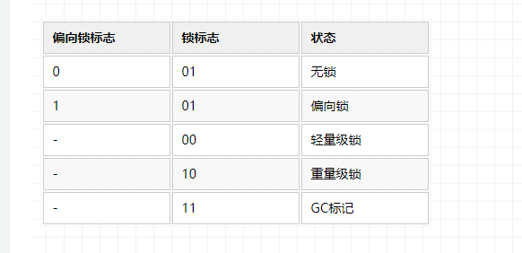
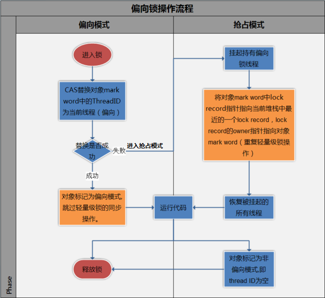
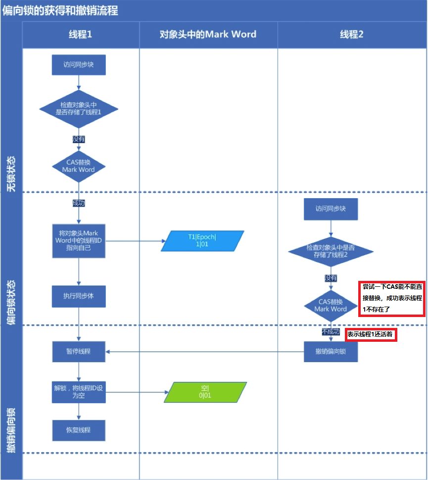
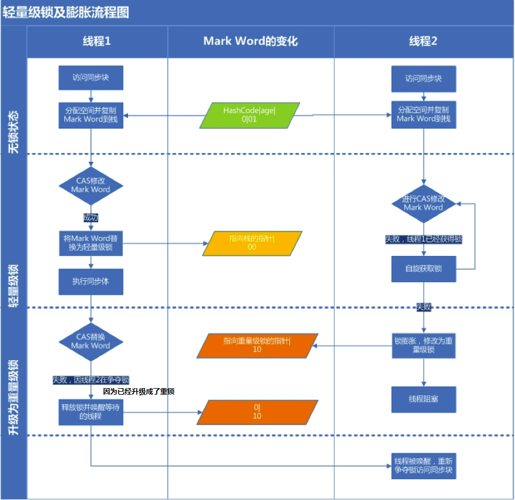

# 多线程 -  synchronized与锁


## synchronized与锁

为什么需要锁？

当多线程的时候，为了保证数据的一致性，因此需要锁。


在Java中，synchronized的实现没有严格的要求，只要能做到：只有由我占有，才能使用即可。

Java中的锁都是基于**对象**的，所以我们又经常称它为对象锁。


### synchronized各种用法

synchronized锁的是对象，既保证原子性，也保证了可见性。

注意：不能用String常量、Integer、Long等基础对象，因为容易锁的同一个对象，这样很多代码用到的地方都容易造成锁等待。

```java
final Object o = new Object(); // 应避免锁的对象发生改变，因此加上final关键字
synchronized(o){}

synchronized void test(){}
// 等于
// 因为每一次锁都创建一个对象不方便，因此最简单的就是锁住当前类实例。
void test(){
    synchronized(this){}
}


class T{
    synchronized static void test(){}
}
// 等于
class T{
    void test(){
        // 静态方法是不需要new一个对象，那么锁的是谁呢？其实锁的是T.class
        // 每一个class文件load到内存后，会生成一个对应的class对象。
        synchronized(T.class){}
    }
}
```


### 可重入锁

```java
class T{
    synchronized void t1(){}
    
    synchronized void t2(){}
}
```

问：t1中是否能调用t2？答案是可以的。Java的synchronized锁是可重入锁


什么是可重入锁？

可重入锁：同一个线程**重复**获取同一个锁。

同⼀个线程每次获取锁，**锁的计数器都⾃增1**，等到锁的计数器下降为0时才能释放锁。

因此，如果t1调用时，已经获得当前类的锁，再调用t2时发现需要锁，这个时候如果不能重复获取锁的话就会造成死锁了。所以synchronized是支持可重入的。


### synchronized遇到异常

程序在执行时，如果出现异常，默认会释放锁。因此要非常小心处理同步业务逻辑中的异常。

```java
public synchronized void t1() {
    if (5/0 == 1){
        System.out.println("--");
    }
}
```

注意：异常会释放锁


## synchronized的执行流程

1.获得同步锁

2.清空工作内存(保证内存可见性)

3.从主内存拷贝对象副本到工作内存

4.执行代码(计算活输出等)

5.刷新主内存数据

6.释放同步锁


### synchronized的实现原理-对象头

我们知道sync锁定的是class实例，也就是对象。JVM通过在对象头中进行标记，表示是否占有锁。sync会有锁升级的一个概念。

 对象头源码详解：https://blog.csdn.net/baidu_28523317/article/details/104453927


每个Java对象都有对象头。如果是非数组类型，则用2个字宽来存储对象头，如果是数组，则会用3个字宽来存储对象头。

在32位处理器中，一个字宽是32位；在64位虚拟机中，一个字宽是64位。对象头的内容如下表：

| 长度     | 内容                   | 说明                         |
| -------- | ---------------------- | ---------------------------- |
| 32/64bit | Mark Word              | 存储对象的hashCode或锁信息等 |
| 32/64bit | Class Metadata Address | 存储到对象类型数据的指针     |


如果是数组，则会用3个字宽来存储对象头

| 长度     | 内容                   | 说明                         |
| -------- | ---------------------- | ---------------------------- |
| 32/64bit | Mark Word              | 存储对象的hashCode或锁信息等 |
| 32/64bit | Class Metadata Address | 存储到对象类型数据的指针     |
| 32/64bit | Array length           | 数组的长度（如果是数组）     |


我们主要来看看Mark Word的格式：

| 锁状态   | 29 bit 或 61 bit             | 1 bit 偏向锁标记           | 2 bit 锁标志 |
| -------- | ---------------------------- | -------------------------- | ------------ |
| 无锁     |                              | 0                          | 01           |
| 偏向锁   | 线程ID                       | 1                          | 01           |
| 轻量级锁 | 指向栈中锁记录的指针         | -                          | 00           |
| 重量级锁 | 指向互斥量（重量级锁）的指针 | -                          | 10           |
| GC标记   |                              | 此时这一位不用于标识偏向锁 | 11           |

可以看到，当对象状态为偏向锁时，Mark Word存储的是偏向的线程ID；

当状态为轻量级锁时，Mark Word存储的是指向线程栈中Lock Record的指针；

当状态为重量级锁时，Mark Word为指向堆中的monitor对象的指针。


### 临界区

我们这里介绍一下“临界区”的概念。所谓“临界区”，指的是某一块代码区域，它同一时刻只能由一个线程执行。

在上面的例子中，如果synchronized关键字在方法上，那临界区就是整个方法内部。而如果是使用synchronized代码块，那临界区就指的是代码块内部的区域。


### 锁升级

**Java 6** 为了减少获得锁和释放锁带来的性能消耗，引入了“偏向锁”和“轻量级锁“。在Java 6 以前，所有的锁都是”重量级“锁。

所以在Java 6 及其以后，一个对象其实有四种锁状态，它们级别由低到高依次是：

1. 无锁状态
2. 偏向锁状态
3. 轻量级锁状态
4. 重量级锁状态

无锁：就是没有对资源进行锁定，任何线程都可以尝试去修改它。

重量级锁：指的系统级别的锁，**不占用CPU**，进入等待状态。


### 锁升级的过程

sync(Object)

1. 当没遇到synchronized时，就是无锁状态
2. 第一个线程访问，markword 记录这个线程ID （偏向锁），如果后面还是这个线程，就不用加锁
3. 如果后面是其它线程，线程争用：锁升级为轻量级锁， 自旋锁
4. 默认自旋10次，10次后未获取到锁，升级为重量级锁（系统锁），进入等待队列


### 锁升级测试

```java
package com.example.thread.other;

import org.openjdk.jol.info.ClassLayout;

import java.util.concurrent.TimeUnit;

public class JavaObjectLayout {

    public static void main(String[] args) throws InterruptedException{
        final A a = new A();
        ClassLayout layout = ClassLayout.parseInstance(a);
        System.out.println("****Fresh object");
        // 当没遇到synchronized时，就是无锁状态
        // 第一个线程访问，markword 记录这个线程ID （偏向锁），如果后面还是这个线程，就不用加锁
        System.out.println(layout.toPrintable());// 01, 无锁可偏向，00000 0 01

        Thread t = new Thread(() -> {
            synchronized (a){
                try {
                    TimeUnit.SECONDS.sleep(10);
                }catch (InterruptedException e){
                    return;
                }
            }
        });
        t.start();


        TimeUnit.SECONDS.sleep(1);

        System.out.println("****Before the lock");
        // 如果后面是其它线程，线程争用：锁升级为轻量级锁， 自旋锁
        System.out.println(layout.toPrintable());// 00, 轻量级锁，11111 0 00

		// 默认自旋10次，10次后未获取到锁，升级为重量级锁（系统锁），进入等待队列
        synchronized (a){
            System.out.println("****With the lock");
            System.out.println(layout.toPrintable());// 10, 重量级锁，11011 0 10
        }

        System.out.println("****After the lock");
        System.out.println(layout.toPrintable());// 10, 锁不会降级

        System.gc();

        System.out.println("****After System.gc()");
        System.out.println(layout.toPrintable());// 如果非11，可能未gc

    }
}


class A{

}
```


**大小端**

查看结果之前，认识一下大小端

- 大端是高字节存放到内存的低地址

- 小端是高字节存放到内存的高地址


高数据位，低数据位：0000 0000 0001 0011。左是高数据位，右是低数据位。

高地址位，低地址位：比如一个四字节内存0x10 0x20 0x30 0x40。左是低地址位，右是高地址位。根据地址的高低判断。


大小端其实就是系统对数据在内存中的存储规则。因此我们的数据分为两种方式存储。

大端模式（Big-endian）存储：数据的低数据位 放在 内存的高地址位。**这和我们的阅读习惯一样。**

小端模式（Little-endian）存储： 数据的低数据位 放在 内存的低地址位。


记住：一般我们的都是小端，和我们的阅读习惯不一样。


**输出结果**




```
# WARNING: Unable to attach Serviceability Agent. You can try again with escalated privileges. Two options: a) use -Djol.tryWithSudo=true to try with sudo; b) echo 0 | sudo tee /proc/sys/kernel/yama/ptrace_scope
****Fresh object
com.example.thread.other.A object internals:
 OFFSET  SIZE   TYPE DESCRIPTION                               VALUE
      0     4        (object header)                           01 00 00 00 (00000001 00000000 00000000 00000000) (1)
      4     4        (object header)                           00 00 00 00 (00000000 00000000 00000000 00000000) (0)
      8     4        (object header)                           92 c3 00 f8 (10010010 11000011 00000000 11111000) (-134167662)
     12     4        (loss due to the next object alignment)
Instance size: 16 bytes
Space losses: 0 bytes internal + 4 bytes external = 4 bytes total

****Before the lock
com.example.thread.other.A object internals:
 OFFSET  SIZE   TYPE DESCRIPTION                               VALUE
      0     4        (object header)                           f8 ed 01 20 (11111000 11101101 00000001 00100000) (536997368)
      4     4        (object header)                           00 00 00 00 (00000000 00000000 00000000 00000000) (0)
      8     4        (object header)                           92 c3 00 f8 (10010010 11000011 00000000 11111000) (-134167662)
     12     4        (loss due to the next object alignment)
Instance size: 16 bytes
Space losses: 0 bytes internal + 4 bytes external = 4 bytes total

****With the lock
com.example.thread.other.A object internals:
 OFFSET  SIZE   TYPE DESCRIPTION                               VALUE
      0     4        (object header)                           da 07 ef 1c (11011010 00000111 11101111 00011100) (485427162)
      4     4        (object header)                           00 00 00 00 (00000000 00000000 00000000 00000000) (0)
      8     4        (object header)                           92 c3 00 f8 (10010010 11000011 00000000 11111000) (-134167662)
     12     4        (loss due to the next object alignment)
Instance size: 16 bytes
Space losses: 0 bytes internal + 4 bytes external = 4 bytes total

****After the lock
com.example.thread.other.A object internals:
 OFFSET  SIZE   TYPE DESCRIPTION                               VALUE
      0     4        (object header)                           da 07 ef 1c (11011010 00000111 11101111 00011100) (485427162)
      4     4        (object header)                           00 00 00 00 (00000000 00000000 00000000 00000000) (0)
      8     4        (object header)                           92 c3 00 f8 (10010010 11000011 00000000 11111000) (-134167662)
     12     4        (loss due to the next object alignment)
Instance size: 16 bytes
Space losses: 0 bytes internal + 4 bytes external = 4 bytes total

****After System.gc()
com.example.thread.other.A object internals:
 OFFSET  SIZE   TYPE DESCRIPTION                               VALUE
      0     4        (object header)                           09 00 00 00 (00001001 00000000 00000000 00000000) (9)
      4     4        (object header)                           00 00 00 00 (00000000 00000000 00000000 00000000) (0)
      8     4        (object header)                           92 c3 00 f8 (10010010 11000011 00000000 11111000) (-134167662)
     12     4        (loss due to the next object alignment)
Instance size: 16 bytes
Space losses: 0 bytes internal + 4 bytes external = 4 bytes total

Disconnected from the target VM, address: '127.0.0.1:61021', transport: 'socket'

Process finished with exit code 0
```


### 锁降级

网上大部分会说，锁只能升级，不能降级。

其实锁是可以降级的，但是锁降级发生的条件会比较苛刻，锁降级发生在Stop The World期间，当JVM进入安全点的时候，会检查是否有闲置的锁，然后进行降级。

关于锁降级有一点说明：

1.不同于大部分文章说锁不能降级，实际上HotSpot JVM 是支持锁降级的。


### 自旋锁

循环里不断的尝试获取锁

自旋锁和系统锁区别

- 系统锁不占用CPU，进入等待队列。所以执行时间长、线程数比较多的用系统锁

- 自旋锁占用CPU，一直在循环里尝试获取锁。所以执行时间短、线程数比较少用自旋锁


### 偏向锁

Hotspot的作者经过以往的研究发现：大多数情况下**锁不仅不存在多线程竞争，而且总是由同一线程多次获得**，于是引入了偏向锁。


当第一线程访问时，Mark Word存储的是偏向的线程ID；标记为偏向锁。如果后面还是这个线程访问，就直接拿来用，不用竞争。

如果后面访问的其它线程，出现锁竞争，升级为轻量级锁


偏向锁操作流程：




**撤销偏向锁**

偏向锁使用了一种**等到竞争出现才释放锁的机制**，所以当其他线程尝试竞争偏向锁时， 持有偏向锁的线程才会释放锁。


偏向锁升级成轻量级锁时，会暂停拥有偏向锁的线程，重置偏向锁标识，这个过程看起来容易，实则开销还是很大的，大概的过程如下：

1. 在一个安全点（在这个时间点上没有字节码正在执行）停止拥有锁的线程。
2. 遍历线程栈，如果存在锁记录的话，需要修复锁记录和Mark Word，使其变成无锁状态。
3. 唤醒被停止的线程，将当前锁升级成轻量级锁。

所以，如果应用程序里所有的锁通常处于竞争状态，那么偏向锁就会是一种累赘，对于这种情况，我们可以一开始就把偏向锁这个默认功能给关闭：

-XX:UseBiasedLocking=false。


偏向锁的获取和撤销流程




### 轻量级锁

多个线程在不同时段获取同一把锁，即不存在锁竞争的情况，也就没有线程阻塞。

针对这种情况，JVM采用轻量级锁来避免线程的阻塞与唤醒。


**轻量级锁的加锁**

JVM会为每个线程在当前线程的栈帧中创建用于存储锁记录的空间，我们称为Displaced Mark Word。如果一个线程获得锁的时候发现是轻量级锁，会把锁的Mark Word复制到自己的Displaced Mark Word里面。

然后线程尝试用CAS将锁的Mark Word替换为指向锁记录的指针。如果成功，当前线程获得锁，如果失败，表示Mark Word已经被替换成了其他线程的锁记录，说明在与其它线程竞争锁，当前线程就尝试使用自旋来获取锁。

自旋：不断尝试去获取锁，一般用循环来实现。

自旋是需要消耗CPU的，如果一直获取不到锁的话，那该线程就一直处在自旋状态，白白浪费CPU资源。解决这个问题最简单的办法就是指定自旋的次数，例如让其循环10次，如果还没获取到锁就进入阻塞状态。

但是JDK采用了更聪明的方式——适应性自旋，简单来说就是线程如果自旋成功了，则下次自旋的次数会更多，如果自旋失败了，则自旋的次数就会减少。

自旋也不是一直进行下去的，如果自旋到一定程度（和JVM、操作系统相关），依然没有获取到锁，称为自旋失败，那么这个线程会阻塞。同时这个锁就会**升级成重量级锁**。


**轻量级锁的释放：**




### 重量级锁

重量级锁也叫做系统级别锁，不占用CPU，会进行等待状态。

重量级锁依赖于操作系统的互斥量（mutex） 实现的，而操作系统中线程间状态的转换需要相对比较长的时间，所以重量级锁效率很低，但被阻塞的线程不会消耗CPU。


### 总结锁的升级流程

每一个线程在准备获取共享资源时： 第一步，检查MarkWord里面是不是放的自己的ThreadId ,如果是，表示当前线程是处于 “偏向锁” 。

第二步，如果MarkWord不是自己的ThreadId，锁升级，这时候，用CAS来执行切换，新的线程根据MarkWord里面现有的ThreadId，通知之前线程暂停，之前线程将Markword的内容置为空。

第三步，两个线程都把锁对象的HashCode复制到自己新建的用于存储锁的记录空间，接着开始通过CAS操作， 把锁对象的MarKword的内容修改为自己新建的记录空间的地址的方式竞争MarkWord。

第四步，第三步中成功执行CAS的获得资源，失败的则进入自旋 。

第五步，自旋的线程在自旋过程中，成功获得资源(即之前获的资源的线程执行完成并释放了共享资源)，则整个状态依然处于 轻量级锁的状态，如果自旋失败 。

第六步，进入重量级锁的状态，这个时候，自旋的线程进行阻塞，等待之前线程执行完成并唤醒自己。


### 优缺点

《Java并发编程的艺术》

| 锁       | 优点                                                         | 缺点                                             | 适用场景                             |
| -------- | ------------------------------------------------------------ | ------------------------------------------------ | ------------------------------------ |
| 偏向锁   | 加锁和解锁不需要额外的消耗，和执行非同步方法比仅存在纳秒级的差距。 | 如果线程间存在锁竞争，会带来额外的锁撤销的消耗。 | 适用于只有一个线程访问同步块场景。   |
| 轻量级锁 | 竞争的线程不会阻塞，提高了程序的响应速度。                   | 如果始终得不到锁竞争的线程使用自旋会消耗CPU。    | 追求响应时间。同步块执行速度非常快。 |
| 重量级锁 | 线程竞争不使用自旋，不会消耗CP                               |                                                  |                                      |


## synchronized优化

锁细化