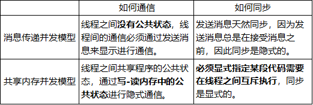
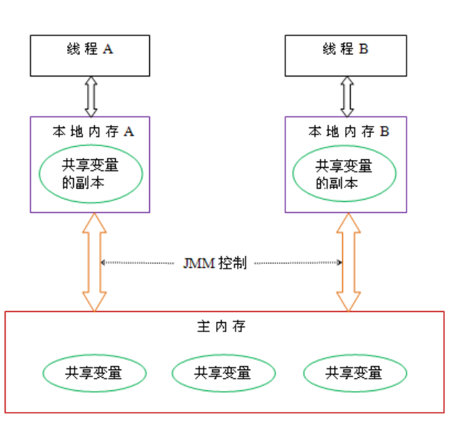
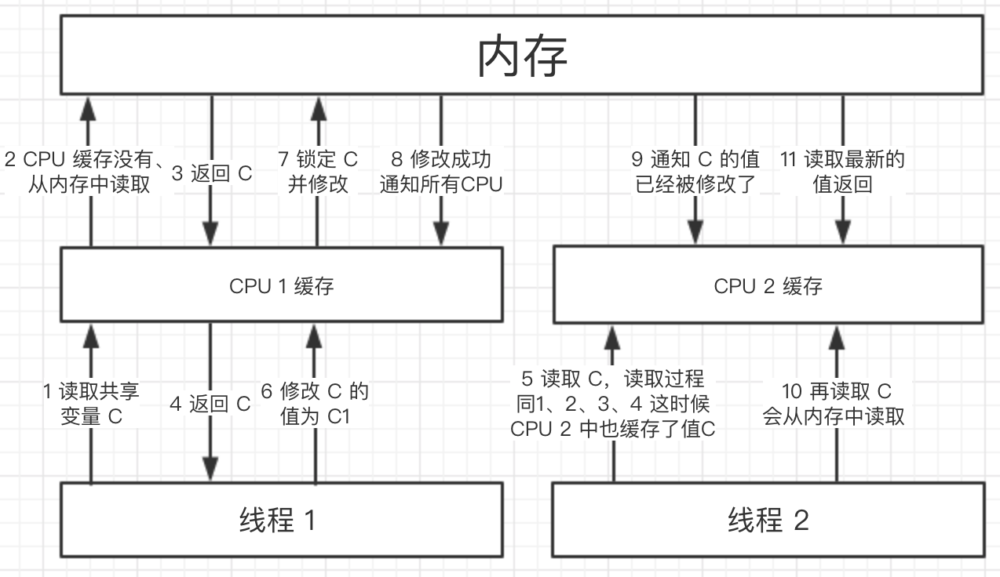

# 多线程 - volatile


首先思考两个问题：

- 线程之间如何通信？即：线程之间用什么机制来交换信息
- 线程之间如何同步？即：线程用什么机制来控制不同线程间操作发生的相对顺序


有两种并发模型可以解决这两个问题：

- 消息传递并发模型
- 共享内存并发模型

这两种模型之间的区别如下表所示：



**在Java中，使用的是共享内存并发模型**。


## volatile的作用

在写代码时，我们偶尔会用到volatile，今天就来探究一下。volatile的作用主要有两个：

- 保证变量在线程之间的内存可见性（MESI 缓存一致性协议）
- 防止指令重排

那内存可见性和指令重排序又是什么呢？


### 内存可见性

内存可见性：指的是**线程之间的可见性**，当一个线程修改了共享变量时，另一个线程可以读取到这个修改后的值。

在Java中使用的是共享内存并发模型。


#### JMM-Java内存模型

JMM：是一种虚拟机规范，叫做Java内存模型（Java Memory Model）。


在JMM中，分为主内存和本地内存。

- 主内存：是多个线程间通信的共享内存。
- 本地内存：每个线程从主内存拷贝的副本。


CPU为了提高效率，增加了本地内存(缓存)，但是同时也会带来问题，就是如果修改了主内存，但是本地内存可能还是旧的。为了解决这个问题，便提供了volatile关键字，主动刷新本地内存，保证内存可见性。（注：我们的缓存一致性问题，是不是有可以借助这种思想呢？）




#### JMM规范

所有的共享变量都存在主内存中，每个线程都保存了一份共享变量的副本。JMM规定，线程对共享变量的操作只能在本地内存中进行，不能直接读取主内存。

如果线程A与线程B之间要通信的话，只能通过主内存进行通信。

1. 线程A将本地内存A中更新过的共享变量刷新到主内存中去。如果加了 volatile ，主内存中值被修改后，会通知到各个 CPU 缓存进行重新获取。
2. 线程B在本地内存B中找到这个共享变量，发现已经被更新了，则会到主内存中重新拷贝更新后的共享变量。
3. 最后线程B再读取本地内存B中的新值。


#### 什么是happens-before规则

介绍：happens-before是JMM定义的一种规范，只要不改变程序的执行结果，编译器和处理器想怎么优化都行。

简单来说：只要遵守happens-before，就能保证在JMM中具有强的内存可见性。


happens-before定义：

1. 如果一个操作happens-before另一个操作，那么第一个操作的执行结果将对第二个操作可见，而且第一个操作的执行顺序排在第二个操作之前。
2. 两个操作之间存在happens-before关系，并不意味着Java平台的具体实现必须要按照happens-before关系指定的顺序来执行。如果重排序之后的执行结果，与按happens-before关系来执行的结果一致，那么JMM也允许这样的重排序。


happens-before关系本质上和as-if-serial语义是一回事。

as-if-serial语义保证单线程内重排序后的执行结果和程序代码本身应有的结果是一致的，happens-before关系保证正确同步的多线程程序的执行结果不被重排序改变。


总之，**如果操作A happens-before操作B，那么操作A在内存上所做的操作对操作B都是可见的，不管它们在不在一个线程。**


### volatile使用例子

最常见的便是单例模式下的双重锁检验(Double Check Lock)

```java
// volatile
private volatile LoadingCache<K, V> cache = null;

// double-checked
private LoadingCache<K, V> getCache() {
		if (null == cache) {
				// synchronized
        synchronized (this) {
           if (null == cache) {
								// do something
					      cache = initCache(); 
           }
				}
		}
}
```


**不加volatile可以吗？**

答：大部分时候是不存在问题。但是当锁住的是一个对象时，new一个对象是非原子性的，底层分为几条指令执行。

这个时候存在一个问题：对象**还没初始化完毕**的时候，第二个线程发现对象已经不为null，就会拿来用，**此时调用这个对象的方法或者成员变量就会有问题。**

因此加volatile可以禁止指令重排，保证其它线程读取到的是**一个完整的对象。**


#### volatile不能保证原子性

volatile关键字可以保证多线程操作共享变量的内存可见性以及禁止指令重排序，但是不保证原子性。

```java
/**
 * volatile不支持原子性
 */
public class T {

    volatile int count = 0;
    void sum(){
        for (int i = 0; i < 10000; i++) {
            // count++不具备原子性，实际上包含了三个操作：获取值，自增，赋值。
            count++;
        }
    }

    public static void main(String[] args) {

        T t = new T();
        List<Thread> threads = new ArrayList<>(10);

        for (int i = 0; i < 10; i++) {
            threads.add(new Thread(t::sum, "thread-" + i));
        }
        threads.forEach(o -> o.start());

        threads.forEach(o -> {
            try {
                o.join();
            }catch (InterruptedException e){}
        });

        System.out.println("sum:" + t.count); // != 100000
    }
}
```


#### 原子性分析

从下面代码可以看到，new Object()并不是一个原子性操作。

1. 分配内存空间
2. 初始化对象
3. 将对象指向刚分配的内存地址

这个时候就会存在一个问题：**由于指令重排序**，可能将顺序调整为1—>3—>2

这时，对象**还没初始化完毕**的时候，第二个线程发现对象已经不为null，就会拿来用，**此时这个对象的方法或者成员变量还未初始化，调用就会有问题。**

因此使用volatile有时候很重要，可以禁止指令重排序。

```java
/**
 * 原子性测试
 */
public class JustTest {

    public static void main(String[] args) {
        Object o = new Object();
    }
}
// 查看字节码
// class version 52.0 (52)
// access flags 0x21
public class com/example/thread/other/JustTest {

  // compiled from: JustTest.java

  // access flags 0x1
  public <init>()V
   L0
    LINENUMBER 6 L0
    ALOAD 0
    INVOKESPECIAL java/lang/Object.<init> ()V
    RETURN
   L1
    LOCALVARIABLE this Lcom/example/thread/other/JustTest; L0 L1 0
    MAXSTACK = 1
    MAXLOCALS = 1

  // access flags 0x9
  public static main([Ljava/lang/String;)V
   L0
    LINENUMBER 9 L0
    NEW java/lang/Object
    DUP
    INVOKESPECIAL java/lang/Object.<init> ()V
    ASTORE 1
   L1
    LINENUMBER 10 L1
    RETURN
   L2
    LOCALVARIABLE args [Ljava/lang/String; L0 L2 0
    LOCALVARIABLE o Ljava/lang/Object; L1 L2 1
    MAXSTACK = 2
    MAXLOCALS = 2
}
// 分析：先NEW
    LINENUMBER 9 L0
    NEW java/lang/Object
    DUP
    INVOKESPECIAL java/lang/Object.<init> ()V
    ASTORE 1
```


### 什么是重排序？

为了优化程序性能，编译器和处理器常常会对原有的指令执行顺序进行优化重新排序。


重排序可能发生一般分为以下三种：

- **编译器优化重排**

编译器在**不改变单线程程序语义**的前提下，可以重新安排语句的执行顺序。

- **指令并行重排**

现代处理器采用了指令级并行技术来将多条指令重叠执行。如果**不存在数据依赖性**(即后一个执行的语句无需依赖前面执行的语句的结果)，处理器可以改变语句对应的机器指令的执行顺序。

- **内存系统重排**

由于处理器使用缓存和读写缓存冲区，这使得加载(load)和存储(store)操作看上去可能是在乱序执行，因为三级缓存的存在，导致内存与缓存的数据同步存在时间差。


但是，需要注意的是：**指令重排可以保证串行语义一致，但是没有保证多线程间的语义也一致**。所以在多线程下，指令重排序可能会导致一些问题。


#### 禁止重排序

在JSR-133之前的旧的Java内存模型中，是允许volatile变量与普通变量进行指令重排序的。

而在JSR133，也就是Java 5 开始对volatile变量重排序进行了严格限制。


#### 禁止重排序原理

禁止重排序的原理：通过内存屏障实现。内存屏障分两种：读屏障（Load Barrier）和写屏障（Store Barrier）


内存屏障的两个作用：

1. 阻止屏障两侧的指令重排序；
2. 强制把写缓冲区/高速缓存中的脏数据等写回主内存，或者让缓存中相应的数据失效。

注意这里的缓存主要指的是CPU缓存，如L1，L2等




#### JMM内存屏障插入策略

- 在每个volatile写操作前插入一个写屏障（Store Barrier）
- 在每个volatile写操作后插入一个写屏障（Store Barrier）
- 在每个volatile读操作后插入一个读屏障（Load Barrier）
- 在每个volatile读操作后再插入一个读屏障（Load Barrier）


#### volatile与普通变量的重排序规则

1. 如果第一个操作是volatile读，那无论第二个操作是什么，都不能重排序；
2. 如果第二个操作是volatile写，那无论第一个操作是什么，都不能重排序；
3. 如果第一个操作是volatile写，第二个操作是volatile读，那不能重排序。


### volatile 的可见性和禁止指令重排序如何实现

可见性：缓存一致性协议

禁止指令重排序：内存屏障


### volatile  和 synchronized

synchronized：保证变量在线程之间的内存可见性，原子性，**但是不能禁止指令重排序。**（synchronized利用锁，已经保证了只有一个线程执行）

volatile ：保证线程之间的内存可见性，防止指令重排序。**但不能保证原子性。**
