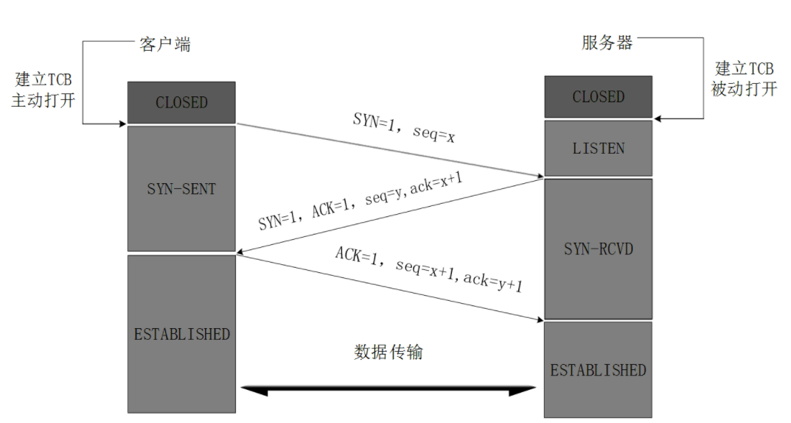

# 计算机网络

## OSI七层模型

1. 物理层（网卡）： 定义的硬件设备标准，用于**计算机之间的数据传输**，传输bit（比特）流，即0101二进制数字。 
2. 数据链路层（交换机）：数据帧，对bit数据格式化，校验。目的是**保障数据传输可靠性** 
3. 网络层（路由选择，点到点）：IP寻址，选择最佳路径，通过IP连接网络上的计算机。 
4. 传输层（端到端）：建立了主机端到端的链接。TCP、UDP。IPV6传输效率高就和这层有关。 
5. 会话层（会话控制）：自动寻址，**管理不同设备之间通信** 
6. 表示层（数据格式转化）：对应用层数据编码和数据**格式转换**，保障不同设备之间通信（windows和linux）。 
7. 应用层：提供应用接口，为用户直接提供各种网络服务。

物理层（网卡）——>数据链路层（交换机）——>网络层（IP路由器）——>传输层（TCP/UDP）——>会话层（）——>表示层（）——>应用层（HTTP）

OSI的实现：TCP/IP


## TCP简介

传输控制协议

- 面向连接的、可靠的、基于字节流的传输层通信协议
- 将应用层的数据流分割成**报文段**并发送给目标节点的TCP层
- 数据包都有序号，对方收到则发送ACK确认，未收到则重传
- 使用**校验和**来校验数据在传输过程中是否有误


### TCP报文头


- Source Port：源端口，2个字节，16位

- Destination Port：目的端口，2个字节，16位

  注：端口的目的，在一台机器中pid是唯一，但是在两台计算机中pid就不够用了，可能会重复，因此在传输层中使用协议端口号，ip地址可以唯一标识一台主机。ip地址可以唯一标识一台主机，ip地址 + 协议 + 端口号  =&gt; 唯一标识网络中的一个进程 =&gt; 套接字 socket

- Sequence Number：占4个字节，tcp的字节流中每个字节都是按顺序去编号的。

  例如一个报文的序号字段值为**107**而携带的数据共有**100**个B(字段)，如果有下一个报文段就应该由107+100从**207**开始。

- Acknowledge number：占4字节，期望收到对方下一个报文的第一个数据字节的序号，

  例如： B 收到了 A发送过来的报文，其序列号字段为301而数据长度是200字节，这表明B正确的收到了到序号301+200-1=500为止的数据，因此B期望收到A的下一个数据序号是**501**所以B在发送给A的确认报文中会把ack确认号置为501。

- offset：指出tcp报文的数据距离tcp报文的起始处有多远。

- reserved：保留域，保留今后使用的但目前都会被标为0。

- tcp flags : 控制位，主要由8个标志位组成，每一个标志位表示一个控制功能。

- window窗口：指的是**滑动窗口**的大小，用来告知接收端与发送端的缓存大小，以此控制发送端发送数据的速率从而达到**流量控制**。 

- check sum ： 检验和，指的是奇偶校验，此校验和是对整个pct报文段，包括tcp头部，和tcp数据，以16位进行计算所得，由发送端计算和存储并由接收端进行验证。 

- urgent pointer：紧急指针，只有tcp flags 中的 urg = 1时才有效。指出本报文段段中的紧急字节数。 

- TCP option ：可选项其长度可变，定义一些其他的可选参数。

**TCP Flags**

- URG：紧急指针标志，1 有效，0 忽略。 
- **ACK：确认序号标志**，1 表示确认号有效，0表示报文中不含确认信息，忽略确认号字段。 上面的Acknowledge number是否有效就是通过该标识号控制。
- PSH：push标志，1表示带有push标志的数据，指示接收方在接受到该报文段应尽快将报文段交给应用程序，而不是在缓冲区进行排队。 
- RST：重置连接标志，用于重置连接，或拒绝连接请求(用于处理连接中断） 
- **SYN：同步序号，用于建立连接过程**。syn = 1 ack = 0 表示该数据段没有使用稍待的域，则连接应答稍待一个确认则syn=1 ack = 1 
- **FIN：finish标志，用于释放连接**。1 表示发送方已经没有数据发送了，即关闭本方数据流。


### TCP通信

当应用程序希望通过tcp与另一个程序通讯时，它会发送一个通讯请求，这个请求必须被送到一个切确的地址，当双方握手之后tcp将在两个应用之间建立一个**全双工的即Full duplex的通讯**，这个全双工的通讯将占用两个计算机之间的通讯线路，直到它被一方或双方关闭为止。 

full duplex： 当A给B发送信息的同事，B也可以给A发送信息。


### TCP三次握手【重点】



状态解释： 

- CLOASED - 关闭状态
- LISTEN - 侦听来自远方TCP端口的连接请求； 
- SYN-SENT - 在发送连接请求后等待匹配的连接请求； 
- SYN-RECEIVED - 在收到和发送一个连接请求后等待对连接请求的确认； 
- ESTABLISHED- 代表一个打开的连接，数据可以传送给用户；


ACK和ack的区别：

- 大写的ACK：是tcp flags中的，确认序号标志，1 表示确认号有效，0表示报文中不含确认信息

- 小写的ack：表示期望收到对方下一个报文的第一个数据字节的序号


**TCP三次握手流程**

- 一开始客户端和服务器端处于**CLOSED**状态，这里假设主动打开的客户端，被动打开的是服务端。
- TCP**服务器**进程先创建**传输控制块**TCB（Transmission Control Block），时刻准备接受客户进程的连接请求，此时**服务器**就进入了**LISTEN**（监听）状态；
- TCP**客户**进程也是先创建传输控制块TCB，然后向**服务器**发出连接请求报文，这是报文首部中的同部位SYN=1，同时选择一个**初始序列号seq=x（x可以是任意一个正整数值）** 。
  此时，TCP**客户端**进程进入了**SYN-SENT**（同步已发送状态）状态。TCP规定，SYN报文段（SYN=1的报文段）不能携带数据，但需要消耗掉一个序号。**这便是第一次握手**。

- TCP**服务器**收到请求报文后，如果同意连接，则发出**确认报文**。确认报文中应该包含**tcp flags**中的两个字段：ACK=1，SYN=1，它的**确认号**是ack=x+1，同时也要为自己初始化一个序列号 seq=y。
  此时，TCP服务器进程进入了**SYN-RCVD**（同步收到）状态。
  这个报文也不能携带数据，但是同样要消耗一个序号。**这便是第二次握手**。
- TCP**客户**进程收到确认后，还要向**服务器**给出确认。确认报文的ACK=1，ack=y+1，自己的序列号seq=x+1，此时，TCP连接建立，客户端进入**ESTABLISHED**（已建立连接）状态。
  TCP规定，这个ACK报文段可以携带数据，前两个是不可以携带的。当然也可以不携带，如果不携带数据就不消耗序号。**这便是第三次握手**。
- 当服务器收到客户端的确认后也进入**ESTABLISHED**状态，此后双方就可以开始通信了。


**TCP三次握手流程总结**

第一次握手：建立连接时，客户端发送SYN包（seq=x）到服务器，并进入SYN_SEND状态，等待服务器确认；

第二次握手：服务器收到SYN包，必须确认客户的SYN（ack=x+1），同时自己也发送一个SYN包（seq=y），即SYN+ACK包，此时服务器进入SYN_RECV状态；

第三次握手：客户端收到服务器的SYN+ACK包，向服务器发送确认包ACK（ack=y+1），此包发送完毕，客户端和服务器进入ESTABLISHED状态，完成三次握手。（这个ACK报文段可以携带数据，前两个是不可以携带的。当然也可以不携带，如果不携带数据就不消耗序号）


### Wireshark-抓包认识三次握手

下载：https://www.wireshark.org/download.html


步骤一：以访问bilibili.com为例

```
C:\Users\AkaneMurakawa>ping bilibili.com

正在 Ping bilibili.com [139.159.241.37] 具有 32 字节的数据:
来自 139.159.241.37 的回复: 字节=32 时间=10ms TTL=47
来自 139.159.241.37 的回复: 字节=32 时间=9ms TTL=47
来自 139.159.241.37 的回复: 字节=32 时间=9ms TTL=47
来自 139.159.241.37 的回复: 字节=32 时间=10ms TTL=47
```


步骤二：过滤内容 `ip.dst==139.159.241.37 or ip.src==139.159.241.37`

模拟三次握手，因此bilibili的ip地址可能是dst也可能是src


### 问题

#### 为什么需要三次握手才能建立起连接【重点】

为了初始化Sequence Number的初始值，通信的双方要通知对方自己的Sequence Number的初始值。

这个序列号要作为以后通信的序号，以保证数据的传输不会因为网络问题而乱序。


#### 首次握手的隐患 --SYN超时

- Server收到Client的SYN，回复SYN+ACK的时候未收到ACK确认

- Server不断重试直至超时，Linux默认等待63s才断开连接


Server发送SYN-ACK后在一段时间内没有收到Client发送到ACK，并不表示连接的成功或失败，Server会不断重发SYN-ACK直至超时。

**在Linux默认会重试5次，间隔的时间从1秒开始，每次都翻倍**。情况是这样的，发送SYN-ACK，

等1s，重试第一次，

等2s，重试第二次，

等4s，重试第三次，

等8s，重试第四次，

等16s，重试第五次，

在第五次发出去后还需要等32s才能判断为超时，共等待63s判定超时连接才断开。

后果：如果攻击者假装Client给Server发送ACK后立即下线不做回应，Server会等待63s才会断开连接，这样攻击者会把Server的SYN队列耗尽，让真正的Client请求无法处理，这就是**SYN Flood**


#### SYN Flood的防护措施

- 当SYN队列满了之后，Server会发送一个由**源端口、目的端口和时间戳**组成的tcp_syncookies参数回发，又称**SYN Cookie**。

- 若为正常连接则Client会回发SYN cookie，直接建立连接。如果是真正的Client会回发SYN Cookie，这样就算是SYN队列满了之后也可以建立连接。


#### 建立连接后，Client出现故障怎么办

**保活机制（keep live time）**

- 向对方发送**保活探测报文**，如果未收到响应则继续发送

- 尝试次数达到保活探测数仍未收到响应则中断连接


### TCP四次挥手【重点】


**TCP四次挥手流程**

1. 一开始客户端和服务器端处于**ESTABLISHED**状态，这里假设客户端主动关闭。

2. 首先**客户端**进程发出连接释放报文，并且停止发送数据。释放数据报文首部，FIN=1，其序列号为seq=u（等于前面已经传送过来的数据的最后一个字节的序号**加1**）。

   此时，**客户端**进入FIN-WAIT**-1**（终止等待1）状态。 TCP规定，FIN报文段即使不携带数据，也要消耗一个序号（即回执的时候需要akc=u+1）。

3. **服务器**收到连接释放报文，发出确认报文，ACK=1，ack=u+1，并且带上自己的序列号seq=v。
   此时，服务端就进入了**CLOSE-WAIT**（关闭等待）状态。
   TCP服务器通知高层的应用进程，客户端向服务器的方向就释放了，这时候处于**半关闭**状态，即**客户端已经没有数据要发送了，但是服务器若发送数据，客户端依然要接受**。这个状态还要持续一段时间，也就是整个CLOSE-WAIT状态持续的时间。

4. 客户端收到服务器的确认请求后，此时，客户端就进入**FIN-WAIT -2**（终止等待2）状态，等待服务器发送连接释放报文（在这之前还需要接受服务器发送的最后的数据）。

5. 服务器将最后的数据发送完毕后，就向客户端发送连接释放报文，FIN=1，ack=u+1，由于在半关闭状态，服务器很可能又发送了一些数据，假定此时的序列号为seq=w，此时，服务器就进入了LAST-ACK（最后确认）状态，等待客户端的确认。

6. 客户端收到服务器的连接释放报文后，必须发出确认，ACK=1，ack=w+1，而自己的序列号是seq=u+1，此时，客户端就进入了**TIME-WAIT**（时间等待）状态。
   注意此时TCP连接还没有释放，必须经过**2\*MSL（**最长报文段寿命）的时间后，当客户端撤销相应的TCB后，才进入CLOSED状态。

7. 服务器只要收到了客户端发出的确认，立即进入CLOSED状态。同样，撤销TCB后，就结束了这次的TCP连接。可以看到，服务器结束TCP连接的时间要比客户端早一些。

注：MSL是**Maximum Segment Lifetime**英文的缩写，中文可以译为“报文最大生存时间”


**TCP四次挥手流程总结**

第一次挥手：Client发送一个FIN包，用来关闭Client到Server的数据传送，Client进入FIN_WAIT_1状态；

第二次挥手：Server收到FIN包后，发送一个ACK给Client，确认序号为收到的序号+1（与SYN同，一个FIN占用一个序号），Server进入CLOSE_WAIT状态;

第三次挥手：Server发送一个FIN，**用来关闭Server到Client的数据传输**，Server进入LAST_ACK状态；

第四次挥手：Client收到FIN包后，Client进入TIME_WAIT状态，接着发送一个ACK给Server，确认序号为收到序号+1，Server进入CLOSED状态，完成四次挥手。

### 问题

#### 为什么会有TIME WAIT状态

- 确保有足够的时间让对方收到ACK包
- 避免新旧连接混淆


#### 为什么需要四次握手才能断开连接

- 因为TCP全双工，发送方和接收方都需要FIN报文和ACK的报文


#### 服务器出现大量CLOSE_WAIT状态的原因

- 对方关闭socket连接，服务器没有及时关闭连接
  - 解决方法：检查代码，特别是释放资源的代码
  - 检查配置，特别是处理请求的线程配置

##### 查看机器网络状态

查看CLOSE_WAIT是否很多

```
netstat -n | awk '/^tcp/{++S[$NF]}END{for(a in S) print a, S[a]}'

[root@test] netstat -n | awk '/^tcp/{++S[$NF]}END{for(a in S) print a, S[a]}'
TIME_WAIT 1
FIN_WAIT1 1
SYN_SENT 3
ESTABLISHED 232
```


#### TCP 协议如何保证可靠传输

1. 应⽤数据被**分割成 TCP 认为最适合发送的数据块。**

2. TCP 给发送的每⼀个包进⾏编号，接收⽅对数据包进⾏排序，把有序数据传送给应⽤层。

3. 校验和： TCP 将保持它⾸部和数据的检验和。这是⼀个端到端的检验和，⽬的是检测数据在传输过程中的任何变化。如果收到段的检验和有差错，TCP 将丢弃这个报⽂段和不确认收到此报⽂段。

4. TCP 的接收端会丢弃重复的数据。

5. **流量控制**： TCP 连接的每⼀⽅都有固定⼤⼩的缓冲空间，TCP的接收端只允许发送端发送接收端缓冲区能接纳的数据。当接收⽅来不及处理发送⽅的数据，能提示发送⽅降低发送的速率，防⽌包丢失。TCP 使⽤的流量控制协议是可变⼤⼩的滑动窗⼝协议。 （TCP 利⽤滑动窗⼝实现流量控制）

6. **拥塞控制**： 当⽹络拥塞时，减少数据的发送。

7. **ARQ协议（**⾃动重传请求Automatic Repeat-reQuest**）**： 也是为了实现可靠传输的，它的基本原理就是每发完⼀个分组就停⽌发送，等待对⽅确认。在收到确认后再发下⼀个分组。

8. **超时重传**： 当 TCP 发出⼀个段后，它启动⼀个定时器，等待⽬的端确认收到这个报⽂段。如果不能及时收到⼀个确认，将重发这个报⽂段。

滑动窗口，心跳检测，超时重传

## UDP简介

### UDP特点

- 面向非连接
- 不维护连接状态，支持同时向多个客户端传输相同的信息
- 数据包报头只有8个字节，额外开销较小
- 吞吐量只受限于数据生成速率、传输速率以及机器性能
- 尽最大努力交付，不保证可靠交付，不需要维持复杂的链接状态表
- 面向报文，不对应用程序提交的报文信息进行拆分或者合并


### UDP报文结构


- Source Port：源端口，2个字节，16位

- Destination Port：目的端口，2个字节，16位


## TCP和UDP的区别

- 面向连接 vs 无连接
- 点对点 vs 点对多
- 可靠性
- 有序性
- 速度
- 量级（TCP重量级、UDP轻量级）


## TCP的滑动窗口

RTT：（Round-TripTime）发送一个数据包到收到对应的ACK，所花费的时间

RTO：（Retransmission Timeout）重传时间间隔，需要由RTT进行计算得到


### TCP使用滑动窗口做流量控制与乱序重排

- 保证TCP的可靠性

- 保证TCP的流控特性（用来告知对方自己缓存大小，以此控制对方的速率，从而达到**流量控制**）


### 窗口数据的计算过程


窗口数据计算： 

- LastByteAcked：连续被接收端接受并**已经返回的确认序列**号最大值 
- LastByteSent：**已发送**的最后一个字节的位置（**未收到ACK确认**） 
- LastByteWritten：上层应用已写完的最后一个字节的位置，即当前程序**准备好的需要发出的最新的数据段**


- LastByteRead：上层应用已经读完的最后一个字节的位置，收到并且ACK处理

- NextByteExpected：收到发送端的连续序列号的最大值的位置（接收到但没有反馈确认ACK ）

- LastByteRcvd：已收到的最后一个字节的位置 


还能够接受的窗口大小：AdvertisedWindow = MaxRcvBuffer - (LastByteRcvd - LastByteRead)

还需要发送的窗口大小：EffectiveWindow = AdvertisedWindow - (LastByteSent - LastByteAcked)


对于发送方：只有序号在 `已发送未ACK - 已发送并ACK`范围内，滑动窗口才会移动


## HTTP

### 特点

- 支持客户/服务器模式
- 简单快速
- 灵活
- **无连接**
- **无状态**

### HTTP请求结构

由**请求行、请求头、请求正文（请求体**）组成

注：HTTP请求结构非常重要，当我们需要发送HTTP请求时候，如爬虫，就需要利用HTTP请求结构。发送相应的请求和数据。


使用WireShark测试


### HTTP响应结构

由状态行、响应头、响应正文（响应体）组成


使用WireShark测试


### 在浏览器中输⼊url地址，按下回车之后经历的流程

1. DNS解析，DNS缓存（浏览器缓存、系统缓存、路由器缓存、IPS服务器缓存、域名缓存）

2. TCP连接

3. 发送HTTP请求

4. 服务器处理请求并返回HTTP报⽂

5. 浏览器解析渲染⻚⾯

6. 连接结束

### HTTP状态码

- 1xx：已接收
- 2xx：已成功接收
- 3xx：重定向
- 4xx：客户端错误--请求语法错误或请求无法实现
- 5xx：服务器错误


### 常见状态码

200：OK

400：Bad Request，客户端语法错误

401：Unauthorized，请求未授权

403：Forbidden，拒绝服务

404：Not Found，请求资源不存在

500：Internal Server Error，程序内部错误

503：Server Unavailable 服务不可用，例如：连接池满了


### GET请求和POST请求的区别

- Http报文层面：GET请求信息放在URL，POST放在报文体中
- GET中放URL，有长度限制
- 数据库层面：GET符合幂等性和安全性，POST不符合
- 其他层面：GET可以被缓存（CDN）、被存，而POST不行


### Cookie和Seesion

#### Cookie

由服务器发给客户端的特殊信息，以文本的形式存放在客户端（在请求头）


#### Sesssion

- 服务器端的机制，在服务器上保存的信息。
- 解析客户端请求并操作**session id**，按需保存状态信息


使用cookie的方式实现：JESESSIONID


#### Cookie和Seesion的区别

- Cookie存放在客户端，Session存放在服务器端
- Session相对安全
- 若考虑减轻服务器负担，应使用Cookie


### HTTP 和 HTTPS 的区别


#### 加密的方式

- 对称加密：密钥只有⼀个，加密解密为同⼀个密码，且加解密速度快，典型的对称加密算法有DES、AES等；
- ⾮对称加密：密钥成对出现（且根据公钥⽆法推知私钥，根据私钥也⽆法推知公钥），加密解密使⽤不同密钥（公钥加密需要私钥解密，私钥加密需要公钥解密），相对对称加密速度᫾慢，典型的⾮对称加密算法有RSA、DSA等。
- 哈希算法：将任意长度的信息转换为固定长度，算法不可逆。
- 数字签名：证明某个消息或者文件时某人发出/认同的。


#### HTTPS数据传输流程

1. 浏览器将支持的**加密算法**信息发送给服务器 

2. 服务器选择一套浏览器支持的加密算法，以**证书的形式回发给浏览器** 

3. 浏览器验证证书的合法性，并结合证书公钥加密信息发送给服务器 

4. 服务器使用私钥解密信息，验证哈希，加密响应消息回发浏览器 

5. 浏览器解密响应信息，并对消息进行验真，之后进行加密交互数据


#### 区别

1. HTTPS需要到CA申请证书，HTTP不需要
2. HTTPS密文传输，HTTP明文传输
3. 连接方式不同，HTTPS默认是443端口，HTTP默认80端口
4. HTTPS=HTTP+加密+认证+完整性保护，比HTTP安全


#### HTTPS真的很安全吗

浏览器默认填充http://, 请求需要进行跳转，有被劫持的风险。

解决：可以用HSTS（HTTP Strict Transport Security，HTTP严格传输）优化


## Socket简介

Socket是对TCP/IP协议的抽象，是操作系统对外开发的接口。


### Socket通信流程

accept：阻塞


注：IP标识主机唯一，端口和TCP标识进程唯一

### 进程的通信方式

管道、内存共享、信号量、消息队列

