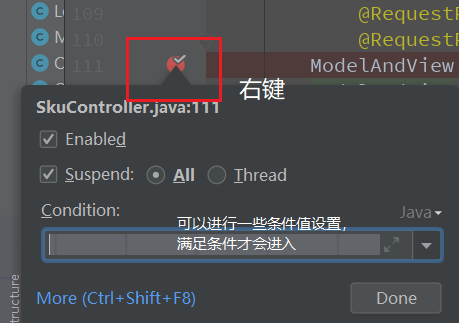

# 1 IntelliJ IDEA的常用设置

## 设置

这一篇里主要是总结一下我在IDEA中的一些基本使用。

说明：我常用的会加粗显示

在使用之前，我都会习惯性的设置一下编码为UTF-8，并且设置一下字体。

- 编码设置：Setttings——Editor——Encodings(注意下面有个properties文件的默认编码设置，这里也需要设置一下)
- 字体设置：Setttings——Editor——Fonts(我习惯用的是Source Code Pro和Consolas)
- 背景设置(可选)：Setttings——Appearance —— Background Image(IDEA比Eclipse友好的地方之一，IDEA可以轻松的设置背景图片，这样我们写代码也有动力，并且透明的背景对我来说比较舒服。)

## 其他设置

Setttings——Editor——General下有几个不错的设置

- Setttings——Editor——General——Change font size(Zoom) with Ctrl+Mouse Wheel (通过Ctrl+鼠标控制字体大小，这样当我们通过IDEA给别人演示的时候，就可以很方便调整字体大小
- Setttings——Editor——General——Appearance——Show method separator一个让我觉得很舒服的设置，这个设置是给方法进行添加一条分割线，不占用行数。
- Setttings——Editor——General——Auto Import——然后勾选Add unambiguous imports on the fly以及Optimize imports on the fly(快速导入和删除无用的包)

## 快捷键

一些简单的复制粘贴就不介绍了，下面是一些我用的比较多，也比较好用的快捷键。快捷键无非就是按键的组合，一般是CTRL、Alt、SHIFT和其他按键的组合。

**Ctrl + F12查看类的方法**

**Ctrl + B 进入光标所在的方法**

**Ctrl + Alt + B 在某个调用的方法名上使用会跳到具体的实现处，可以跳过接口**

**Ctrl + D 复制光标所在行 或 复制选择内容**

**Ctrl + E 显示最近打开的文件记录列表**

**Ctrl + F 在当前文件进行文本查找**

**Ctrl + Shift + F 根据输入内容查找整个项目 或 指定目录内文件**

**Ctrl + G 在当前文件跳转到指定行处**

**Ctrl + H 调用层次**

**Ctrl + I 选择可继承的方法**

**Ctrl + O 选择可重写的方法**

**Ctrl + Q 打开javadoc**

Ctrl + R 在当前文件进行文本替换

Ctrl + Shift + R 根据输入内容替换对应内容，范围为整个项目 或 指定目录内文件

**Ctrl + Y 删除光标所在行 或 删除选中的行，这是和Eclipse不太一样的**

Ctrl + + 展开代码

Ctrl + - 折叠代码

Ctrl + / 注释光标所在行代码，会根据当前不同文件类型使用不同的注释符号

Ctrl + Shift + / 代码块注释

Alt + Enter IntelliJ IDEA 根据光标所在问题，提供快速修复选择，光标放在的位置不同提示的结果也不同

**Alt + Insert 代码自动生成，如生成对象的 set / get 方法，构造函数，toString() 等**

Shift + 左键单击 在打开的文件名上按此快捷键，可以关闭当前打开文件

**Ctrl + Shift + Alt + C 复制参考信息，IDEA中复制整个类的路径**

**Ctrl + Shift + Alt + V 无格式黏贴**

Ctrl + 左方向键 光标跳转到当前单词 / 中文句的左侧开头位置

Ctrl + 右方向键 光标跳转到当前单词 / 中文句的右侧开头位置

Ctrl + 前方向键 等效于鼠标滚轮向前效果

Ctrl + 后方向键 等效于鼠标滚轮向后效果

Alt + 左方向键 用此快捷键就可以在子视图中切换

Alt + 右方向键 用此快捷键就可以在子视图中切换

**Ctrl + Alt + 左方向键 退回到上一个操作的地方**

**Ctrl + Alt + 右方向键 前进到上一个操作的地方**

Ctrl + Shift + 左方向键 标跳转到当前单词 / 中文句的左侧开头位置，同时选中该单词 / 中文句

Ctrl + Shift + 右方向键 光标跳转到当前单词 / 中文句的右侧开头位置，同时选中该单词 / 中文句

Shift + 滚轮前后滚动 当前文件的横向滚动轴滚动(用鼠标的时候也可以很骚)

**Ctrl + F9 当引入Springboot-devtool时，可以实现热部署的功能**

### ⾃动代码

- fori/sout/psvm+Tab即可⽣成循环、System.out、main⽅法等boilerplate样板代码
- 输⼊for(User user : users)只需输⼊user.for+Tab  
- 输⼊Date birthday = user.getBirthday()只需输⼊user.getBirthday().var+Tab即可
- 代码标签输⼊完成后，按Tab，⽣成代码

## Debug

F7 在 Debug 模式下，进入下一步，如果当前行断点是一个方法，则进入当前方法体内，如果该方法体还有方法，则不会进入该内嵌的方法中

F8 在 Debug 模式下，进入下一步，如果当前行断点是一个方法，则不进入当前方法体内

F9 在 Debug 模式下，恢复程序运行，但是如果该断点下面代码还有断点则停在下一个断点上

(Tip：在debug模式下Debugger栏目下有个像计算器的图标，那就是Evaluate Expression，一个可以动态执行代码的工具，我基本上用来查看变量)

另外在debug模式下，还可以动态改值。

断点中可以进行一些条件值设置，满足条件才会进入

推荐文章[IntelliJ IDEA Windows And Linux Keymap简体中文](https://blog.csdn.net/qwfys200/article/details/81835845)

## IDEA Plugins

Alibaba Java Coding Guidelines 代码规范

Grep Console 控制台多彩

Lombok

Mybatis Log Plugin

MyBatisCodeHelperPro

Maven Helper

EasyCode Mybatis

RestfulToolkit 可以根据URL跳转到对应的方法(全局快捷搜索：*Ctrl \\* )

SonarLint

Translation 翻译工具