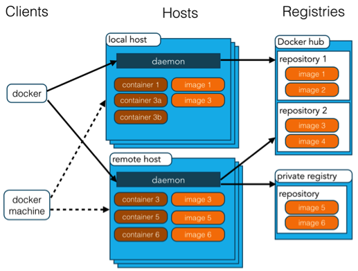

# Docker和容器

## Docker应用容器引擎

> Docker 是一个开源的应用容器引擎，基于 [Go 语言](http://www.runoob.com/go/go-tutorial.html) 并遵从Apache2.0协议开源。
>
> Docker 可以让开发者打包他们的应用以及依赖包到一个轻量级、可移植的容器中，然后发布到任何流行的 Linux 机器上，也可以实现虚拟化。容器是完全使用沙箱机制，相互之间不会有任何接口（类似 iPhone 的 app）,更重要的是容器性能开销极低。

通俗的说，Docker类似于虚拟机，让开发者能够实现**环境隔离**，在一个物理机上能够跑N个环境。


## Docker架构

Docker采用CS架构，一个客户端，一个服务器。




## Docker原理


## 容器和镜像

简单来说，Docker将相同的部分变成镜像，在只读层。而不同部分为可写层，称为容器。

Image(镜像)：用于**创建Docker Container(容器)的模板**，打包保存的东西。（只读层）

Docker Container(容器)：则是一个或一组独立运行的**应用**，运行的程序。（可写层）


## 常用命令-容器管理

- 创建容器：docker run
- 容器列表：docker ps，查看运行中的容器， **-a**查看所有的容器
- 容器启动/停止： docker start /stop container-name/container-id，通过容器的名称或者id 启动 / 停止容器
- 容器删除：docker rm
- 容器改名：docker rename
- 容器复制：docker cp
- 删除停止的容器：docker container prune
- 运行命令：docker exec
- 从容器创建新镜像：docker commit


## 常用命令-镜像管理

镜像列表：docker images

镜像删除：docker rmi  镜像id 或 docker image prune

镜像保存：docker save/load

镜像传输：docker pull /push 镜像名:版本名称（当运行一个不存在的镜像名的时候，就会自动下载）（注：如果不加版本，默认是lastest，可以加，如ubuntu:14.04）

镜像标签：docker tag，docker tag [OPTIONS] IMAGE[:TAG] REGISTRYHOST/NAME[:TAG]，示例：docker tag ubuntu:15.10 runoob/ubuntu:v3 添加标签

镜像搜索：docker search 镜像名，实际上到https://hub.docker.com/这里找


## 常用命令-信息和状态

- 日志：docker logs container-name/container-id
- 状态：docker stats
- 版本：docker version
- 进程：docker top
- 元数据：docker inspect
- 变化：docker diff
- 端口：docker port


## 数据卷管理

创建：docker volume create

列表：docker volume ls

元信息：docker volume inspect

删除：docker volume rm


## 运行镜像-创建容器

```
docker run -p 端口 --rm --name container-name -d images-name
```

 -p：端口映射，将宿主机的端口和镜像端口映射起来，示例：8080：80，这时宿主机的是8080，镜像用的是80

 --rm：运行结束后自动删除，省去了我们删除

--name：自定义容器名称

-v：将宿主机文件挂载到镜像中，例如：`$ docker run --name some-nginx -v /some/content:/usr/share/nginx/html:ro -d nginx` ro表示镜像只读

-d：daemon，后台运行。当我们需要停止时，需要用：docker stop 容器id


## 常用软件启动命令

```bash
#首次启动
$ docker run --name mysql -d -p 3306:3306 -e MYSQL_ROOT_PASSWORD=admin -d mysql:5.7
$ docker run --name redis -d -p 6379:6379 redis redis-server --appendonly yes
$ docker run --name mongo -d -p 27017:27017 -e MONGO_INITDB_ROOT_USERNAME=admin -e MONGO_INITDB_ROOT_PASSWORD=admin mongo
$ docker run --name nginx -d -p 8080:80 nginx:1.19.7

# 后续启动
$ docker start mysql
$ docker start redis
$ docker start mongo
$ docker start nginx
```


## 进入容器

在使用 -d 参数时，容器启动后会进入后台。此时想要进入容器，可以通过以下指令进入：`docker exec`

-i: 交互式操作

-t: 终端

/bin/bash：指定交互的shell

```bash
docker exec -it 容器id /bin/bash
示例：
root@ubuntu:/home/mizu# docker ps
CONTAINER ID        IMAGE               COMMAND                  CREATED             STATUS              PORTS                  NAMES
197bc0f63b01        nginx               "/docker-entrypoint.…"   22 minutes ago      Up 22 minutes       0.0.0.0:8080->80/tcp   reverent_allen
root@ubuntu:/home/mizu# docker exec -it 197b /bin/bash

```


## 从容器创建新镜像

```
docker commit 镜像id // 创建镜像
docker tag 镜像id hello:lastest // 打标签
```


## 制作Docker镜像

导入包：FROM

添加文件：COPY/ADD

- ADD 支持URL，压缩文件
- 优先使用COPY，因为更透明

添加信息：ENV/LABEL/ARG  环境变量/元数据/构建时参数

执行命令：

- RUN/SHELL ——> exec 形式的命令

- CMD/ENTRYPOINT

其他命令：

- FROM/ EXPOSE/ VOLUME/ WORKDIR/ USER

- ONBUILD/ STOPSINAL


需要编写Dockerfile文件，具体参考网上

https://www.runoob.com/docker/docker-dockerfile.html

https://www.jianshu.com/p/cbce69c7a52f


示例：

```dockerfile
FROM webdevops/php-apache:8.0-apline

# 配置vhost
COPY vhost.conf /opt/docker/etc/httpd/vhost.conf
# 初始化脚本
COPY init.sh /opt/docker/provision/entrypoint.d
# supervisord进程管理工具，用途：例如进程自动重启
ADD supervisord-proxy.conf /opt/docker/etc/supervisor.d/prism-proxy.conf
EXPOSE 80 8802
```


## Docker Compose多容器

```yml
version: '3'
services:
	mariadb:
		image: 'mariadb:10.5.8-focal'
		 volumes:
		 	- 'mariadb_data': /var/lib/mysql'
         environment:
         	- MYSQL_ROOT_PASSWORD=admin
         	- MYSQL_DATABASE=prism
         ports:
         	- '33306:3306'
	app:
		#image: 'webdevops/php-apache:8.0-apline'
    	build: './docker/web/'
		ports:
   			- '8801:80'
   			- '8802:8802'
   			- '443:443'
		volumes:
			- './:/app'
        depends_on:
        	- mariadb
        environment:
        	- DB_HOST=mariadb
        	- DB_PORT=3306
        	- DB_USERNAME=root
        	- DB_PASSWORD=amdin
volumes:
  logvolume01: {}
```

