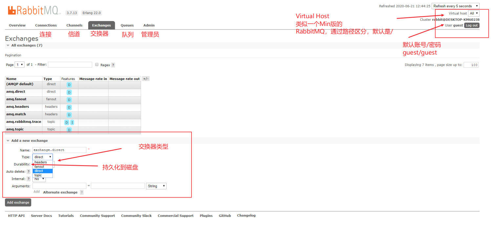
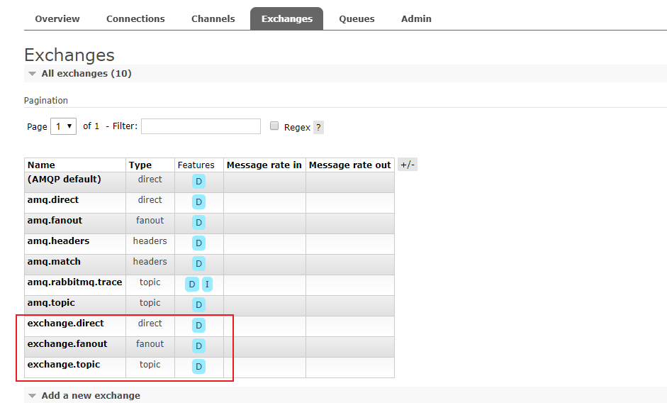
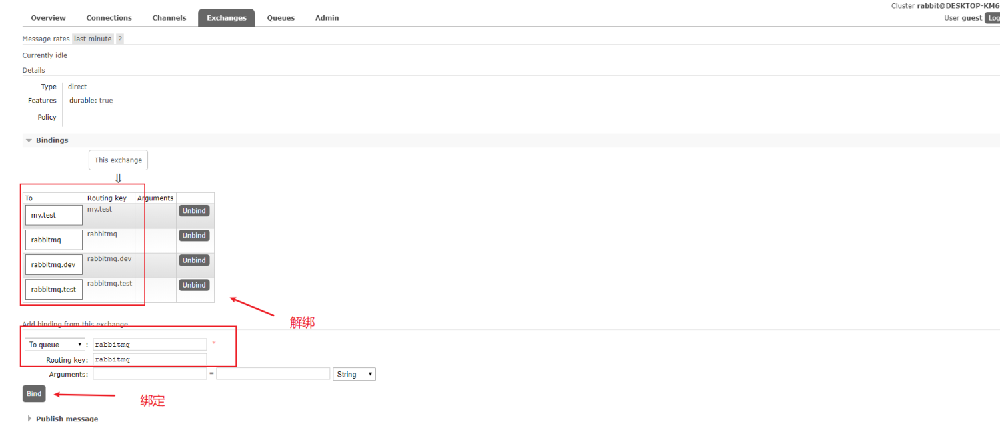
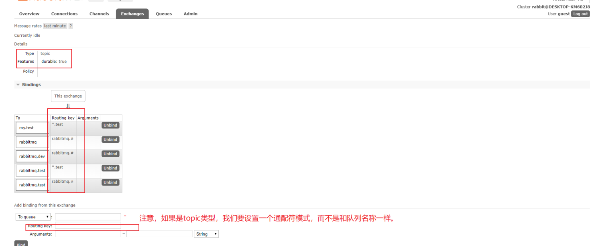
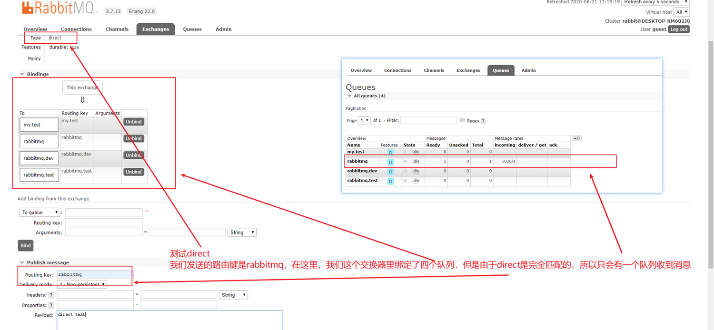
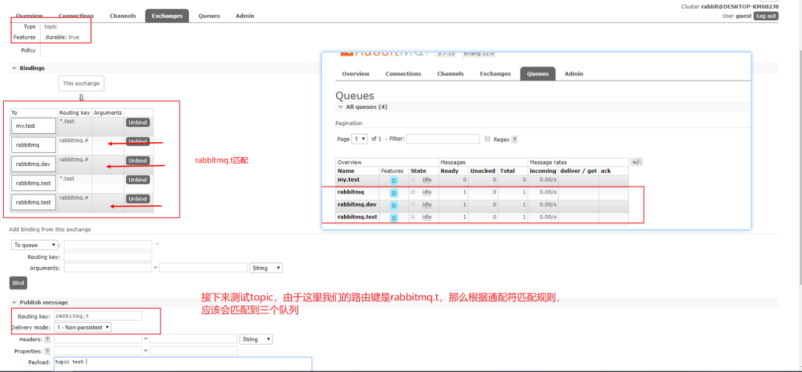

# RabbitMQ

RabbitMQ是一个由erlang语言开发的AMQP的开源实现。


## 应用场景

- 应用解耦
- 流量削峰


## 概念

### 消息服务中的概念

消息代理 (message broker)

目的地 (destination)

当消息发送者发送消息以后，由消息代理接管，消息代理保证消息传递到指定目的地


### 消息队列主要有两种形式的目的地：

1. 队列(queue) ：点对点(Point-To-Point)消息通信

1. 主题(topic)：发布(Publish) / 订阅(Subscribe)消息通信


点对点(Point-To-Point)消息通信说明：

消息发送者发送消息，消息代理将其放入一个队列中，消息接收者从队列中获取消息内容，消息读取后被移除队列。消息只有唯一的发送者和接收者，但并不是只能有一个接收者。如果一个接收者先拿到，这条消息就被消费了，其它接收者就不会再接收这条消息。


发布(Publish) / 订阅(Subscribe)消息通信说明：

发送者发送消息到主题，多个接收者(订阅者)监听(订阅)这个主题，那么就会同时接收到消息。


### JMS和AMQP

JMS(Java Message Service)

Java消息服务，基于JVM消息代理的规范。ActiveMQ、HornetMQ是JMS实现。


 AMQP(Advanced Message Queuing Protocol)

 高级消息队列协议，也是一个消息代理规范，兼容JMS。RabbitMQ是AMQP的实现。


## RbbitMQ中的概念

注：有些概念是相对的或者关联的，因此我会将其用空行区分，也避免内容太紧凑。


- Producer：消息生产者
- Consumer：消息消费者

- Exchange：消息交换机，它指定消息按什么规则，路由哪个队列。类似我们的路由器
- Queue：消息队列载体，每个消息都会被投入到一个或多个队列
- Binding： 绑定。作用是：把exchange和Queue按照路由规则绑定起来
- Routing Key： 路由关键字，exchange根据这个关键字进行消息投递

- Connection：网络连接，比如一个TCP连接
- Channel：信道，多路复用连接中的一条独立的双向数据流通道，减少连接的创建和销毁。消息通道，在客户端的每个连接里，可以建立多个channel，每个channel代表一个会话任务
- 
- VHost：虚拟主机，表示一批交换器、消息队列和相关对象。每个虚拟主机本质上就像是一个独立的mini版本的RabbitMQ。一个broker里可以开设多个vhost，用作不同用户的权限分离，**默认是/，通过路径划分**。
- Broker: 消息代理，消息服务器实体


Exchange  + Routing Key + Queue确定唯一路由路线


### 交换器类型

1. direct exchange
2. fanout exchange
3. topic exchange
4. headers exchange (几乎用不到，Headers类似我们的请求头)


#### Direct Exchange

消息中的路由键(Routing Key)如果和Binding中的binding key一直，交换器(Exchange)就会将消息发送到对应的队列。它是完全匹配、单播的模式。这就是我们上面所说的点对点消息通信的实现。


#### Fanout Exchange

每个发送到fanout类型交换器的消息，都会分到所有绑定的队列上。fanout交换器不处理路由键，只是简单的将队列绑定到交换器上。类似于我们的**广播**，每一个人都可以接收。fanout类型转发消息是最快的。


#### Topic Exchange

topic交换器通过模式匹配分配消息的路由键属性，将路由键和某个模式进行匹配，此时队列需要绑定到一个模式上。在这里可以使用两个**通配符**，#匹配0或多个单词，*匹配一个单词。


### 消息限流

其实就是指定并发数量

```properties
spring.rabbitmq.listener.simple.prefetch=5
```


### TTL消息/队列

`TTL`是Time To Live的缩写，也就是生存时间的意思，`RabbitMQ`支持消息的过期时间，在消息发送时可以进行指定，也支持队列的过期时间，从消息入队列开始计算，只要超过了队列的超时时间配置，那么**消息会自动的清除**。


设置参数：x-message-ttl

```java
  // TTL队列示例
    @Bean
    public Queue ttlQueue() {
        Map<String, Object> arguments = new HashMap<>();
        // 设置3s过期
        arguments.put("x-message-ttl", 3000);
        return new Queue("topicQueue1",false,false,false, arguments);
    }
```


### DLX死信队列

https://www.cnblogs.com/he-erduo/p/13605911.html

当一条消息：

- 消费被拒绝（basic.reject/basic.nack）并且requeue=false
- **TTL过期**
- 要进入的队列达到最大长度

这三种情况，就可以判定一条消息死了，**这种消息如果我们没有做处理，它就会被自动删除。**

设置了一个队列中的消息死亡后的去处，就等于消息死亡后给它不把它删掉而是做一次**转发**，发到其他`Exchange`去。


设置参数：x-dead-letter-exchange

```java
    // DLX队列示例
    @Bean
    public Queue dlxQueue() {
        Map<String, Object> arguments = new HashMap<>();
        // 指定消息死亡后发送到ExchangeName="dlx.exchange"的交换机去
        arguments.put("x-dead-letter-exchange","dlx.exchange");
        return new Queue("topicQueue1", false, false, false, arguments);
    }
```


### 延时队列

RabbitMQ中没有延时队列，但是**TTL+DLX**就能组成一个延时队列。


## 界面介绍

由于RabbitMQ是erlang语言开发的，所以安装之前需搭建erlang环境。


### 基本使用



### 


### 测试准备

第一步，新建三个交换器：exchange.direct、exchagne.fanout、exchange.topic




第二步，新建四个队列：rabbitmq、rabbitmq.test、rabbitmq.dev、my.test

****

****


第三步，绑定队列。前面我们说到，Exchange  + Routing Key + Queue确定唯一路由路线。因此在这里还需要将交换器(Exchange) 和 队列(Queue)通过路由键(Routing Key)绑定(Binding)起来。

****

****

****


#### 测试Direct Exchange

****


#### 测试Fanout Exchange


#### 测试Topic Exchange




## SpringBoot集成RabbitMQ


几个重要的类

### RabbitAdmin

RabbitMQ系统管理功能组件，用于创建和删除Exchange、Queue、Binding

declareXxx() 创建Xxx


### SimpleMessageConverter

默认的消息转换器，我们可以自定义使用Jackson2JsonMessageConverter转换器


几个重要的注解


### @EnableRabbit

开启基于注解的RabbitMQ模式


### @RabbitListener

监听消息队列


### 消息发送

rabbitTemplate.convertAndSend();


### 消息确认

channel.basicAck(deliveryTag, false);


### 如何保证消息的可靠性投递

等消息处理结束后再执行消息手动确认，消费者消费后再手动确认 ，超过一定重试次数后，丢到死信队列。