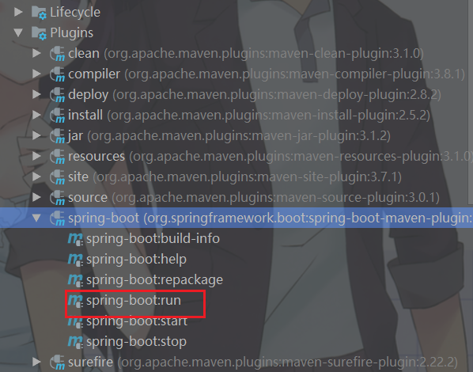

# 问题整理

记录一些个人踩过的坑以及解决方法，是坑也是心得，也是开发技巧。

## Mybatis

### in 空指针问题

空值则会抛异常，所以插入数据或者查询用到**in**需要考虑是否会空，是否需要做空的判断。这跟Mybatis的解析Mappe.xml有关。


### Available parameters are [collection, list]

当Mybatis传入参数为list集合的时候；mybatis会自动把其封装为一个map；会以“list”作为key；

解决: 利用@Param注解

```java
selectBy(@Param("nos") List<String> nos);
```


### Mybatis分页插件自动分页

参数中有pageNum，pageSize 则会自动添加分页，因此要注意SQL中是否有LIMIT，否则就会报SQL语法错误

```properties
pagehelper.support-methods-arguments=true
```

另外，可使用**PageHelper.clearPage();**清除分页


## 编译启动

### Disconnected from the target VM, address: '127.0.0.1:56091', transport: 'socket

当启动SpringBoot项目时，并没有指明错误的原因，只有短短的几行信息。在这里，可以使用Maven的spring-boot插件启动，可以看到更多打印信息，然后再通过信息去排查原因。




### IDEA找不到类

查看工程设置的Sources-src路径对不对，还有Paths -output path对不对


### 如何查看服务是否启动


```
ps -ef | grep 服务名 用户名后面对应的pid 
杀死服务 kill -9 对应的pid  说明：-9 强制终止程序
```


### Lombok 作用域和@Tolerate问题

在lambda表达式中访问外层作用域和老版本的匿名对象中的方式很相似。你可以直接访问标记了final的外层局部变量，或者实例的字段以及静态变量。

```
@ToString(callSuper = true)
```


**@Tolerate问题**

补充：@Builder和@Data同时使用时，使用无参构造会报错

- @Data作用于类上，是以下注解的集合：@Getter @Setter @ToString @EqualsAndHashCode @RequiredArgsConstructor，
- @Builder将类转为建造者模式

```java
@Builder
public class User {
    private Integer id;
}

// 编译后
public class User {
    private Integer id;

    User(final Integer id) {
        this.id = id;
    }

    public static User.UserBuilder builder() {
        return new User.UserBuilder();
    }

    public static class UserBuilder {
        private Integer id;

        UserBuilder() {
        }

        public User.UserBuilder id(final Integer id) {
            this.id = id;
            return this;
        }

        public User build() {
            return new User(this.id);
        }

        public String toString() {
            return "User.UserBuilder(id=" + this.id + ")";
        }
    }
}

```

解决办法：

生成无参构造，加上**@Tolerate**注解

```java
@Data
@Builder
public class Test implements Serializable {

    @Tolerate
    public Test() {}
```


### Jenkins编译失败问题

原因：

1. 找不到包
2. 缺少代码
3. 代码错误


对于找不到包，分析的主要有几个方面：

1. cannot find symbol XXX，是由于该工程依赖了其它工程，而其他工程未重新打包导致的。解决方式就是将对应的工程重新编译即可。
2. 但是有时重新编译了还是不行，这个时候首先要看是否共用的是同一个maven(之前就踩过这个坑)，因为测试环境上往往是安装到本地仓库的(参见maven的生命周期)。如果还是不行，查看依赖的版本是否对应。


对于缺少代码，没什么好说的，就是将检查重新提交到 GIT/SVN即可。

对于代码错误，常见的是缺少配置文件，或是Spring中循环依赖，都会导致编译失败。


### Maven打包问题

多个包打成一个包，其他包在lib里面

如果改了一个服务的代码，不一定是要发布这个服务，首先要看这个问题的入口是在哪里，然后和调用（改代码的服务）是什么关系，是pom打包关系还是远程调用。

如果是打包，则应该发另一个包。


## 程序问题

### 日期、时区

```
yyyy-MM-dd'T'HH:mm:ssZ
select current_timestamp();
select date_format(now(), '%Y-%m-%dT%H:%i:%s+0800');
```


### Communications link failure The last packet successfully received from the server was 60,060 milliseconds ago

```
Communications link failure The last packet successfully received from the server was 60,060 milliseconds ago
....
UPDATE sku_info xxxx
Lock wait timeout exceeded; try restarting transaction
```

原因：慢查询，占用链接，事务被锁，等待超时


###  java.io.IOException: Broken pipe

进程中止，**客户端主动断开连接**，一般是慢查询或大批量的导数据


### Feign问题

如果请求参数过长，可能造成status 400错误，因为后面的一些参数可能解析不到。

解决方式：换成@RequestBody

一些特殊字符或者参数过长的时候，一定要注意，不要用queryString，字符串拼接。

**坑：当参数不足的时候，例如加了@Valid校验，如果未传参数，会报BadReuqest错误**


### BeanUtils.copyProperties()浅拷贝

惨，在debug的时候看到数据是复制过来了，没注意到List<Object>里面的Object不是同一个，而是复制源对象里面的List里的对象，说好的泛型呢。

解决方法是：自定义一个集合，遍历复制对象，然后将对象添加进去即可。


## 服务问题

### 循环里面不用去批量调用服务

应减少调用次数，如果必须批量调用，应限制其大小上限。另外避免大事务。


### mq队列消息堆积

原因：消费时间过长，消息生产速度过快。比如双十一流量高峰

一方面消息没控制好数量，另一方面，消息消费的时候调用别人的接口，然后正好对着别人的服务器挂了，**自己这边超时设置的时间过长**。导致消费的速度很慢。其实这也说明了熔断的重要性。

解决：

1. 提高消费者性能

2. 设置淘汰策略

3. 并发消费。默认情况下，rabbitmq消费者为单线程串行消费，设置并发消费两个关键属性concurrentConsumers和prefetchCountoncurrent

   https://www.jianshu.com/p/9b0bcbf6d12c

```properties
#每次从队列中取几个
spring.rabbitmq.listener.simple.prefetch=5 
#消费者的数量 出队。并发消费者个数
spring.rabbitmq.listener.simple.concurrency=10 
```


### SQL执行

**当查询生产数据时，要避免全表扫描，以免影响生产数据库。**

**另外，当修改表结构时候，应该避免作业高峰期。**


### 虚拟机无法ifconfig问题

第一步：首先确保有网络，如果有图形界面可上网试一下。如果没有图形界面，可以用ping命令，例如：`ping bing.com`。在这里网络我选择的是Bridged模式。

第二步：使用`sudo apt-get update`更新依赖包，接着按照提示，安装`net-tools`，命令：`sudo apt install net-tools`

第三步：`ifconfig`

### Xshell连接虚拟机Connection failed.

第一步：相互ping一下，可以发现虚拟机无法ping通本机

第二步：虚拟机安装ssh，命令：`sudo apt install ssh`

## 其他问题

###  SVN无法提交，被lock了

1）commit message描述信息过长

2）格式不对

```
Desc:第一次提交 
Reviewer: AkaneMurakawa
```


3）提交时候有其他文件正在被使用，比如excel

补充：SVN合并代码的坑，SVN追踪可能会根据行数去判断，有一次就发现合并代码的时候发现代码其实差异很大的，但是没有冲突。**SVN合并成功了，但是合并错了位置。**


### keytool导入证书问题

导入的时候，会说找不到文件


默认的JAVA_HOME：`C:\Program Files\Java\jdk1.8.0_131`**路径有空格，**

1. **看文件是否只读**
2. **如果权限不足，请使用管理员运行。**


### Navicat导入数据读取不到文件

excel文件必须是打开的，另外sheet即表名。


### Archery审核平台自增问题

用的Archery审核平台，插入的时候未注意是自增的，插入的内容超过了最大值。结果竟然成功了，还把自增的值改成了最大值。下一次再插入的时候就报错了。

坑，自测数据库插入超过了是报错了。

教训：用SQL审核平台的时候，插入数据一定要注意自增问题。并且回滚的话，并不能改变自增值。


### java.Net.UnknownHostException

第一步，查看hostname

```
> hostname 例如hostname为：test

如何修改hostname
> hostname 名称
```

第二步，修改hosts

```
> vim /etc/hosts
新增内容:
127.0.0.1 test localhost localhost.localdomain localhost4 localhost4.localdomain4
127.0.0.1 test

说明这里的test就是新增内容，为hostname。术语上称为dns硬解析，当然你还可以设置其它的，例如：
127.0.0.1 bing.com  # 这样当你访问bing.com会调用你本地的ip
# 123.1.5.1 bing.com 
```

最好就是默认为localhost。


其他，查看DNS域

```
cat /etc/resolv.conf
```


### fiddler抓包工具

需代理**8888**端口，安卓模拟器或浏览器设置代理之后，需重启。


